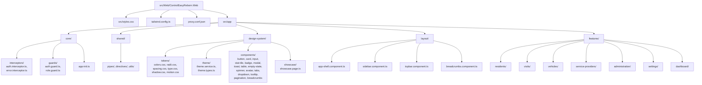
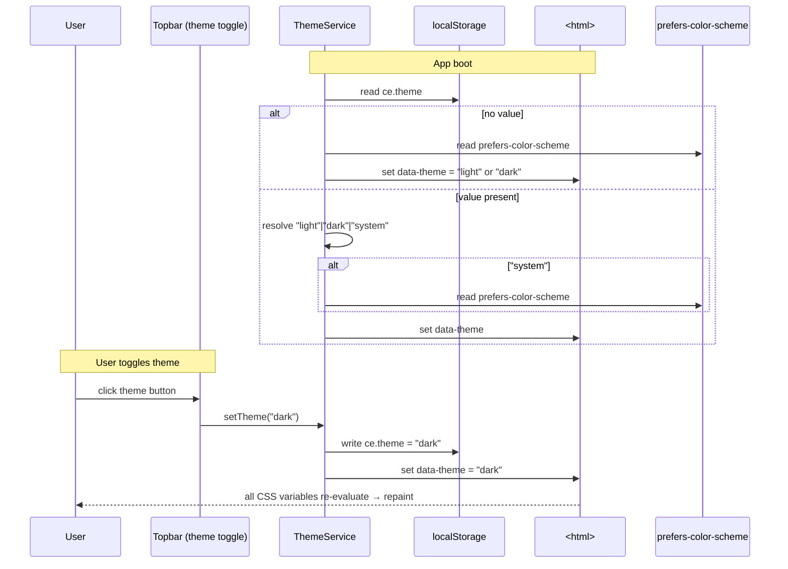
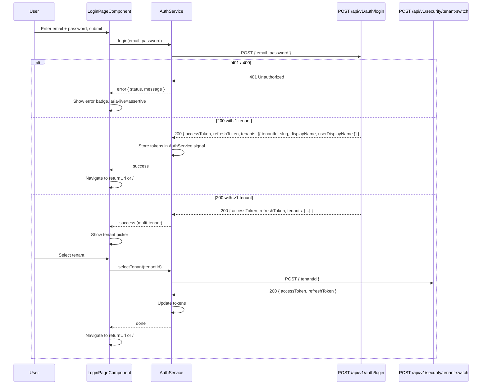
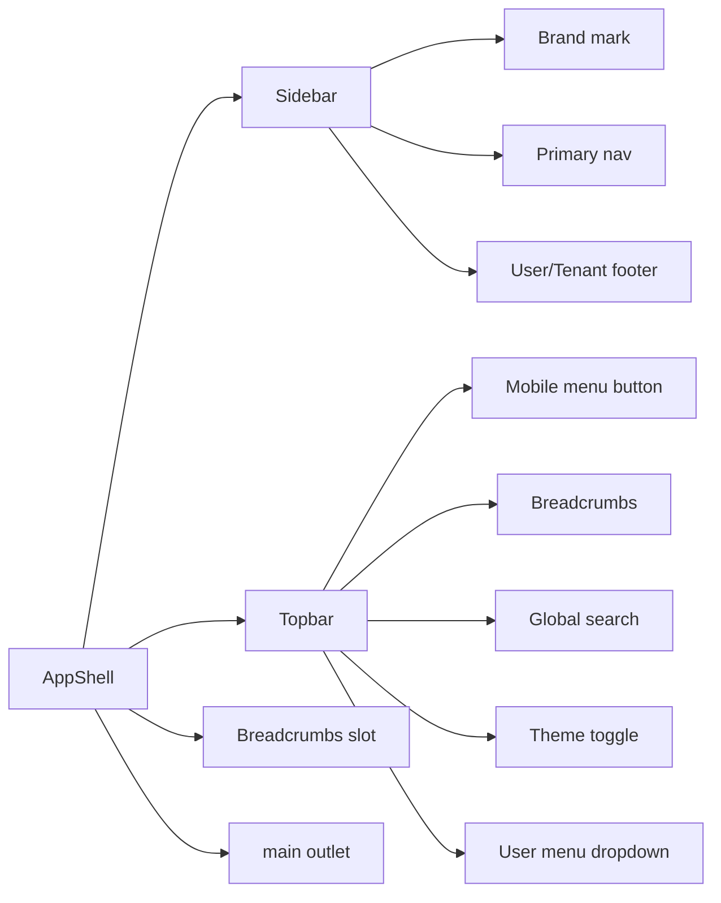

# Design — Visual Design System

> Companion to `requirements.md` and `tasks.md`. The visual + behavioral design for the new ControlEasy Reborn Angular SPA, matching the **TCS Dashboard** reference (React + Vite + Tailwind CSS v4, served at `http://localhost:8080`).

## Overview

This spec defines the **visual design system** for the ControlEasy Reborn Angular SPA — the tokens, base components, layout shell, responsive rules, and accessibility patterns that every feature page will consume. The system is deliberately **small, opinionated, and reference-driven**: every value comes from the TCS Dashboard CSS (compiled `index-CRtOy2AX.css`) so the new app is visually indistinguishable from a battle-tested admin dashboard that already has user-trust equity. Where the reference relies on React + Tailwind v4's `@theme` directive, the Angular port uses **the same Tailwind v4 setup** plus a thin layer of CSS custom properties on `:root` so a future redesign can re-skin the entire app by editing one file.

The architecture is **token → theme service → base component → feature component**. Tokens live in CSS files under `src/app/design-system/tokens/` and are loaded once at app bootstrap. A `ThemeService` writes the active theme (`light` | `dark` | `system`) to `localStorage` and applies it as a `data-theme` attribute on `<html>`. Base components are Angular standalone components in `src/app/design-system/components/`, each one a thin wrapper that consumes tokens via Tailwind utility classes and `var(--…)` references — never hex literals. Feature pages compose base components; they do not redefine colors, radii, or shadows. A `/design-system/showcase` route renders one of every base component in every variant and both themes, giving the team a single page to review the system at a glance.

The system also encodes **accessibility** (WCAG 2.1 AA: focus-visible rings, ARIA semantics, keyboard navigation, `prefers-reduced-motion`), **responsiveness** (mobile-first; sidebar collapses to a drawer below `sm` and an icon rail between `sm` and `lg`), and **brand customization hooks** (the primary token is wrapped in a `-raw` variable so a future tenant admin can re-color the app per tenant). The system ships without Angular Material — the reference is Tailwind v4, and Material's design language would fight the indigo/light surfaces/dark sidebar of the reference. Angular CDK (overlay, a11y, dialog, menu) is used **headlessly** for focus trapping, overlay positioning, and keyboard navigation in `Modal`, `DropdownMenu`, and `Tooltip`. See `orchestration.md` for the **Material-vs-Tailwind conflict** with task 1.8 of `.specs/1 - modernization-roadmap/tasks.md` (awaiting user approval).

## Glossary

- **Token** — A named design primitive (color, radius, spacing step, font size, shadow, duration) exposed as a CSS custom property and as a Tailwind v4 `@theme` value.
- **Theme** — One of three user-selectable modes: `light`, `dark`, `system`. Resolved to either `light` or `dark` and applied as `<html data-theme="…">`.
- **Token file** — A `.css` file under `src/app/design-system/tokens/` that defines CSS custom properties on `:root` and re-defines them under `[data-theme=dark]`.
- **Tailwind v4 `@theme` block** — A CSS block that exposes tokens as Tailwind utility values, so `rounded-lg` resolves to `var(--radius-lg)`.
- **Base component** — A presentational Angular standalone component in `src/app/design-system/components/` (e.g. `ButtonComponent`, `CardComponent`).
- **Feature component** — A page-level component in `src/app/features/<feature>/` that composes base components.
- **`ce-` prefix** — Custom-element-style prefix on all base component selectors (`ce-button`, `ce-card`, `ce-input`, etc.) to avoid clashes with native elements and other libraries.
- **Tone** — Semantic color category: `primary | success | warning | danger | info | neutral`.
- **Variant** — Component-level style category (e.g. Button's `primary | secondary | ghost | danger`).
- **Size** — Component-level scale (`sm | md | lg`, occasionally `xs`).
- **Surface** — A neutral background level: `--color-background` (page) → `--color-surface` (section) → `--color-surface-elevated` (card/modal).
- **Sidebar palette** — The dark-mode-by-default sidebar tokens (`--sidebar-bg`, `--sidebar-text`, `--sidebar-active-bg`, `--sidebar-active-text`) that intentionally contrast with the main surface palette.
- **AppShell** — The root layout component that renders `Sidebar + Topbar + <main>`.
- **Showcase** — The `/design-system/showcase` route that renders one of every base component.
- **Strict mode** — TypeScript `strict: true` plus `noUncheckedIndexedAccess`, `exactOptionalPropertyTypes`.
- **`OnPush`** — Default change-detection strategy for every component.
- **CPM** — Central Package Management (NuGet) — applies to the backend; not relevant here, mentioned only to disambiguate from `ng-openapi-gen`.

## Architecture

### Folder layout



### Theme service flow



### Tailwind v4 setup

```mermaid
graph LR
  A[styles.css] -->|@import| B[tailwindcss]
  A -->|@import| C[design-system/tokens/colors.css]
  A -->|@import| D[design-system/tokens/radii.css]
  A -->|@import| E[design-system/tokens/spacing.css]
  A -->|@import| F[design-system/tokens/type.css]
  A -->|@import| G[design-system/tokens/shadow.css]
  A -->|@import| H[design-system/tokens/motion.css]
  A -->|@layer base| I[@theme {<br/>  --color-primary: var(--color-primary-raw);<br/>  --radius-lg: var(--radius-lg);<br/>  ...<br/>}]
  I --> J[Build output:<br/>tailwind.css with utility classes<br/>resolved to var(--...)]
  J --> K[Angular standalone components<br/>use utility classes + var(--...)]
```

`tailwind.config.ts` only contains the content globs:

```ts
import type { Config } from 'tailwindcss';
export default {
  content: ['./src/**/*.{html,ts}'],
} satisfies Config;
```

All tokens live in CSS files so that **deleting the Angular build pipeline still leaves a valid, documented design system in plain CSS** (useful for Storybook export, Figma Tokens plugin, or a future web component port).

### How Angular components consume tokens

Base components use a single, consistent pattern: Tailwind utility classes for the **structural** values (`flex`, `grid`, `p-4`, `gap-2`), and `var(--…)` references for the **themed** values that the `@theme` block does not surface as a utility:

```ts
@Component({
  selector: 'ce-button',
  standalone: true,
  changeDetection: ChangeDetectionStrategy.OnPush,
  template: `
    <button
      [class]="hostClass()"
      [attr.aria-busy]="loading() ? 'true' : null"
      [attr.aria-disabled]="disabled() ? 'true' : null">
      @if (loading()) { <ce-spinner size="sm" /> }
      <ng-content />
    </button>
  `,
})
export class ButtonComponent {
  variant = input<'primary' | 'secondary' | 'ghost' | 'danger'>('primary');
  size    = input<'sm' | 'md' | 'lg'>('md');
  loading = input(false);
  disabled = input(false);

  hostClass = computed(() => {
    const v = this.variant();
    const s = this.size();
    // base + size + variant; tokens are referenced by Tailwind utilities
    // (rounded-lg → var(--radius-lg)) or by var(--…) for custom values
    return [
      'inline-flex items-center justify-center gap-2',
      'font-medium select-none rounded-lg',
      'transition-[transform,box-shadow,background-color] duration-150',
      s === 'sm' ? 'h-8 px-3 text-sm' : '',
      s === 'md' ? 'h-10 px-4 text-sm' : '',
      s === 'lg' ? 'h-12 px-6 text-base' : '',
      v === 'primary'   ? 'bg-primary text-white shadow-sm hover:-translate-y-px hover:shadow-[0_8px_24px_-8px_var(--color-primary)] focus-visible:outline focus-visible:outline-2 focus-visible:outline-offset-2 focus-visible:outline-primary' : '',
      v === 'secondary' ? 'bg-surface text-text-primary border border-border hover:bg-surface-elevated' : '',
      v === 'ghost'     ? 'bg-transparent text-text-primary hover:bg-surface' : '',
      v === 'danger'    ? 'bg-danger text-white hover:opacity-90' : '',
      this.disabled() || this.loading() ? 'opacity-60 pointer-events-none' : '',
    ].filter(Boolean).join(' ');
  });
}
```

### How dark mode toggles the `data-theme` attribute

The `ThemeService` writes `data-theme` to `<html>` and a single CSS rule re-defines the relevant tokens:

```css
:root {
  --color-background: #f8fafc;
  --color-surface: #ffffff;
  --color-surface-elevated: #ffffff;
  --color-text-primary: #0f172a;
  --color-text-secondary: #475569;
  --color-border: #e2e8f0;
  --color-primary-raw: #4f46e5;
  --color-primary: var(--color-primary-raw);
  --color-primary-hover: #4338ca;
  --color-primary-light: #eef2ff;
  /* ... */
}
[data-theme="dark"] {
  --color-background: #0b1020;
  --color-surface: #111827;
  --color-surface-elevated: #1f2937;
  --color-text-primary: #f1f5f9;
  --color-text-secondary: #94a3b8;
  --color-border: #1f2937;
  --color-primary-raw: #818cf8;
  --color-primary: var(--color-primary-raw);
  --color-primary-hover: #a5b4fc;
  --color-primary-light: #1e1b4b;
  /* sidebar palette is dark in BOTH themes */
  --sidebar-bg: #0f172a;
  --sidebar-text: #cbd5e1;
  --sidebar-active-bg: #4f46e5;
  --sidebar-active-text: #ffffff;
}
```

The tailwind `@theme` block maps these variables to utility classes so `bg-primary` always resolves to the current `var(--color-primary)`, which is itself re-defined by the `[data-theme="dark"]` selector. No JS re-skinning is required.

### Brand customization hook

The `--color-primary-raw` / `--color-primary` split exists so that **utility classes never lose their meaning** (`bg-primary` always paints in the brand color) while the brand can be re-set by overriding only the `-raw` variable:

```css
[data-tenant="acme"] {
  --color-primary-raw: #059669; /* emerald for Acme */
}
[data-tenant="globex"] {
  --color-primary-raw: #db2777; /* pink for Globex */
}
```

This spec ships the hook only — no admin UI for it. A future spec will add a `TenantBrandService` that reads the active tenant and applies `data-tenant` to the root of `<app-root>`.

### Testing strategy

- **Unit (Jasmine):** one spec per base component, covering inputs, outputs, ARIA attributes, and computed class strings. `ThemeService` spec covers `localStorage` round-trips, `system` resolution, and SSR safety.
- **DOM (Jasmine + TestBed):** a "render every component" smoke test on the showcase page that catches wiring regressions.
- **Visual regression (Playwright + screenshot diff):** the showcase page is captured in `light` and `dark` themes at three viewport widths (375, 768, 1440) and the screenshots are committed to `tests/visual/__snapshots__/`. Failures block the PR.
- **Accessibility (Playwright + axe-core):** an a11y scan runs on the showcase page; any `serious` or `critical` violation blocks the PR.
- **Reduced motion (Playwright + DevTools emulate):** the showcase page is rendered with `prefers-reduced-motion: reduce`; keyframes must not animate.

## Token tables

### Color tokens — light theme

| Token | Value | Usage |
|---|---|---|
| `--color-background` | `#f8fafc` | Page background |
| `--color-surface` | `#ffffff` | Section/card background |
| `--color-surface-elevated` | `#ffffff` | Modal, popover, dropdown |
| `--color-border` | `#e2e8f0` | Default border |
| `--color-text-primary` | `#0f172a` | Headings, body text |
| `--color-text-secondary` | `#475569` | Captions, helper text |
| `--color-primary-raw` | `#4f46e5` | Brand indigo (override hook) |
| `--color-primary` | `var(--color-primary-raw)` | Primary buttons, links, focus rings |
| `--color-primary-hover` | `#4338ca` | Primary hover/active |
| `--color-primary-light` | `#eef2ff` | Tinted backgrounds (badge, selected row) |
| `--color-danger` | `#ef4444` | Destructive actions, errors |
| `--color-danger-light` | `#fee2e2` | Destructive-tinted backgrounds |
| `--color-warning` | `#f59e0b` | Warnings |
| `--color-warning-light` | `#fef3c7` | Warning-tinted backgrounds |
| `--color-success` | `#22c55e` | Success states |
| `--color-success-light` | `#dcfce7` | Success-tinted backgrounds |
| `--color-info` | `#3b82f6` | Informational |
| `--color-info-light` | `#dbeafe` | Info-tinted backgrounds |
| `--sidebar-bg` | `#0f172a` | Sidebar background (dark in both themes) |
| `--sidebar-text` | `#cbd5e1` | Sidebar item text |
| `--sidebar-active-bg` | `#4f46e5` | Active route background |
| `--sidebar-active-text` | `#ffffff` | Active route text |

### Color tokens — dark theme

| Token | Value |
|---|---|
| `--color-background` | `#0b1020` |
| `--color-surface` | `#111827` |
| `--color-surface-elevated` | `#1f2937` |
| `--color-border` | `#1f2937` |
| `--color-text-primary` | `#f1f5f9` |
| `--color-text-secondary` | `#94a3b8` |
| `--color-primary-raw` | `#818cf8` |
| `--color-primary` | `var(--color-primary-raw)` |
| `--color-primary-hover` | `#a5b4fc` |
| `--color-primary-light` | `#1e1b4b` |
| `--color-danger` | `#f87171` |
| `--color-danger-light` | `#7f1d1d` |
| `--color-warning` | `#fbbf24` |
| `--color-warning-light` | `#78350f` |
| `--color-success` | `#4ade80` |
| `--color-success-light` | `#14532d` |
| `--color-info` | `#60a5fa` |
| `--color-info-light` | `#1e3a8a` |
| Sidebar palette | unchanged (dark in both themes) |

### Radii

| Token | Value | Tailwind utility |
|---|---|---|
| `--radius-sm` | `4px` | `rounded-sm` |
| `--radius-md` | `8px` | `rounded-md` |
| `--radius-lg` | `12px` | `rounded-lg` (buttons, inputs) |
| `--radius-xl` | `16px` | `rounded-xl` (cards, modals) |
| `--radius-full` | `9999px` | `rounded-full` (badges, avatars) |

### Spacing scale

Matches Tailwind's default scale: `0, 1 (4px), 2 (8px), 3 (12px), 4 (16px), 5 (20px), 6 (24px), 8 (32px), 10 (40px), 12 (48px), 16 (64px)`. Exposed as `--space-1`…`--space-16` in CSS for direct `var()` use in templates.

### Typography

| Token | Value |
|---|---|
| `--font-family-sans` | `Inter, ui-sans-serif, system-ui, -apple-system, "Segoe UI", Roboto, "Helvetica Neue", Arial, "Noto Sans", sans-serif` |
| `--font-size-xs` | `0.75rem` (12px) |
| `--font-size-sm` | `0.875rem` (14px) |
| `--font-size-base` | `1rem` (16px) |
| `--font-size-lg` | `1.125rem` (18px) |
| `--font-size-xl` | `1.25rem` (20px) |
| `--font-size-2xl` | `1.5rem` (24px) |
| `--font-size-3xl` | `1.875rem` (30px) |
| `--font-weight-regular` | `400` |
| `--font-weight-medium` | `500` |
| `--font-weight-semibold` | `600` |
| `--font-weight-bold` | `700` |
| `--line-height-tight` | `1.25` |
| `--line-height-normal` | `1.5` |
| `--line-height-relaxed` | `1.625` |

### Shadows

| Token | Value | Use |
|---|---|---|
| `--shadow-sm` | `0 1px 2px 0 rgb(0 0 0 / 0.05)` | Buttons, inputs |
| `--shadow-card` | `0 1px 3px 0 rgb(0 0 0 / 0.08), 0 1px 2px -1px rgb(0 0 0 / 0.05)` | Cards |
| `--shadow-md` | `0 4px 6px -1px rgb(0 0 0 / 0.1), 0 2px 4px -2px rgb(0 0 0 / 0.1)` | Dropdowns, popovers |
| `--shadow-lg` | `0 10px 15px -3px rgb(0 0 0 / 0.1), 0 4px 6px -4px rgb(0 0 0 / 0.1)` | Modals |
| `--shadow-primary-glow` | `0 8px 24px -8px var(--color-primary)` | Primary button hover |
| Dark-theme shadows | inset `0 0 0 1px rgb(255 255 255 / 0.04)` to keep contrast on dark surfaces |

### Motion

| Token | Value | Use |
|---|---|---|
| `--duration-fast` | `120ms` | Hover, focus |
| `--duration-base` | `200ms` | Most transitions |
| `--duration-slow` | `320ms` | Modal, drawer |
| `--ease-out` | `cubic-bezier(0.16, 1, 0.3, 1)` | Entrances |
| `--ease-in-out` | `cubic-bezier(0.4, 0, 0.2, 1)` | State changes |
| `--ease-in` | `cubic-bezier(0.4, 0, 1, 1)` | Exits |

| Animation keyframe | Use |
|---|---|
| `slide-in` | Drawer / sidebar mobile |
| `fade-in` | Backdrop, page transitions |
| `zoom-in` | Modal entrance (`scale(0.96) → scale(1)`) |
| `toast-in` | Toast entrance (slide+fade from right) |
| `toast-out` | Toast exit |
| `pulse-subtle` | Live indicators |
| `spin-slow` | Spinner (`1.4s linear infinite`) |

`@media (prefers-reduced-motion: reduce)` collapses all of these to `0ms` with no transform.

## Component inventory

### `ce-button` — Button

| Prop | Type | Default | Description |
|---|---|---|---|
| `variant` | `'primary' \| 'secondary' \| 'ghost' \| 'danger'` | `'primary'` | Visual style |
| `size` | `'sm' \| 'md' \| 'lg'` | `'md'` | Height + padding |
| `loading` | `boolean` | `false` | Spinner + disable interaction |
| `disabled` | `boolean` | `false` | Disable interaction |
| `type` | `'button' \| 'submit' \| 'reset'` | `'button'` | Native button type |
| Output `(click)` | `MouseEvent` | — | Native click |

Composition: a `ce-button` wrapping a label and (optionally) a leading or trailing icon. Example:

```html
<ce-button variant="primary" size="md" (click)="save()">
  <lucide-icon name="check" /> Save
</ce-button>
```

### `ce-card` — Card

| Prop | Type | Default | Description |
|---|---|---|---|
| `accent` | `'primary' \| 'success' \| 'warning' \| 'danger' \| 'info' \| null` | `null` | Left border accent |
| `padded` | `boolean` | `true` | Inner padding on body slot |

Slots: `default` (body), `[card-header]`, `[card-footer]`.

Composition:

```html
<ce-card accent="success">
  <h3 ce-card-header>Resident</h3>
  <p>Name: {{ resident().name }}</p>
  <div ce-card-footer>
    <ce-button variant="ghost">Cancel</ce-button>
    <ce-button variant="primary">Save</ce-button>
  </div>
</ce-card>
```

### `ce-input` — Input

| Prop | Type | Default | Description |
|---|---|---|---|
| `label` | `string` | — | Visible label (sets `for` on the inner label) |
| `helper` | `string` | — | Helper text below the input |
| `error` | `string \| null` | `null` | Error text; when set, switches to error tone and sets `aria-invalid` |
| `placeholder` | `string` | — | Native placeholder |
| `value` / `[(ngModel)]` or reactive form control | — | — | Two-way binding via `ControlValueAccessor` |

Slots: `[input-prefix]`, `[input-suffix]`.

Composition:

```html
<ce-input label="Apartment" helper="Number or letter" formControlName="apartment">
  <lucide-icon name="home" input-prefix />
</ce-input>
```

### `ce-stat-tile` — StatTile

| Prop | Type | Default | Description |
|---|---|---|---|
| `label` | `string` | — | Small caption above the value |
| `value` | `string \| number` | — | Big number |
| `trend` | `{ direction, value, tone } \| null` | `null` | Optional trend chip |

### `ce-badge` — StatusBadge

| Prop | Type | Default | Description |
|---|---|---|---|
| `tone` | `'primary' \| 'success' \| 'warning' \| 'danger' \| 'info' \| 'neutral'` | `'neutral'` | Color |
| `size` | `'sm' \| 'md'` | `'md'` | Scale |

### `ce-modal` — Modal

| Prop | Type | Default | Description |
|---|---|---|---|
| `open` | `boolean` | `false` | Two-way (`(openChange)`) |
| `title` | `string` | — | Header text |
| `size` | `'sm' \| 'md' \| 'lg' \| 'xl'` | `'md'` | Max-width |

Slots: `default` (body), `[modal-footer]`.

### `ce-toast` (service) — Toast

```ts
toast.success('Resident saved');
toast.error('Failed to save resident', { duration: 8000 });
toast.info('Sync in progress…', { duration: 0 }); // sticky
```

### `ce-table` — Table

Slots: `default` (the `<table>` body); consumers write `<th>` / `<td>` with `ce-th` / `ce-td` attribute selectors. The component provides sticky header, hover row, and cell padding.

### `ce-empty-state` — EmptyState

| Prop | Type | Default | Description |
|---|---|---|---|
| `icon` | `string` (Lucide name) | — | Icon |
| `title` | `string` | — | Headline |
| `description` | `string` | — | Body |
| `actionLabel` | `string` | — | Optional CTA label |

Output `(action)`: `void`.

### `ce-spinner` — Spinner

| Prop | Type | Default | Description |
|---|---|---|---|
| `size` | `'sm' \| 'md' \| 'lg'` | `'md'` | 16 / 24 / 32 px |
| `tone` | `'primary' \| 'current'` | `'current'` | Color |

### `ce-avatar` — Avatar

| Prop | Type | Default | Description |
|---|---|---|---|
| `src` | `string \| null` | `null` | Image URL |
| `name` | `string` | — | Used for initials + deterministic background |
| `size` | `'xs' \| 'sm' \| 'md' \| 'lg' \| 'xl'` | `'md'` | 24 / 32 / 40 / 48 / 64 px |

### `ce-tabs` — Tabs

Slots: `<ce-tab label="…">…</ce-tab>` children. Active tab gets the `aria-selected="true"` and a sliding underline (`bottom: 0; width: var(--tab-active-width); transform: translateX(var(--tab-active-left))`).

### `ce-dropdown` — DropdownMenu

Slots: `default` (the menu) and a `[ceDropdownTrigger]` projected element (must be a `<button>`).

### `ce-tooltip` — Tooltip

Directive: `<button ceTooltip="Open settings">…</button>`. Show after 400ms hover; hide on leave. `role="tooltip"`.

### `ce-pagination` — Pagination

| Prop | Type | Default | Description |
|---|---|---|---|
| `page` | `number` | `1` | Current page (1-based) |
| `pageSize` | `number` | `10` | Rows per page |
| `total` | `number` | `0` | Total rows |
| `pageSizeOptions` | `number[]` | `[10, 25, 50, 100]` | Selector options |

Outputs: `(pageChange)`, `(pageSizeChange)`.

### `ce-breadcrumbs` — Breadcrumbs

Inputs: `crumbs: Array<{ label: string; route?: string }>` (optional override). When unset, the component reads each activated route's `data.breadcrumb` and concatenates parent → child.

### `ce-checkbox` — Checkbox

| Prop | Type | Default | Description |
|---|---|---|---|
| `label` | `string` | — | Visible label text |
| `checked` | `boolean` | `false` | Two-way (`(checkedChange)`) |
| `disabled` | `boolean` | `false` | Disable interaction |
| `indeterminate` | `boolean` | `false` | Indeterminate state |
| `name` | `string` | — | Native form field name |

A thin styled wrapper around native `<input type="checkbox">` with a custom `ce-` styled box, `--color-primary` check mark, and `:focus-visible` ring. Used on the login page ("Remember my email") and in future filter/setting pages.

## Login page

The login page is the **only page** rendered outside the `AppShell`. It composes base components from this design system and delegates all authentication logic to `AuthService`. The backend contract is defined in `.specs/1 - modernization-roadmap/design.md` (JWT claims, multi-tenant tenant picker, refresh tokens).

### Route and guard

- Route: `/login` (standalone, no parent layout).
- `AuthGuard` redirects unauthenticated requests to `/login?returnUrl=<encoded URL>`.
- After successful login + tenant selection, `AuthService` navigates to `returnUrl` or `/`.
- The login page is **not** lazy-loaded (it is the first route users hit; pre-bundled in the main chunk).

### Composition

```mermaid
graph TD
  LP[LoginPageComponent] --> BG[Full-viewport background<br/>var(--color-background)]
  BG --> TC[Theme toggle button<br/>top-right corner]
  BG --> CARD[ce-card<br/>centered, max-w-md]
  CARD --> LOGO[Brand mark<br/>ControlEasy logo]
  CARD --> H1[h1: Sign in to ControlEasy]
  CARD --> ERR[Error region<br/>aria-live=assertive]
  CARD --> EMAIL[ce-input label=Email<br/>type=email<br/>autocomplete=email]
  CARD --> PASS[ce-input label=Password<br/>type=password<br/>autocomplete=current-password<br/>suffix: show/hide toggle]
  CARD --> REM[ce-checkbox<br/>label=Remember my email]
  CARD --> BTN[ce-button variant=primary<br/>type=submit<br/>loading=isSubmitting]
  CARD --> LINK[Forgot password? link<br/>href=/forgot-password<br/>tone: text-secondary]
  CARD --> TENANT[Tenant picker view<br/>shown if login response<br/>has >1 tenant]
  TENANT --> TCARD[ce-card accent=primary<br/>per tenant]
  TCARD --> TNAME[tenant.displayName]
  TCARD --> TUSER[userDisplayName for that tenant]
```

### Login card layout

```css
/* LoginPageComponent — host styles */
:host {
  display: flex;
  align-items: center;
  justify-content: center;
  min-height: 100dvh;
  background: var(--color-background);
  padding: var(--space-4);
}

/* Card wrapper */
.login-card {
  width: 100%;
  max-width: 28rem; /* max-w-md */
  margin: 0 auto;
}

/* Brand mark */
.login-brand {
  height: 3rem; /* h-12 */
  margin-bottom: var(--space-6);
}
@media (max-width: 639px) {
  .login-brand { height: 2rem; } /* h-8 on mobile */
}

/* Form spacing */
.login-form {
  display: flex;
  flex-direction: column;
  gap: var(--space-4);
}

/* Tenant picker grid */
.tenant-picker {
  display: grid;
  gap: var(--space-3);
}
@media (min-width: 768px) {
  .tenant-picker { grid-template-columns: repeat(2, 1fr); }
}
```

### Login flow



### Error states

| HTTP status | Error display | Fields affected |
|---|---|---|
| 400 (validation) | Per-field `ce-input` error prop (`error` input) | Email and/or password |
| 401 | `ce-badge tone="danger"` above form: "Invalid email or password." | Password gets `aria-invalid`; focus returns to email |
| 429 (rate limited) | `ce-badge tone="warning"`: "Too many attempts. Please try again in a few minutes." | Sign-in button disabled for the `Retry-After` duration |
| Network error | `ce-badge tone="danger"`: "Unable to connect to the server. Please check your network." | None |
| Session expired redirect | `ToastService.info("Your session has expired. Please sign in again.")` on page mount | Email pre-filled from `localStorage["ce.email"]` if "Remember me" was checked |

### "Remember my email" behavior

- Checking `ce-checkbox` labeled "Remember my email" stores the email in `localStorage["ce.email"]` on successful login.
- Unchecking it removes `localStorage["ce.email"]`.
- On mount, if `localStorage["ce.email"]` exists, the email field is pre-filled and the checkbox is checked.
- Password is **never** stored client-side.

### Password show/hide toggle

- The password `ce-input` has a `[input-suffix]` slot containing a `<button>` with `lucide-icon name="eye"` / `lucide-icon name="eye-off"`.
- Clicking the button toggles `<input type="password">` ↔ `<input type="text">`.
- The button has `aria-label="Show password"` / `aria-label="Hide password"`.

### Session expiry redirect

When `AuthInterceptor` detects a 401 with an expired refresh token:
1. Clear tokens from `AuthService`.
2. Redirect to `/login?reason=session-expired`.
3. `LoginPageComponent` reads `reason` from `ActivatedRoute.queryParams`.
4. If `reason === 'session-expired'`, fire `ToastService.info($localize`Your session has expired. Please sign in again.`)` on `ngOnInit`.
5. Pre-fill email from `localStorage["ce.email"]` if available.

### Theme toggle on login page

- A standalone theme toggle button (`sun`/`moon` Lucide icon) is pinned to `position: fixed; top: var(--space-4); right: var(--space-4); z-index: 40;` on the login page.
- It uses the global `ThemeService.toggle()` method.
- The FOUC-prevention `<script>` in `index.html` (from Phase B, task B.5) ensures the correct `data-theme` is applied before Angular bootstraps, so the login page never flashes.

### Dark mode on login page

- The login card uses `bg-surface-elevated` (`var(--color-surface-elevated)`) in both themes.
- The viewport background uses `var(--color-background)`.
- In dark mode, the card gets an inset border: `box-shadow: inset 0 0 0 1px var(--color-border);` to maintain contrast against the dark background.
- All text, inputs, and buttons use design-system tokens; no hex literals.

### Accessibility (login-specific)

- `<main id="login" tabindex="-1">` for skip-link target (the skip link on the login page jumps past the theme toggle to the main landmark).
- `<h1>` is "Sign in to ControlEasy" (i18n: `$localize`:@@LOGIN.HEADING:Sign in to ControlEasy``).
- `aria-live="assertive"` region for error messages (screen readers announce errors immediately).
- Password show/hide button: `aria-label` toggles between "Show password" and "Hide password".
- After a failed login attempt, `focus()` returns to the email input.
- After a successful login, `focus()` moves to `<main id="main">` in the `AppShell`.
- All touch targets ≥ 44×44px.

### New base component: `ce-checkbox`

The login page requires a checkbox. A thin `ce-checkbox` component is added to the base component inventory:

| Prop | Type | Default | Description |
|---|---|---|---|
| `label` | `string` | — | Visible label text |
| `checked` | `boolean` | `false` | Two-way (`(checkedChange)`) |
| `disabled` | `boolean` | `false` | Disable interaction |
| `indeterminate` | `boolean` | `false` | Indeterminate state |
| `name` | `string` | — | Native form field name |

Styling: custom check box (20×20px, `var(--radius-sm)`, `var(--color-primary)` fill when checked), `var(--color-primary)` check mark SVG, `:focus-visible` ring of `0 0 0 3px color-mix(in oklch, var(--color-primary) 15%, transparent)`. Label text is `var(--font-size-sm)`, `var(--color-text-secondary)`.

## Layout shell

### `AppShell`



- `display: grid; grid-template-columns: 16rem 1fr;` on `md+`.
- Single column on `< md`; sidebar becomes a slide-in drawer (`transform: translateX(-100%) → translateX(0)`, 240ms `slide-in`).
- Main area: `overflow-y-auto; padding: var(--space-6); background: var(--color-background);`.
- Skip-to-content link is the first focusable element; jumps to `<main id="main">`.

### Sidebar

- `w-64` (16rem) on `md+`, `w-16` (icon rail) between `sm` and `md`, drawer on `< sm`.
- `background: var(--sidebar-bg); color: var(--sidebar-text);`.
- Active route: `background: var(--sidebar-active-bg); color: var(--sidebar-active-text); border-radius: var(--radius-md);`.
- Items: dashboard icon, then Residents, Visits, Vehicles, Service Providers, Administration, Settings. Permissions filter (out of scope for this spec — feature-page concern).

### Topbar

- `sticky top-0; height: 4rem (64px); background: var(--color-surface); border-bottom: 1px solid var(--color-border);`.
- Left: mobile-menu button (visible `< md` only) + breadcrumbs.
- Right: global search input (`< md`: collapses to icon), theme toggle, user menu (`ce-avatar` + `ce-dropdown`).
- Z-index: 50 (above page content, below modals).

### Main content area

- `<main id="main" tabindex="-1">` for skip-link target.
- Max content width: 1440px, centered, with responsive horizontal padding (`var(--space-4)` → `var(--space-8)`).

## Responsive breakpoints

Mobile-first; Tailwind v4 default values:

| Breakpoint | Min width | Layout |
|---|---|---|
| (base) | 0 | Single column, sidebar = drawer |
| `sm` | 640px | Sidebar = icon rail (w-16), topbar expands |
| `md` | 768px | Sidebar = full (w-64), table density relaxes |
| `lg` | 1024px | Two-column forms, side panels |
| `xl` | 1280px | Max content width 1440px, generous gutters |
| `2xl` | 1536px | No further layout changes (cap at 1440px content) |

## Accessibility

- **Focus visible:** global `:focus-visible { outline: 2px solid var(--color-primary); outline-offset: 2px; border-radius: inherit; }` on every interactive element. Custom focus rings are layered on top in component CSS only when the global one would clash (e.g. inside an already-tinted badge).
- **ARIA roles:** modal (`dialog` + `aria-modal` + `aria-labelledby`), dropdown (`menu` / `menuitem`), tabs (`tablist` / `tab` / `tabpanel`), table (`table` is native; `<th scope>` always set), pagination (`nav aria-label="Pagination"`), breadcrumbs (`nav aria-label="Breadcrumb"` + `<ol>`), toast container (`region aria-live="polite" aria-label="Notifications"`), spinner (`role="status" aria-label="Loading"`).
- **Keyboard navigation:**
  - Modal: `Tab` cycles inside, `Shift+Tab` cycles backward, `Escape` closes.
  - Tabs: `←/→` move focus + activate, `Home/End` jump to first/last.
  - Dropdown: `↑/↓` navigate items, `Enter`/`Space` activate, `Escape` close, `Tab` close.
  - Tooltip: shows on focus, hides on `blur`/`Escape`.
  - Button: `Space` and `Enter` activate.
- **`prefers-reduced-motion`:** a global media query that sets all keyframes to `0ms` and all transitions to `0ms`. Spinner becomes a static dashed circle.
- **Color contrast:** all text/background pairs are pre-checked in the showcase page with axe-core; the script lives in `tests/a11y/check-contrast.ts` and is part of the verification gate.
- **Touch targets:** all interactive elements are ≥ 44×44px on `< sm`.

## Conflict note (Material vs Tailwind v4)

> **Decision (this spec):** The visual design system is **Tailwind CSS v4 + custom design tokens + Angular CDK** (overlay, a11y, dialog, menu) for headless behavior. It is **not** Angular Material.
>
> **Conflict:** `.specs/1 - modernization-roadmap/tasks.md` task 1.8 currently specifies **Angular Material** ("`src/Web/ControlEasyReborn.Web` (Angular 18+ standalone-component SPA, TypeScript strict mode, **Angular Material**)"). The reference application (TCS Dashboard) is Tailwind v4, and Material's design language (Roboto, M3 tokens, ripple effects) would visually clash with the reference.
>
> **Impact if approved:**
> - Task 1.8's parenthetical changes from "Angular Material" to "Tailwind CSS v4 + custom design tokens, Angular CDK (headless only)".
> - `package.json` of the Angular app gets `tailwindcss@^4`, `@angular/cdk`, `lucide-angular`; it does **not** get `@angular/material`.
> - The reference-driven design tokens, components, and showcase page in this spec become the foundation for every feature page.
>
> **If the user rejects this decision**, this spec must be re-scoped: either (a) keep Angular Material and rewrite the visual system to match M3 (different reference needed), or (b) re-scope to a different reference app. **Nothing in `.specs/1 - modernization-roadmap/tasks.md` is modified by this spec** — the change is logged in `orchestration.md` and awaits user approval.
