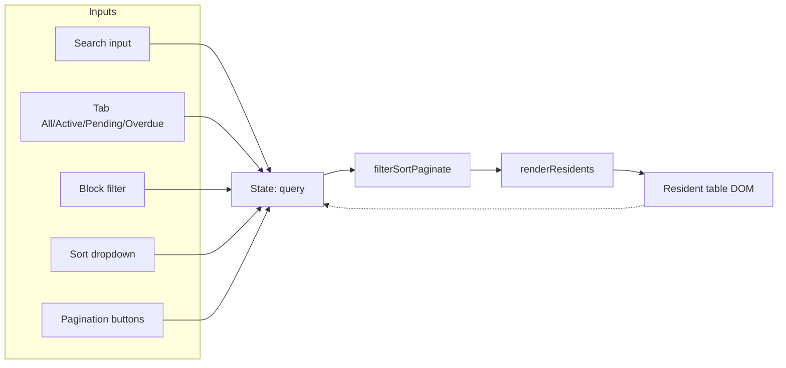

# Mockup functional fixes — Design

## Overview

The `mockup/` directory is a self-contained, build-free HTML/CSS/JS prototype of the visual design system. It mirrors
the planned Angular components 1:1 in structure and styling. After a static review of the source we identified that
several components render incorrectly by default (modals and dropdowns are visible at page load) and that the
JavaScript behaviors for filtering, sorting, pagination, tabs, and the login error path are stubbed out. The goal of
this spec is to make the mockup *behave* the same way the planned Angular components are specified to behave in
`.specs/2 - visual-design-system/design.md` — without changing any visual design tokens, layout, or copy.

We will fix the bugs at three layers: (a) CSS rules to give `.is-open` semantics to modals and dropdowns and to
hide them by default; (b) HTML corrections (the duplicate `class` attribute, the broken breadcrumb, the redundant
`removeAttribute('hidden')` script in `app.html`, the missing `data-modal-open` plumbing on the
"Add resident" trigger, and the `data-sort-key` / `data-block-key` data attributes for filter values); (c) new
JavaScript in `mockup/assets/app.js` plus a new `mockup/assets/data.js` for the resident dataset that wires up
search, tabs, sort, pagination, login error paths, and the "Forgot password" link.

No backend, no build step, no new dependencies. Everything stays inside `mockup/`. The fix is intentionally a thin
script that previews the **contract** the Angular service-layer code will later implement.

## Glossary

- **Mockup** — the `mockup/` directory. Self-contained HTML/CSS/JS preview of the design system. No bundler.
- **Component** — a `ce-*` CSS class implementing a piece of UI (button, modal, dropdown, table, etc.).
- **Data attribute hook** — an HTML attribute (`data-modal-open`, `data-dropdown-trigger`, `data-tab`, …) that
  the JS uses to wire behavior without coupling to specific class names.
- **`.is-open`** — the visibility class added by JS to `.ce-dropdown-menu` and `.ce-modal-backdrop` to show them.
- **Resident dataset** — an in-memory array of resident records (id, name, cpf, block, apartment, phone, status,
  lastVisitAt) used by the search/filter/sort/pagination logic in `app.js`.

## Architecture

### Layer 1 — CSS

- `.ce-dropdown-menu { display: none; }` and `.ce-dropdown-menu.is-open { display: block; }`.
- `.ce-modal-backdrop { display: none; }` and `.ce-modal-backdrop.is-open { display: flex; }`. Remove the
  `animation: fade-in` from the base rule (animations should only run when opening, not on every paint).
- Animate the open transition with a `[data-open]` keyframe, optional polish.
- Optional: add `.ce-pagination[aria-busy="true"] { opacity: 0.6; }` and a tiny skeleton for the table body when
  filtering.

### Layer 2 — HTML

- `index.html` line 136: merge the two `class` attributes into a single `class="grid mb-8"`.
- `app.html`: add `data-block-key` to the "Block: All" dropdown trigger, `data-sort-key` to the "Sort: Name"
  trigger, and a `data-target="#filter-block-label"` / `#filter-sort-label` so JS can rewrite the trigger text.
- `app.html`: add a `` inside each filter trigger so JS can rewrite the label.
- `app.html`: change the "Início" breadcrumb link to `index.html`.
- `app.html`: remove the redundant inline script
  `document.querySelectorAll(".ce-modal-backdrop").forEach((m) => m.removeAttribute("hidden"));` because the
  CSS default will now hide them.
- `login.html`: add `data-no-redirect` is **not** needed; instead, special-case two demo emails in the submit
  handler.
- `login.html`: add a `data-toast="info" data-toast-msg="..."` on the "Forgot password?" link so clicking it
  surfaces a toast (UC-11).
- `login.html`: add `id="login-error-text"` is already present — reuse it.
- `showcase.html`: remove the same `m.removeAttribute('hidden'); m.hidden = true;` workaround since the CSS
  default will now hide them.

### Layer 3 — JavaScript

- New file `mockup/assets/data.js`: exposes a `window.MockData` object with `residents` (≈ 30 records) and a
  `filterSortPaginate(residents, { search, block, status, sortKey, page, pageSize })` pure function.
- `app.js`:
  - On `DOMContentLoaded`, call `renderResidents()` which wires the resident table to the data layer.
  - The "Início" breadcrumb on `app.html` still works after we change its href — no JS needed.
  - Wire `[data-search]` to filter on `input` event with a 120 ms debounce.
  - Wire the tab group: when a tab is clicked, read its `data-status` (`all|active|pending|overdue|inactive`)
    and re-render. The count badge in the tab text is also updated.
  - Wire the "Block" and "Sort" dropdowns: on item click, set the `data-block-key` / `data-sort-key` of the
    trigger, rewrite the visible label, close the menu, and re-render.
  - Wire pagination: clicking a page number or Prev/Next calls `renderResidents()` with the new page and
    updates `aria-current="page"` and the disabled state of Prev/Next.
  - Dropdown `is-open` toggling is unchanged but the **CSS** now makes it visible.
  - Modal `is-open` toggling is unchanged but the **CSS** now makes it visible.
  - Login submit: special-case `email === "fail@x.com"` → show inline error, re-enable button; `email ===
    "ratelimit@x.com"` → show inline error, disable button for 15 s, re-enable via `setTimeout`. Otherwise the
    existing flow (tenant picker if email contains "multi", else navigate) is kept.
  - The "Forgot password?" link should have `data-toast` and a friendly message; no other behavior change.
- `icons.js`: change `icon()` to be size-aware by storing each icon's intrinsic size alongside it, so any
  declared size works (defensive — only matters for future icons).

### Component breakdown (what changes per file)

- `mockup/styles.css` — 2 rules added/changed.
- `mockup/index.html` — 1 line merged.
- `mockup/app.html` — breadcrumb href fixed, filter labels added, redundant script removed.
- `mockup/showcase.html` — redundant modal-visibility script removed.
- `mockup/login.html` — Forgot-password link gets `data-toast`.
- `mockup/assets/app.js` — new sections: data wiring, tabs, sort, block filter, pagination, search debounce,
  login error/rate-limit paths, "Forgot password" toast.
- `mockup/assets/data.js` — new file with resident fixtures and `filterSortPaginate` helper.
- `mockup/assets/icons.js` — minor robustness (intrinsic size registry).

### Mermaid — what the data flow looks like

### Success criteria

- Open `app.html` → no modal, no dropdown visible by default.
- Click "Add resident" → modal opens, focuses name input, closes with Escape or X.
- Click any dropdown trigger → menu opens, closes on outside click / item click / Escape.
- Type in the search box → table filters within ~150 ms.
- Switch tabs → table filters by status.
- Pick "Block B" → table filters to Block B.
- Pick "Last visit (newest)" → rows reorder.
- Click page 2 → rows 11–20 render, "Showing 11–20 of N" updates, Prev enabled, page 2 highlighted.
- Login with `test@test.com` / `test123` → 900 ms loading → navigate to `app.html`.
- Login with `multi@test.com` / any password → 900 ms loading → tenant picker appears.
- Login with `fail@x.com` / any password → inline error "Invalid email or password", button re-enables.
- Login with `ratelimit@x.com` / any password → inline error "Too many attempts. Try again in 15 s",
  button disabled 15 s.
- Any other email with a 6+ char password → 900 ms loading → navigate to `app.html` (demo only).
- Login password show/hide eye toggles input type and icon.
- "Forgot password?" link triggers an info toast.
- The "Dashboard preview" stat grid on `index.html` has the intended bottom margin.

### Files to be created / modified

- New: `mockup/assets/data.js`.
- Modified: `mockup/index.html`, `mockup/app.html`, `mockup/showcase.html`, `mockup/login.html`,
  `mockup/styles.css`, `mockup/assets/app.js`, `mockup/assets/icons.js`.

### Testing strategy

- Static review of HTML/CSS/JS.
- Manual smoke checklist (the success criteria above) is the "test" because we have no Playwright Chromium in
  this environment. We will produce a `mockup/SMOKE.md` checklist the reviewer can run.
- For every changed `data-` hook we will verify the handler is registered exactly once (no duplicate bindings).

### Verification approach

- `git diff` per file.
- `grep` the codebase for any remaining duplicate `class=`, `removeAttribute('hidden')` in the modal context,
  and for the new data hooks.
- Produce `mockup/SMOKE.md` with the checklist that maps 1:1 to the success criteria.
