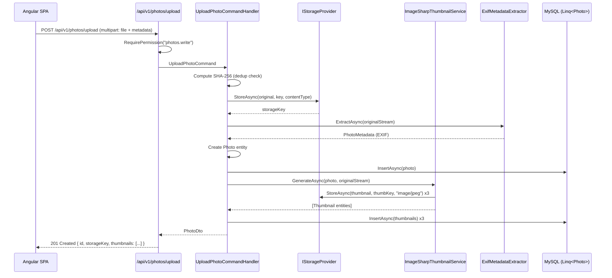
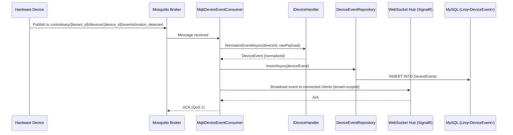
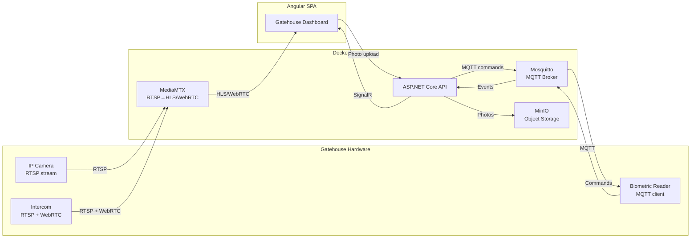

# Design — Photo Capture & Hardware Integration

## Overview

This spec adds two new modules to the ControlEasy Reborn modular monolith:

1. **`Modules/Photos/`** — captures, stores, retrieves, and manages photographs of residents, visitors, vehicles, and service providers. Photos are stored behind an `IStorageProvider` abstraction (local filesystem for development, MinIO/S3-compatible for production). Thumbnails are generated server-side at multiple resolutions. EXIF metadata is extracted and persisted. Access is permission-controlled and audit-logged.

2. **`Modules/HardwareIntegration/`** — provides a pluggable framework for registering and managing IoT devices (cameras, biometric readers, intercoms, barrier gates) at condominium entrance points. Device events are ingested via MQTT, normalized into a unified `DeviceEvent` model, and persisted. Biometric templates are encrypted at rest. Device health is monitored via heartbeat tracking. Camera streams are proxied through a media server.

Both modules follow the same Clean Architecture pattern established in `.specs/1 - modernization-roadmap/design.md`: `Domain → Application → Infrastructure → Api`. All repositories use `Linq<TModel>` and `TenantAwareLinqFactory`. All endpoints are Minimal APIs returning `ProblemDetails` on error. All entities carry `TenantId` per the C.6 architecture rule.

## Glossary

| Term | Meaning |
|---|---|
| **Photo** | A digital image captured at the gatehouse or uploaded by a resident, stored with metadata and thumbnails. |
| **Thumbnail** | A resized derivative of a Photo, generated at upload time in predefined dimensions (small 128x128, medium 512x512, large 1024x1024). |
| **CaptureContext** | Value object recording who took the photo, from which device, at which gatehouse, and for which entity (resident/visit/vehicle/service-provider). |
| **StorageProvider** | Abstraction over file storage (`IStorageProvider`). Swappable: `LocalFileStorageProvider` (dev), `MinioStorageProvider` (prod). |
| **Device** | A physical hardware unit registered in the system (camera, biometric reader, intercom, barrier gate). |
| **DeviceType** | Enum: `Camera`, `BiometricReader`, `Intercom`, `BarrierGate`, `Unknown`. Extensible via strategy pattern. |
| **DeviceEvent** | A normalized event emitted by a Device, ingested via MQTT and persisted with a JSON payload. |
| **BiometricTemplate** | An encrypted biometric enrollment record (fingerprint, iris, face) stored with AES-256-GCM encryption at rest. |
| **IDeviceHandler** | Strategy interface for device-type-specific logic (e.g., camera stream URLs, biometric match commands). |
| **MQTT** | Message Queuing Telemetry Transport — lightweight pub/sub protocol used for device event ingestion and command dispatch. |
| **HLS** | HTTP Live Streaming — Apple's adaptive bitrate streaming protocol used for standard camera feeds. |
| **WebRTC** | Web Real-Time Communication — low-latency peer-to-peer protocol used for intercom audio/video. |
| **MinIO** | S3-compatible object storage server, used in Docker Compose for photo/thumbnail storage in development and production. |
| **Mosquitto** | Eclipse Mosquitto — lightweight MQTT broker used in Docker Compose for device event routing. |
| **MediaMTX** | Lightweight media server supporting RTSP-to-HLS and RTSP-to-WebRTC transcoding, used as a proxy for camera streams. |

## Architecture

### Solution Layout (additions)

```
ControlEasyReborn/
├── src/
│   ├── Modules/
│   │   ├── Photos/
│   │   │   ├── ControlEasyReborn.Modules.Photos.Domain/
│   │   │   ├── ControlEasyReborn.Modules.Photos.Application/
│   │   │   ├── ControlEasyReborn.Modules.Photos.Infrastructure/
│   │   │   └── ControlEasyReborn.Modules.Photos.Api/
│   │   └── HardwareIntegration/
│   │       ├── ControlEasyReborn.Modules.HardwareIntegration.Domain/
│   │       ├── ControlEasyReborn.Modules.HardwareIntegration.Application/
│   │       ├── ControlEasyReborn.Modules.HardwareIntegration.Infrastructure/
│   │       └── ControlEasyReborn.Modules.HardwareIntegration.Api/
│   │
│   ├── BuildingBlocks/
│   │   ├── ControlEasyReborn.SharedKernel/        # + PhotoEntityType, DeviceType, DeviceStatus
│   │   └── ControlEasyReborn.Infrastructure/       # + Storage DI extensions, MQTT DI extensions
│   │
│   └── Host/
│       └── ControlEasyReborn.Api/
│           └── Program.cs                          # + AddPhotosModule(), AddHardwareIntegrationModule()
│
├── docker/
│   ├── docker-compose.yml                          # + minio, mosquitto, mediamtx services
│   ├── .env.example                                # + MINIO_, MQTT_, MEDIA_ vars
│   └── mysql/init/
│       └── 05-photos-and-devices-schema.sql        # Photos, Thumbnails, Devices, DeviceEvents, BiometricTemplates
│
└── tests/
    ├── ControlEasyReborn.IntegrationTests/
    │   ├── PhotosEndpointTests.cs
    │   └── DevicesEndpointTests.cs
    └── ControlEasyReborn.UnitTests/
        ├── Photos/
        └── HardwareIntegration/
```

### Module: Photos

#### Domain Layer

```
Modules/Photos/ControlEasyReborn.Modules.Photos.Domain/
├── Entities/
│   ├── Photo.cs
│   └── Thumbnail.cs
├── ValueObjects/
│   ├── PhotoId.cs
│   ├── PhotoMetadata.cs
│   ├── CaptureContext.cs
│   └── ThumbnailSize.cs
├── Events/
│   ├── PhotoUploaded.cs
│   └── PhotoDeleted.cs
└── Enums/
    └── PhotoEntityType.cs
```

**Photo entity:**

```csharp
namespace ControlEasyReborn.Modules.Photos.Domain.Entities;

public sealed class Photo
{
    public Guid Id { get; private set; }
    public Guid TenantId { get; private set; }
    public PhotoEntityType EntityType { get; private set; }  // Resident, Visit, Vehicle, ServiceProvider
    public Guid EntityId { get; private set; }
    public string FileHash { get; private set; } = string.Empty; // SHA-256 of the original file
    public string ContentType { get; private set; } = string.Empty; // image/jpeg, image/png
    public long FileSize { get; private set; }
    public CaptureContext CaptureContext { get; private set; } = CaptureContext.Default;
    public PhotoMetadata Metadata { get; private set; } = PhotoMetadata.Empty;
    public string StorageKey { get; private set; } = string.Empty;
    public string StorageProvider { get; private set; } = string.Empty; // "local" | "minio"
    public bool IsActive { get; private set; } = true;
    public DateTime TakenAtUtc { get; private set; }
    public Guid? TakenByUserId { get; private set; }       // null for resident self-upload
    public Guid? DeviceId { get; private set; }             // null if uploaded manually
    public DateTime CreatedAtUtc { get; private set; }
    public DateTime? DeletedAtUtc { get; private set; }

    // Navigation (lazy, not EF — loaded separately via Linq<Thumbnail>)
    // Thumbnails are accessed via IPhotoRepository.GetThumbnailsAsync(photoId)
}
```

**PhotoEntityType enum:**

```csharp
namespace ControlEasyReborn.Modules.Photos.Domain.Enums;

public enum PhotoEntityType
{
    Resident = 1,
    Visit = 2,
    Vehicle = 3,
    ServiceProvider = 4
}
```

**Thumbnail entity:**

```csharp
namespace ControlEasyReborn.Modules.Photos.Domain.Entities;

public sealed class Thumbnail
{
    public Guid Id { get; private set; }
    public Guid PhotoId { get; private set; }
    public string SizeLabel { get; private set; } = string.Empty; // "small", "medium", "large"
    public int Width { get; private set; }
    public int Height { get; private set; }
    public string StorageKey { get; private set; } = string.Empty;
    public DateTime CreatedAtUtc { get; private set; }
}
```

**CaptureContext value object:**

```csharp
namespace ControlEasyReborn.Modules.Photos.Domain.ValueObjects;

public sealed record CaptureContext(
    Guid? GatehouseId,     // which gatehouse the photo was taken at
    string? Source         // "gatehouse-camera", "attendant-phone", "resident-upload", "system-auto"
);
```

**PhotoMetadata value object:**

```csharp
namespace ControlEasyReborn.Modules.Photos.Domain.ValueObjects;

public sealed record PhotoMetadata(
    double? Latitude,
    double? Longitude,
    DateTime? TakenAtOriginal,    // from EXIF DateTimeOriginal
    string? Make,                 // camera make (e.g., "Hikvision")
    string? Model,               // camera model
    int? Orientation,
    Dictionary<string, string>? Extra  // any additional EXIF fields
);
```

**ThumbnailSize value object:**

```csharp
namespace ControlEasyReborn.Modules.Photos.Domain.ValueObjects;

public sealed record ThumbnailSize(string Label, int Width, int Height);

public static class ThumbnailSizes
{
    public static readonly ThumbnailSize Small  = new("small", 128, 128);
    public static readonly ThumbnailSize Medium = new("medium", 512, 512);
    public static readonly ThumbnailSize Large  = new("large", 1024, 1024);

    public static IReadOnlyList<ThumbnailSize> All =>
        [Small, Medium, Large];
}
```

**Domain events:**

```csharp
namespace ControlEasyReborn.Modules.Photos.Domain.Events;

public sealed record PhotoUploaded(
    Guid PhotoId,
    Guid TenantId,
    PhotoEntityType EntityType,
    Guid EntityId,
    string StorageKey,
    DateTime OccurredAtUtc
);

public sealed record PhotoDeleted(
    Guid PhotoId,
    Guid TenantId,
    string StorageKey,
    bool Permanent,          // true = hard delete (biometric cascade), false = soft delete
    DateTime OccurredAtUtc
);
```

#### Application Layer

```
Modules/Photos/ControlEasyReborn.Modules.Photos.Application/
├── Abstractions/
│   ├── IPhotoRepository.cs
│   ├── IThumbnailRepository.cs
│   ├── IStorageProvider.cs
│   ├── IThumbnailService.cs
│   └── IPhotoMetadataExtractor.cs
├── Commands/
│   ├── UploadPhotoCommand.cs
│   ├── DeletePhotoCommand.cs
│   └── UploadPhotoCommandValidator.cs
├── Queries/
│   ├── GetPhotoQuery.cs
│   ├── GetPhotosByEntityQuery.cs
│   └── GetThumbnailQuery.cs
├── Handlers/
│   ├── UploadPhotoCommandHandler.cs
│   ├── DeletePhotoCommandHandler.cs
│   ├── GetPhotoQueryHandler.cs
│   ├── GetPhotosByEntityQueryHandler.cs
│   └── GetThumbnailQueryHandler.cs
├── DTOs/
│   ├── PhotoDto.cs
│   ├── ThumbnailDto.cs
│   ├── PhotoUploadRequest.cs
│   └── PhotoDetailDto.cs
└── Permissions/
    └── PhotoPermissions.cs
```

**IPhotoRepository:**

```csharp
namespace ControlEasyReborn.Modules.Photos.Application.Abstractions;

public interface IPhotoRepository
{
    Task<Photo?> FindAsync(Guid id, CancellationToken ct);
    Task<IReadOnlyList<Photo>> ListByEntityAsync(
        PhotoEntityType entityType, Guid entityId, int skip, int take, CancellationToken ct);
    Task<Photo> AddAsync(Photo photo, CancellationToken ct);
    Task SoftDeleteAsync(Guid id, CancellationToken ct);
    Task PermanentDeleteAsync(Guid id, CancellationToken ct);
}
```

**IStorageProvider (the swappable abstraction):**

```csharp
namespace ControlEasyReborn.Modules.Photos.Application.Abstractions;

public interface IStorageProvider
{
    /// <summary>Stores a stream under the given key. Returns the final storage key (may include prefix).</summary>
    Task<string> StoreAsync(Stream data, string key, string contentType, CancellationToken ct);

    /// <summary>Retrieves a stream for the given key. Returns null if not found.</summary>
    Task<Stream?> RetrieveAsync(string key, CancellationToken ct);

    /// <summary>Deletes the object at the given key. No-op if the key does not exist.</summary>
    Task DeleteAsync(string key, CancellationToken ct);

    /// <summary>Generates a presigned URL for temporary read access (used by Angular for direct display).</summary>
    Task<string> GetPresignedUrlAsync(string key, TimeSpan expiry, CancellationToken ct);
}
```

**IThumbnailService:**

```csharp
namespace ControlEasyReborn.Modules.Photos.Application.Abstractions;

public interface IThumbnailService
{
    /// <summary>Generates thumbnails for all predefined sizes. Returns the created Thumbnail entities (not yet persisted).</summary>
    Task<IReadOnlyList<Thumbnail>> GenerateAsync(Photo original, Stream originalData, CancellationToken ct);
}
```

**IPhotoMetadataExtractor:**

```csharp
namespace ControlEasyReborn.Modules.Photos.Application.Abstractions;

public interface IPhotoMetadataExtractor
{
    Task<PhotoMetadata> ExtractAsync(Stream photoStream, CancellationToken ct);
}
```

**PhotoPermissions:**

```csharp
namespace ControlEasyReborn.Modules.Photos.Application.Permissions;

public static class PhotoPermissions
{
    public const string Read   = "photos.read";
    public const string Write  = "photos.write";
    public const string Delete = "photos.delete";
}
```

**UploadPhotoCommand:**

```csharp
namespace ControlEasyReborn.Modules.Photos.Application.Commands;

public sealed record UploadPhotoCommand(
    PhotoEntityType EntityType,
    Guid EntityId,
    Stream PhotoStream,
    string ContentType,
    string FileName,
    Guid? GatehouseId,
    string? Source
);
```

**UploadPhotoCommandHandler (sketch):**

```csharp
namespace ControlEasyReborn.Modules.Photos.Application.Handlers;

internal sealed class UploadPhotoCommandHandler(
    IPhotoRepository photoRepo,
    IThumbnailRepository thumbRepo,
    IStorageProvider storage,
    IThumbnailService thumbnails,
    IPhotoMetadataExtractor metadataExtractor,
    ITenantContext tenantContext
)
{
    public async Task<PhotoDto> Handle(UploadPhotoCommand cmd, CancellationToken ct)
    {
        var tenantId = tenantContext.TenantId
            ?? throw new ForbiddenException("Photos require a tenant context.");

        // 1. Compute SHA-256 hash (dedup check)
        cmd.PhotoStream.Position = 0;
        var hash = await ComputeSha256Async(cmd.PhotoStream, ct);

        // 2. Store original
        var storageKey = $"photos/{tenantId}/{cmd.EntityType}/{cmd.EntityId}/{Guid.NewGuid()}{Path.GetExtension(cmd.FileName)}";
        cmd.PhotoStream.Position = 0;
        await storage.StoreAsync(cmd.PhotoStream, storageKey, cmd.ContentType, ct);

        // 3. Extract metadata
        cmd.PhotoStream.Position = 0;
        var metadata = await metadataExtractor.ExtractAsync(cmd.PhotoStream, ct);

        // 4. Create Photo entity
        var photo = new Photo
        {
            Id = Guid.NewGuid(),
            TenantId = tenantId,
            EntityType = cmd.EntityType,
            EntityId = cmd.EntityId,
            FileHash = hash,
            ContentType = cmd.ContentType,
            FileSize = /* length from stream */,
            StorageKey = storageKey,
            StorageProvider = storage.ProviderName,
            Metadata = metadata,
            CaptureContext = new CaptureContext(cmd.GatehouseId, cmd.Source),
            TakenAtUtc = metadata.TakenAtOriginal ?? DateTime.UtcNow,
            TakenByUserId = tenantContext.IsPlatformAdmin ? null : /* current user id from context */,
            CreatedAtUtc = DateTime.UtcNow
        };
        await photoRepo.AddAsync(photo, ct);

        // 5. Generate thumbnails
        cmd.PhotoStream.Position = 0;
        var thumbs = await thumbnails.GenerateAsync(photo, cmd.PhotoStream, ct);
        foreach (var thumb in thumbs)
            await thumbRepo.AddAsync(thumb, ct);

        // 6. Map to DTO and return
        return photo.ToDto();
    }
}
```

#### Infrastructure Layer

```
Modules/Photos/ControlEasyReborn.Modules.Photos.Infrastructure/
├── Persistence/
│   ├── PhotoRepository.cs
│   └── ThumbnailRepository.cs
├── Storage/
│   ├── LocalFileStorageProvider.cs
│   └── MinioStorageProvider.cs
├── Thumbnails/
│   └── ImageSharpThumbnailService.cs
├── Metadata/
│   └── ExifMetadataExtractor.cs
├── Mapping/
│   └── PhotoMappingProfile.cs
└── DI/
    └── PhotosModuleServiceCollectionExtensions.cs
```

**PhotoRepository (using DBTools_SQL `Linq<Photo>` and `TenantAwareLinqFactory`):**

```csharp
namespace ControlEasyReborn.Modules.Photos.Infrastructure.Persistence;

using DBTools.Linq;
using ControlEasyReborn.BuildingBlocks.Infrastructure.MultiTenancy;

internal sealed class PhotoRepository(
    TenantAwareLinqFactory linqFactory,
    IAsyncSqlClient db
) : IPhotoRepository
{
    private readonly Linq<Photo> _photos = linqFactory.Create<Photo>(/* ITenantContext injected */, db, "Photos", "Id", autoIncrement: false);

    public Task<Photo?> FindAsync(Guid id, CancellationToken ct) =>
        _photos.FirstOrDefaultAsync(p => p.Id == id, ct);

    public async Task<IReadOnlyList<Photo>> ListByEntityAsync(
        PhotoEntityType entityType, Guid entityId, int skip, int take, CancellationToken ct)
    {
        return await _photos.AsQueryable()
            .Where(p => p.EntityType == entityType && p.EntityId == entityId && p.IsActive)
            .OrderByDescending(p => p.CreatedAtUtc)
            .Skip(skip).Take(take)
            .ToListAsync(ct);
    }

    public Task<bool> AddAsync(Photo photo, CancellationToken ct) =>
        _photos.InsertAsync(photo, ct);

    public async Task SoftDeleteAsync(Guid id, CancellationToken ct)
    {
        var photo = await FindAsync(id, ct)
            ?? throw new NotFoundException(nameof(Photo), id);
        photo.IsActive = false;
        photo.DeletedAtUtc = DateTime.UtcNow;
        await _photos.UpdateAsync(photo, ct);
    }

    public async Task PermanentDeleteAsync(Guid id, CancellationToken ct)
    {
        // Used only for biometric cascade (LGPD/GDPR hard-delete)
        await _photos.DeleteAsync(id, ct);
    }
}
```

**LocalFileStorageProvider (dev):**

```csharp
namespace ControlEasyReborn.Modules.Photos.Infrastructure.Storage;

internal sealed class LocalFileStorageProvider(
    IOptions<LocalFileStorageOptions> options
) : IStorageProvider
{
    public string ProviderName => "local";

    public async Task<string> StoreAsync(Stream data, string key, string contentType, CancellationToken ct)
    {
        var path = Path.Combine(options.Value.BasePath, key.Replace('/', Path.DirectorySeparatorChar));
        Directory.CreateDirectory(Path.GetDirectoryName(path)!);
        using var fs = new FileStream(path, FileMode.Create, FileAccess.Write);
        await data.CopyToAsync(fs, ct);
        return key;
    }

    public Task<Stream?> RetrieveAsync(string key, CancellationToken ct)
    {
        var path = Path.Combine(options.Value.BasePath, key.Replace('/', Path.DirectorySeparatorChar));
        if (!File.Exists(path)) return Task.FromResult<Stream?>(null);
        return Task.FromResult<Stream?>(new FileStream(path, FileMode.Open, FileAccess.Read));
    }

    public Task DeleteAsync(string key, CancellationToken ct)
    {
        var path = Path.Combine(options.Value.BasePath, key.Replace('/', Path.DirectorySeparatorChar));
        if (File.Exists(path)) File.Delete(path);
        return Task.CompletedTask;
    }

    public Task<string> GetPresignedUrlAsync(string key, TimeSpan expiry, CancellationToken ct)
    {
        // Local dev: return a relative API URL that serves the file through the controller
        return Task.FromResult($"/api/v1/photos/{key.Split('/').Last()}/file");
    }
}
```

**MinioStorageProvider (prod):**

```csharp
namespace ControlEasyReborn.Modules.Photos.Infrastructure.Storage;

using Minio;
using Minio.DataModel.Args;

internal sealed class MinioStorageProvider(
    IMinioClient minioClient,
    IOptions<MinioStorageOptions> options
) : IStorageProvider
{
    public string ProviderName => "minio";

    public async Task<string> StoreAsync(Stream data, string key, string contentType, CancellationToken ct)
    {
        await minioClient.PutObjectAsync(new PutObjectArgs()
            .WithBucket(options.Value.BucketName)
            .WithObject(key)
            .WithStreamData(data)
            .WithContentType(contentType)
            .WithObjectSize(data.Length), ct);
        return key;
    }

    public async Task<Stream?> RetrieveAsync(string key, CancellationToken ct)
    {
        var ms = new MemoryStream();
        try
        {
            await minioClient.GetObjectAsync(new GetObjectArgs()
                .WithBucket(options.Value.BucketName)
                .WithObject(key)
                .WithCallbackStream(stream => stream.CopyTo(ms)), ct);
            ms.Position = 0;
            return ms;
        }
        catch (Minio.Exceptions.ObjectNotFoundException)
        {
            await ms.DisposeAsync();
            return null;
        }
    }

    public async Task DeleteAsync(string key, CancellationToken ct)
    {
        await minioClient.RemoveObjectAsync(new RemoveObjectArgs()
            .WithBucket(options.Value.BucketName)
            .WithObject(key), ct);
    }

    public async Task<string> GetPresignedUrlAsync(string key, TimeSpan expiry, CancellationToken ct)
    {
        return await minioClient.PresignedGetObjectAsync(new PresignedGetObjectArgs()
            .WithBucket(options.Value.BucketName)
            .WithObject(key)
            .WithExpiry((int)expiry.TotalSeconds));
    }
}
```

**ImageSharpThumbnailService:**

```csharp
namespace ControlEasyReborn.Modules.Photos.Infrastructure.Thumbnails;

using SixLabors.ImageSharp;
using SixLabors.ImageSharp.Processing;

internal sealed class ImageSharpThumbnailService(
    IStorageProvider storage
) : IThumbnailService
{
    public async Task<IReadOnlyList<Thumbnail>> GenerateAsync(
        Photo original, Stream originalData, CancellationToken ct)
    {
        var thumbnails = new List<Thumbnail>();

        originalData.Position = 0;
        using var image = await Image.LoadAsync(originalData, ct);

        foreach (var size in ThumbnailSizes.All)
        {
            using var resized = image.Clone(ctx => ctx.Resize(new ResizeOptions
            {
                Size = new Size(size.Width, size.Height),
                Mode = ResizeMode.Max
            }));

            using var ms = new MemoryStream();
            await resized.SaveAsJpegAsync(ms, ct);
            ms.Position = 0;

            var thumbKey = $"{original.StorageKey}/thumbnails/{size.Label}.jpg";
            await storage.StoreAsync(ms, thumbKey, "image/jpeg", ct);

            thumbnails.Add(new Thumbnail
            {
                Id = Guid.NewGuid(),
                PhotoId = original.Id,
                SizeLabel = size.Label,
                Width = size.Width,
                Height = size.Height,
                StorageKey = thumbKey,
                CreatedAtUtc = DateTime.UtcNow
            });
        }

        return thumbnails;
    }
}
```

#### Api Layer

```
Modules/Photos/ControlEasyReborn.Modules.Photos.Api/
├── Endpoints/
│   ├── UploadPhotoEndpoint.cs
│   ├── GetPhotoEndpoint.cs
│   ├── GetPhotoFileEndpoint.cs
│   ├── GetThumbnailEndpoint.cs
│   ├── DeletePhotoEndpoint.cs
│   ├── GetEntityPhotosEndpoint.cs
│   └── UploadProfilePhotoEndpoint.cs
└── DI/
    └── PhotosApiServiceCollectionExtensions.cs
```

**Endpoints (summary):**

| Method | Route | Permission | Description |
|---|---|---|---|
| `POST` | `/api/v1/photos/upload` | `photos.write` | Upload a photo for an entity (multipart/form-data). Body: `EntityType`, `EntityId`, `File`, `GatehouseId?`, `Source?`. Returns `PhotoDto` with presigned URL. |
| `GET` | `/api/v1/photos/{id}` | `photos.read` | Get photo metadata (not the binary). Returns `PhotoDetailDto`. |
| `GET` | `/api/v1/photos/{id}/file` | `photos.read` | Stream the original photo binary. Sets `Content-Type` and `Content-Disposition`. |
| `GET` | `/api/v1/photos/{id}/thumbnails/{size}` | `photos.read` | Stream a thumbnail (`small`, `medium`, `large`). Redirects to presigned URL if using MinIO. |
| `DELETE` | `/api/v1/photos/{id}` | `photos.delete` | Soft-delete a photo (sets `IsActive = false`). Hard-delete for biometric cascade (LGPD). |
| `GET` | `/api/v1/residents/{id}/photos` | `photos.read` | List all photos for a resident. Returns `IReadOnlyList<PhotoDto>`. |
| `GET` | `/api/v1/visits/{id}/photos` | `photos.read` | List all photos for a visit. |
| `GET` | `/api/v1/vehicles/{id}/photos` | `photos.read` | List all photos for a vehicle. |
| `GET` | `/api/v1/service-providers/{id}/photos` | `photos.read` | List all photos for a service provider. |
| `POST` | `/api/v1/residents/{id}/profile-photo` | `photos.write` (or resident self-upload) | Upload or replace the resident's profile photo. |

**Upload flow:**



#### Database Schema

**`docker/mysql/init/05-photos-and-devices-schema.sql`:**

```sql
-- ============================================================
-- Photos module
-- ============================================================
CREATE TABLE IF NOT EXISTS Photos (
    Id              CHAR(36)        NOT NULL,
    TenantId        CHAR(36)        NOT NULL,
    EntityType      TINYINT         NOT NULL,   -- 1=Resident, 2=Visit, 3=Vehicle, 4=ServiceProvider
    EntityId        CHAR(36)        NOT NULL,
    FileHash        CHAR(64)        NOT NULL,   -- SHA-256
    ContentType     VARCHAR(50)     NOT NULL,   -- image/jpeg, image/png
    FileSize        BIGINT          NOT NULL,
    CaptureSource   VARCHAR(50)     NULL,       -- gatehouse-camera, attendant-phone, resident-upload, system-auto
    GatehouseId     CHAR(36)        NULL,
    TakenAtUtc      DATETIME(3)     NOT NULL,
    TakenByUserId   CHAR(36)        NULL,
    DeviceId        CHAR(36)        NULL,
    StorageKey      VARCHAR(500)    NOT NULL,
    StorageProvider VARCHAR(20)     NOT NULL DEFAULT 'local',
    MetadataJson    JSON            NULL,
    IsActive        BOOLEAN         NOT NULL DEFAULT TRUE,
    CreatedAtUtc    DATETIME(3)     NOT NULL DEFAULT CURRENT_TIMESTAMP(3),
    DeletedAtUtc    DATETIME(3)     NULL,
    PRIMARY KEY (Id),
    INDEX IX_Photos_Tenant_Entity (TenantId, EntityType, EntityId),
    INDEX IX_Photos_StorageKey (StorageKey),
    INDEX IX_Photos_FileHash (FileHash)
) ENGINE=InnoDB DEFAULT CHARSET=utf8mb4 COLLATE=utf8mb4_unicode_ci;

CREATE TABLE IF NOT EXISTS Thumbnails (
    Id              CHAR(36)        NOT NULL,
    PhotoId         CHAR(36)        NOT NULL,
    SizeLabel       VARCHAR(10)     NOT NULL,   -- small, medium, large
    Width            INT             NOT NULL,
    Height           INT             NOT NULL,
    StorageKey      VARCHAR(500)    NOT NULL,
    CreatedAtUtc    DATETIME(3)     NOT NULL DEFAULT CURRENT_TIMESTAMP(3),
    PRIMARY KEY (Id),
    INDEX IX_Thumbnails_PhotoId (PhotoId),
    INDEX IX_Thumbnails_PhotoId_SizeLabel (PhotoId, SizeLabel),
    CONSTRAINT FK_Thumbnails_Photos FOREIGN KEY (PhotoId) REFERENCES Photos(Id) ON DELETE CASCADE
) ENGINE=InnoDB DEFAULT CHARSET=utf8mb4 COLLATE=utf8mb4_unicode_ci;
```

### Module: HardwareIntegration

#### Domain Layer

```
Modules/HardwareIntegration/ControlEasyReborn.Modules.HardwareIntegration.Domain/
├── Entities/
│   ├── Device.cs
│   ├── DeviceEvent.cs
│   └── BiometricTemplate.cs
├── ValueObjects/
│   ├── DeviceId.cs
│   └── EventPayload.cs
├── Events/
│   ├── DeviceRegistered.cs
│   ├── DeviceWentOffline.cs
│   └── BiometricMatchOccurred.cs
└── Enums/
    ├── DeviceType.cs
    └── DeviceStatus.cs
```

**Device entity:**

```csharp
namespace ControlEasyReborn.Modules.HardwareIntegration.Domain.Entities;

public sealed class Device
{
    public Guid Id { get; private set; }
    public Guid TenantId { get; private set; }
    public Guid? GatehouseId { get; private set; }       // links to Security/Gatehouse
    public DeviceType DeviceType { get; private set; }
    public string Vendor { get; private set; } = string.Empty;
    public string Model { get; private set; } = string.Empty;
    public string? SerialNumber { get; private set; }
    public string? FirmwareVersion { get; private set; }
    public string? IpAddress { get; private set; }
    public string MqttTopicPrefix { get; private set; } = string.Empty;
    public DeviceStatus Status { get; private set; } = DeviceStatus.Offline;
    public DateTime? LastHeartbeatAtUtc { get; private set; }
    public string? ConfigJson { get; private set; }       // vendor-specific config (camera URL, biometric algorithm, etc.)
    public bool IsActive { get; private set; } = true;
    public DateTime CreatedAtUtc { get; private set; }
    public DateTime UpdatedAtUtc { get; private set; }
}
```

**DeviceType enum:**

```csharp
namespace ControlEasyReborn.Modules.HardwareIntegration.Domain.Enums;

public enum DeviceType
{
    Camera = 1,
    BiometricReader = 2,
    Intercom = 3,
    BarrierGate = 4,
    Unknown = 99
}
```

**DeviceStatus enum:**

```csharp
namespace ControlEasyReborn.Modules.HardwareIntegration.Domain.Enums;

public enum DeviceStatus
{
    Online = 1,
    Offline = 2,
    Degraded = 3,     // intermittent heartbeats
    Maintenance = 4   // intentionally taken offline by admin
}
```

**DeviceEvent entity:**

```csharp
namespace ControlEasyReborn.Modules.HardwareIntegration.Domain.Entities;

public sealed class DeviceEvent
{
    public Guid Id { get; private set; }
    public Guid TenantId { get; private set; }
    public Guid DeviceId { get; private set; }
    public string EventType { get; private set; } = string.Empty;  // "motion_detected", "biometric_match", "biometric_no_match", "intercom_call", "barrier_opened", "heartbeat"
    public string PayloadJson { get; private set; } = string.Empty; // vendor-specific JSON
    public DateTime OccurredAtUtc { get; private set; }
    public DateTime IngestedAtUtc { get; private set; } = DateTime.UtcNow;
}
```

**BiometricTemplate entity:**

```csharp
namespace ControlEasyReborn.Modules.HardwareIntegration.Domain.Entities;

public sealed class BiometricTemplate
{
    public Guid Id { get; private set; }
    public Guid TenantId { get; private set; }
    public Guid ResidentId { get; private set; }        // links to Residents module
    public Guid DeviceId { get; private set; }           // which reader enrolled the template
    public byte[] TemplateEncrypted { get; private set; } = [];  // AES-256-GCM ciphertext
    public string EncryptionVersion { get; private set; } = "v1";
    public string Algorithm { get; private set; } = string.Empty; // e.g., "ISO_19794-2", "NEUROTECH_V3"
    public bool IsActive { get; private set; } = true;
    public DateTime CreatedAtUtc { get; private set; }
    public DateTime? DeletedAtUtc { get; private set; } // null until hard-deleted (LGPD: no soft-delete for biometrics)
}
```

**Domain events:**

```csharp
namespace ControlEasyReborn.Modules.HardwareIntegration.Domain.Events;

public sealed record DeviceRegistered(
    Guid DeviceId, Guid TenantId, DeviceType DeviceType, DateTime OccurredAtUtc);

public sealed record DeviceWentOffline(
    Guid DeviceId, Guid TenantId, DateTime? LastHeartbeatAtUtc, DateTime OccurredAtUtc);

public sealed record BiometricMatchOccurred(
    Guid DeviceId, Guid TenantId, Guid ResidentId, double ConfidenceScore, DateTime OccurredAtUtc);
```

#### Application Layer

```
Modules/HardwareIntegration/ControlEasyReborn.Modules.HardwareIntegration.Application/
├── Abstractions/
│   ├── IDeviceRepository.cs
│   ├── IDeviceEventRepository.cs
│   ├── IBiometricTemplateRepository.cs
│   ├── IBiometricService.cs
│   ├── IDeviceHealthMonitor.cs
│   ├── IDeviceHandler.cs                    # Strategy interface per DeviceType
│   └── IDeviceEventPublisher.cs             # Abstraction over MQTT publish
├── Commands/
│   ├── RegisterDeviceCommand.cs
│   ├── UpdateDeviceCommand.cs
│   ├── DeleteDeviceCommand.cs
│   ├── EnrollBiometricCommand.cs
│   ├── IngestDeviceEventCommand.cs
│   └── Validators/
│       ├── RegisterDeviceCommandValidator.cs
│       └── EnrollBiometricCommandValidator.cs
├── Queries/
│   ├── GetDeviceQuery.cs
│   ├── ListDevicesQuery.cs
│   ├── GetDeviceEventsQuery.cs
│   ├── GetDeviceHealthQuery.cs
│   └── ListBiometricTemplatesQuery.cs
├── Handlers/
│   ├── RegisterDeviceCommandHandler.cs
│   ├── UpdateDeviceCommandHandler.cs
│   ├── DeleteDeviceCommandHandler.cs
│   ├── EnrollBiometricCommandHandler.cs
│   ├── IngestDeviceEventCommandHandler.cs
│   ├── GetDeviceQueryHandler.cs
│   ├── ListDevicesQueryHandler.cs
│   ├── GetDeviceEventsQueryHandler.cs
│   ├── GetDeviceHealthQueryHandler.cs
│   └── ListBiometricTemplatesQueryHandler.cs
├── DeviceHandlers/
│   ├── CameraDeviceHandler.cs
│   ├── BiometricReaderDeviceHandler.cs
│   ├── IntercomDeviceHandler.cs
│   ├── BarrierGateDeviceHandler.cs
│   └── UnknownDeviceHandler.cs
├── DTOs/
│   ├── DeviceDto.cs
│   ├── DeviceEventDto.cs
│   ├── DeviceHealthDto.cs
│   ├── BiometricTemplateDto.cs
│   └── RegisterDeviceRequest.cs
└── Permissions/
    └── HardwareIntegrationPermissions.cs
```

**IDeviceHandler (strategy per DeviceType):**

```csharp
namespace ControlEasyReborn.Modules.HardwareIntegration.Application.Abstractions;

/// <summary>
/// Strategy interface for device-type-specific logic.
/// Each DeviceType has its own handler registered via DI.
/// New hardware types add a new IDeviceHandler implementation — no core logic changes.
/// </summary>
public interface IDeviceHandler
{
    DeviceType SupportedDeviceType { get; }

    /// <summary>Validates device-specific config JSON before registration.</summary>
    Task<Result> ValidateConfigAsync(string configJson, CancellationToken ct);

    /// <summary>Returns the MQTT topic pattern for this device type.</summary>
    string GetMqttTopicPattern(Guid tenantId, Guid deviceId);

    /// <summary>Processes an incoming event and returns a normalized DeviceEvent.</summary>
    Task<DeviceEvent> NormalizeEventAsync(Guid deviceId, string rawPayload, CancellationToken ct);

    /// <summary>Returns a stream URL for live feeds (cameras only; others return null).</summary>
    string? GetStreamUrl(Device device, TimeSpan? expiry = null);
}
```

**IDeviceEventPublisher (abstraction over MQTT):**

```csharp
namespace ControlEasyReborn.Modules.HardwareIntegration.Application.Abstractions;

public interface IDeviceEventPublisher
{
    /// <summary>Publishes a command to a device via MQTT.</summary>
    Task PublishCommandAsync(Guid tenantId, Guid deviceId, string commandType, string payloadJson, CancellationToken ct);

    /// <summary>Publishes a device event to downstream consumers (e.g., WebSocket hub) via MQTT.</summary>
    Task PublishEventAsync(Guid tenantId, Guid deviceId, string eventType, string payloadJson, CancellationToken ct);
}
```

**IBiometricService:**

```csharp
namespace ControlEasyReborn.Modules.HardwareIntegration.Application.Abstractions;

public interface IBiometricService
{
    /// <summary>Encrypts a biometric template for storage.</summary>
    Task<BiometricTemplate> EnrollAsync(Guid residentId, Guid deviceId, byte[] rawTemplate, string algorithm, CancellationToken ct);

    /// <summary>Decrypts a template and sends it to a reader for matching (never stored decrypted).</summary>
    Task<bool> VerifyAsync(Guid templateId, Guid readerDeviceId, CancellationToken ct);

    /// <summary>Permanently deletes a biometric template (LGPD/GDPR hard-delete, no soft-delete).</summary>
    Task DeleteAsync(Guid templateId, CancellationToken ct);
}
```

**IDeviceHealthMonitor:**

```csharp
namespace ControlEasyReborn.Modules.HardwareIntegration.Application.Abstractions;

public interface IDeviceHealthMonitor
{
    /// <summary>Returns the current health status of a device based on heartbeat history.</summary>
    Task<DeviceHealthDto> GetHealthAsync(Guid deviceId, CancellationToken ct);

    /// <summary>Checks all devices for missed heartbeats and publishes DeviceWentOffline events.</summary>
    Task CheckHeartbeatsAsync(CancellationToken ct);
}
```

**HardwareIntegrationPermissions:**

```csharp
namespace ControlEasyReborn.Modules.HardwareIntegration.Application.Permissions;

public static class HardwareIntegrationPermissions
{
    public const string ReadDevices   = "devices.read";
    public const string ManageDevices = "devices.manage";
    public const string ReadEvents    = "devices.events.read";
    public const string EnrollBiometrics = "biometrics.enroll";
    public const string ReadBiometrics   = "biometrics.read";
    public const string DeleteBiometrics = "biometrics.delete";
}
```

#### Infrastructure Layer

```
Modules/HardwareIntegration/ControlEasyReborn.Modules.HardwareIntegration.Infrastructure/
├── Persistence/
│   ├── DeviceRepository.cs
│   ├── DeviceEventRepository.cs
│   └── BiometricTemplateRepository.cs
├── Mqtt/
│   ├── MqttClientService.cs                # Background service: connects, subscribes, dispatches
│   ├── MqttDeviceEventPublisher.cs          # Implements IDeviceEventPublisher
│   └── MqttDeviceEventConsumer.cs           # Receives events from hardware, normalizes, persists
├── Biometrics/
│   └── BiometricEncryptionService.cs        # AES-256-GCM encrypt/decrypt
├── Health/
│   └── DeviceHealthMonitorService.cs        # Background service: periodic heartbeat check
├── DeviceHandlers/
│   ├── CameraDeviceHandler.cs               # Stream URL generation (HLS via MediaMTX)
│   ├── BiometricReaderDeviceHandler.cs       # Biometric-specific config validation
│   ├── IntercomDeviceHandler.cs              # WebRTC stream URL generation
│   ├── BarrierGateDeviceHandler.cs           # Gate open/close command dispatch
│   └── UnknownDeviceHandler.cs               # Pass-through (no device-specific logic)
├── Mapping/
│   └── HardwareIntegrationMappingProfile.cs
└── DI/
    └── HardwareIntegrationModuleServiceCollectionExtensions.cs
```

**DeviceRepository (DBTools_SQL `Linq<Device>` + `TenantAwareLinqFactory`):**

```csharp
namespace ControlEasyReborn.Modules.HardwareIntegration.Infrastructure.Persistence;

using DBTools.Linq;
using ControlEasyReborn.BuildingBlocks.Infrastructure.MultiTenancy;

internal sealed class DeviceRepository(
    TenantAwareLinqFactory linqFactory,
    IAsyncSqlClient db
) : IDeviceRepository
{
    private readonly Linq<Device> _devices = linqFactory.Create<Device>(/* ctx */, db, "Devices", "Id", autoIncrement: false);

    public Task<Device?> FindAsync(Guid id, CancellationToken ct) =>
        _devices.FirstOrDefaultAsync(d => d.Id == id, ct);

    public async Task<IReadOnlyList<Device>> ListAsync(
        DeviceType? deviceType, DeviceStatus? status, int skip, int take, CancellationToken ct)
    {
        IQueryable<Device> q = _devices.AsQueryable();
        if (deviceType.HasValue)
            q = q.Where(d => d.DeviceType == deviceType.Value);
        if (status.HasValue)
            q = q.Where(d => d.Status == status.Value);
        return await q.OrderBy(d => d.Vendor).ThenBy(d => d.Model).Skip(skip).Take(take).ToListAsync(ct);
    }

    public Task<bool> AddAsync(Device device, CancellationToken ct) =>
        _devices.InsertAsync(device, ct);

    public Task<bool> UpdateAsync(Device device, CancellationToken ct) =>
        _devices.UpdateAsync(device, ct);

    public async Task SoftDeleteAsync(Guid id, CancellationToken ct)
    {
        var device = await FindAsync(id, ct)
            ?? throw new NotFoundException(nameof(Device), id);
        device.IsActive = false;
        device.Status = DeviceStatus.Offline;
        device.UpdatedAtUtc = DateTime.UtcNow;
        await _devices.UpdateAsync(device, ct);
    }
}
```

**BiometricEncryptionService (AES-256-GCM):**

```csharp
namespace ControlEasyReborn.Modules.HardwareIntegration.Infrastructure.Biometrics;

using System.Security.Cryptography;

internal sealed class BiometricEncryptionService(
    IOptions<BiometricEncryptionOptions> options
) : IBiometricService
{
    private readonly byte[] _masterKey = Convert.FromBase64String(options.Value.MasterKeyBase64);

    public async Task<BiometricTemplate> EnrollAsync(
        Guid residentId, Guid deviceId, byte[] rawTemplate, string algorithm, CancellationToken ct)
    {
        var (ciphertext, nonce, tag) = Encrypt(rawTemplate);
        return new BiometricTemplate
        {
            Id = Guid.NewGuid(),
            TenantId = /* from ITenantContext */,
            ResidentId = residentId,
            DeviceId = deviceId,
            TemplateEncrypted = [..nonce, ..tag, ..ciphertext], // prepend nonce+tag for storage
            EncryptionVersion = "v1",
            Algorithm = algorithm,
            IsActive = true,
            CreatedAtUtc = DateTime.UtcNow
        };
    }

    public async Task<bool> VerifyAsync(Guid templateId, Guid readerDeviceId, CancellationToken ct)
    {
        // Decrypt template, send to reader via MQTT command, await match result
        // The raw template is NEVER stored decrypted or transmitted outside the reader session
        // ... (implementation details in the task phase)
        throw new NotImplementedException("Biometric verification requires MQTT command dispatch");
    }

    public async Task DeleteAsync(Guid templateId, CancellationToken ct)
    {
        // LGPD/GDPR: hard-delete only — no soft-delete for biometrics
        // Called from the repository's PermanentDeleteAsync
        throw new NotImplementedException("Will delegate to BiometricTemplateRepository.PermanentDeleteAsync");
    }

    private (byte[] ciphertext, byte[] nonce, byte[] tag) Encrypt(byte[] plaintext)
    {
        var nonce = new byte[AesGcm.NonceByteSizes]; // 12 bytes
        RandomNumberGenerator.Fill(nonce);
        var ciphertext = new byte[plaintext.Length];
        var tag = new byte[AesGcm.TagByteSizes]; // 16 bytes
        using var aes = new AesGcm(_masterKey, AesGcm.TagByteSizes);
        aes.Encrypt(nonce, plaintext, ciphertext, tag);
        return (ciphertext, nonce, tag);
    }
}
```

**MqttClientService (background service):**

```csharp
namespace ControlEasyReborn.Modules.HardwareIntegration.Infrastructure.Mqtt;

using MQTTnet;
using MQTTnet.Client;

internal sealed class MqttClientService(
    IOptions<MqttOptions> mqttOptions,
    IDeviceEventRepository eventRepo,
    IDeviceHealthMonitor healthMonitor,
    IServiceScopeFactory scopeFactory,
    ILogger<MqttClientService> logger
) : BackgroundService
{
    private IMqttClient? _client;

    protected override async Task ExecuteAsync(CancellationToken stoppingToken)
    {
        _client = new MqttFactory().CreateMqttClient();

        var options = new MqttClientOptionsBuilder()
            .WithTcpServer(mqttOptions.Value.BrokerHost, mqttOptions.Value.BrokerPort)
            .WithCredentials(mqttOptions.Value.Username, mqttOptions.Value.Password)
            .Build();

        _client.ApplicationMessageReceivedAsync += HandleMessageAsync;

        await _client.ConnectAsync(options, stoppingToken);

        // Subscribe to all device event topics (tenant isolation enforced in message handler)
        await _client.SubscribeAsync(new MqttTopicFilterBuilder()
            .WithTopic("controleasy/+/devices/+/events/#")
            .Build(), stoppingToken);

        await _client.SubscribeAsync(new MqttTopicFilterBuilder()
            .WithTopic("controleasy/+/devices/+/heartbeat")
            .Build(), stoppingToken);

        logger.LogInformation("MQTT client connected to {Host}:{Port}", mqttOptions.Value.BrokerHost, mqttOptions.Value.BrokerPort);

        // Keep alive until cancelled
        try { await Task.Delay(Timeout.Infinite, stoppingToken); }
        catch (OperationCanceledException) { }

        await _client.DisconnectAsync();
    }

    private async Task HandleMessageAsync(MqttApplicationMessageReceivedEventArgs e)
    {
        // Parse tenant_id and device_id from topic: controleasy/{tenant_id}/devices/{device_id}/events/{event_type}
        var topic = e.ApplicationMessage.Topic;
        var segments = topic.Split('/');

        if (segments.Length < 5) return;

        var tenantId = Guid.Parse(segments[1]);
        var deviceId = Guid.Parse(segments[3]);
        var isHeartbeat = topic.EndsWith("/heartbeat");

        if (isHeartbeat)
        {
            // Update device last heartbeat
            using var scope = scopeFactory.CreateScope();
            var repo = scope.ServiceProvider.GetRequiredService<IDeviceRepository>();
            var device = await repo.FindAsync(deviceId, CancellationToken.None);
            if (device is not null && device.TenantId == tenantId)
            {
                device.LastHeartbeatAtUtc = DateTime.UtcNow;
                device.Status = DeviceStatus.Online;
                await repo.UpdateAsync(device, CancellationToken.None);
            }
            return;
        }

        // Ingest as DeviceEvent
        var payload = Encoding.UTF8.GetString(e.ApplicationMessage.Payload);
        using var eventScope = scopeFactory.CreateScope();
        var consumer = eventScope.ServiceProvider.GetRequiredService<IDeviceEventConsumer>();
        await consumer.IngestAsync(tenantId, deviceId, payload, CancellationToken.None);
    }
}
```

**MQTT topic structure:**

```
controleasy/{tenant_id}/devices/{device_id}/events/{event_type}   # QoS 1 — device → server
controleasy/{tenant_id}/devices/{device_id}/commands/{cmd_type}   # QoS 1 — server → device
controleasy/{tenant_id}/devices/{device_id}/heartbeat              # QoS 0 — device → server
controleasy/{tenant_id}/devices/{device_id}/status                  # QoS 0 — server → UI (via WebSocket)
```

#### Api Layer

```
Modules/HardwareIntegration/ControlEasyReborn.Modules.HardwareIntegration.Api/
├── Endpoints/
│   ├── RegisterDeviceEndpoint.cs
│   ├── ListDevicesEndpoint.cs
│   ├── GetDeviceEndpoint.cs
│   ├── UpdateDeviceEndpoint.cs
│   ├── DeleteDeviceEndpoint.cs
│   ├── GetDeviceEventsEndpoint.cs
│   ├── GetDeviceHealthEndpoint.cs
│   ├── PostHeartbeatEndpoint.cs
│   ├── EnrollBiometricEndpoint.cs
│   ├── ListBiometricTemplatesEndpoint.cs
│   ├── DeleteBiometricTemplateEndpoint.cs
│   └── GetCameraStreamUrlEndpoint.cs
└── DI/
    └── HardwareIntegrationApiServiceCollectionExtensions.cs
```

**Endpoints (summary):**

| Method | Route | Permission | Description |
|---|---|---|---|
| `POST` | `/api/v1/devices` | `devices.manage` | Register a new device. Body: `{ gatehouseId?, deviceType, vendor, model, serialNumber?, firmwareVersion?, ipAddress?, configJson? }`. Returns `DeviceDto`. |
| `GET` | `/api/v1/devices?deviceType=&status=` | `devices.read` | List devices for current tenant (filtered by type/status). |
| `GET` | `/api/v1/devices/{id}` | `devices.read` | Get device details. |
| `PUT` | `/api/v1/devices/{id}` | `devices.manage` | Update device config, IP, firmware. |
| `DELETE` | `/api/v1/devices/{id}` | `devices.manage` | Soft-delete a device (sets `IsActive = false`, `Status = Offline`). |
| `GET` | `/api/v1/devices/{id}/events?from=&to=&eventType=` | `devices.events.read` | Query device events (paginated, filtered by time range and event type). |
| `GET` | `/api/v1/devices/{id}/health` | `devices.read` | Get device health status (online/offline, last heartbeat, error counts). |
| `POST` | `/api/v1/devices/{id}/heartbeat` | `devices.read` (device itself) | Receive a heartbeat from a device (updates `LastHeartbeatAtUtc`, sets status to Online). |
| `POST` | `/api/v1/devices/{id}/biometric-templates` | `biometrics.enroll` | Enroll a biometric template for a resident on this device. |
| `GET` | `/api/v1/devices/{id}/biometric-templates` | `biometrics.read` | List biometric templates enrolled on this device. |
| `DELETE` | `/api/v1/biometric-templates/{id}` | `biometrics.delete` | Permanently delete a biometric template (LGPD/GDPR hard-delete). |
| `GET` | `/api/v1/devices/{id}/stream-url` | `devices.read` | Get the camera stream URL (HLS or WebRTC presigned URL). |

**Device event ingestion flow:**



#### Database Schema (HardwareIntegration)

**`docker/mysql/init/05-photos-and-devices-schema.sql` (continued):**

```sql
-- ============================================================
-- HardwareIntegration module
-- ============================================================
CREATE TABLE IF NOT EXISTS Devices (
    Id                  CHAR(36)        NOT NULL,
    TenantId            CHAR(36)        NOT NULL,
    GatehouseId         CHAR(36)        NULL,
    DeviceType          TINYINT         NOT NULL,   -- 1=Camera, 2=BiometricReader, 3=Intercom, 4=BarrierGate, 99=Unknown
    Vendor              VARCHAR(100)    NOT NULL,
    Model               VARCHAR(100)    NOT NULL,
    SerialNumber        VARCHAR(100)    NULL,
    FirmwareVersion     VARCHAR(50)     NULL,
    IpAddress           VARCHAR(45)     NULL,       -- IPv4 or IPv6
    MqttTopicPrefix     VARCHAR(200)    NOT NULL,
    Status              TINYINT         NOT NULL DEFAULT 2, -- 1=Online, 2=Offline, 3=Degraded, 4=Maintenance
    LastHeartbeatAtUtc  DATETIME(3)     NULL,
    ConfigJson          JSON            NULL,
    IsActive            BOOLEAN         NOT NULL DEFAULT TRUE,
    CreatedAtUtc        DATETIME(3)     NOT NULL DEFAULT CURRENT_TIMESTAMP(3),
    UpdatedAtUtc        DATETIME(3)     NOT NULL DEFAULT CURRENT_TIMESTAMP(3) ON UPDATE CURRENT_TIMESTAMP(3),
    PRIMARY KEY (Id),
    INDEX IX_Devices_Tenant_Type (TenantId, DeviceType),
    INDEX IX_Devices_Tenant_Status (TenantId, Status),
    INDEX IX_Devices_Gatehouse (GatehouseId),
    INDEX IX_Devices_Serial (SerialNumber)
) ENGINE=InnoDB DEFAULT CHARSET=utf8mb4 COLLATE=utf8mb4_unicode_ci;

CREATE TABLE IF NOT EXISTS DeviceEvents (
    Id              CHAR(36)        NOT NULL,
    TenantId        CHAR(36)        NOT NULL,
    DeviceId        CHAR(36)        NOT NULL,
    EventType       VARCHAR(50)     NOT NULL,   -- motion_detected, biometric_match, biometric_no_match, intercom_call, barrier_opened, heartbeat
    PayloadJson     JSON            NOT NULL,
    OccurredAtUtc   DATETIME(3)     NOT NULL,
    IngestedAtUtc   DATETIME(3)     NOT NULL DEFAULT CURRENT_TIMESTAMP(3),
    PRIMARY KEY (Id),
    INDEX IX_DeviceEvents_Device_Time (DeviceId, OccurredAtUtc),
    INDEX IX_DeviceEvents_Tenant_Type (TenantId, EventType),
    INDEX IX_DeviceEvents_IngestedAt (IngestedAtUtc),
    CONSTRAINT FK_DeviceEvents_Devices FOREIGN KEY (DeviceId) REFERENCES Devices(Id) ON DELETE CASCADE
) ENGINE=InnoDB DEFAULT CHARSET=utf8mb4 COLLATE=utf8mb4_unicode_ci;

CREATE TABLE IF NOT EXISTS BiometricTemplates (
    Id                  CHAR(36)        NOT NULL,
    TenantId            CHAR(36)        NOT NULL,
    ResidentId          CHAR(36)        NOT NULL,
    DeviceId            CHAR(36)        NOT NULL,
    TemplateEncrypted   LONGBLOB        NOT NULL,    -- AES-256-GCM encrypted (nonce + tag + ciphertext)
    EncryptionVersion   VARCHAR(10)     NOT NULL DEFAULT 'v1',
    Algorithm           VARCHAR(50)     NOT NULL,     -- e.g., "ISO_19794-2", "NEUROTECH_V3"
    IsActive            BOOLEAN         NOT NULL DEFAULT TRUE,
    CreatedAtUtc        DATETIME(3)     NOT NULL DEFAULT CURRENT_TIMESTAMP(3),
    DeletedAtUtc        DATETIME(3)     NULL,         -- hard-delete timestamp (LGPD audit)
    PRIMARY KEY (Id),
    INDEX IX_Biometrics_Tenant_Resident (TenantId, ResidentId),
    INDEX IX_Biometrics_Device (DeviceId),
    CONSTRAINT FK_Biometrics_Devices FOREIGN KEY (DeviceId) REFERENCES Devices(Id) ON DELETE RESTRICT
) ENGINE=InnoDB DEFAULT CHARSET=utf8mb4 COLLATE=utf8mb4_unicode_ci;
```

### Security & Privacy

#### Biometric Data Protection (LGPD/GDPR)

- **Encryption at rest:** Biometric templates are encrypted with AES-256-GCM before storage. The master encryption key is injected via environment variable / Docker secret (`Biometric__MasterKeyBase64`). The key is never logged, never included in API responses, and never transmitted in plaintext.
- **Encryption versioning:** The `EncryptionVersion` field allows key rotation. When the key is rotated, a background service re-encrypts all templates with the new key, updating `EncryptionVersion` atomically.
- **Hard-delete only:** Biometric templates are never soft-deleted. When a resident requests deletion (LGPD Article 18), the template row is permanently removed from the database, and the deletion is audit-logged (who requested it, when, which template).
- **No plaintext transmission:** Biometric verification happens on the reader device. The server sends the encrypted template to the reader via MQTT command; the reader decrypts locally, performs matching, and returns only a match/no-match result with a confidence score. The raw template never leaves the reader.

#### Photo Access Control

- **Permissions:** `photos.read` (view), `photos.write` (upload/update), `photos.delete` (soft-delete or hard-delete for LGPD).
- **Resident self-upload:** Residents can upload their own profile photo via `POST /api/v1/residents/{id}/profile-photo` if the JWT `sub` matches the `residentId` or if they have `photos.write`.
- **Audit logging:** Every photo access (view, upload, delete) is logged via Serilog with `TenantId`, `UserId`, `PhotoId`, and action. These logs are queryable in Seq (dev) or external SIEM (prod).
- **Presigned URLs:** When using MinIO, photo binaries are served via presigned URLs with configurable expiry (default 15 minutes). The Angular SPA does not receive the MinIO internal URL; it gets a presigned URL that is valid for a limited time.

#### Device Management Permissions

- **`devices.read`:** View devices and device health.
- **`devices.manage`:** Register, update, soft-delete devices.
- **`devices.events.read`:** Query device events.
- **`biometrics.enroll`:** Enroll biometric templates (TenantAdmin only by default).
- **`biometrics.read`:** View biometric template metadata (no raw templates in API responses).
- **`biometrics.delete`:** Permanently delete biometric templates (TenantAdmin only, audit-logged).

### Cross-Cutting Concerns

| Concern | Choice | Where it lives |
|---|---|---|
| Photo storage | `IStorageProvider` (DI-swappable: `LocalFileStorageProvider` or `MinioStorageProvider`) | `Photos.Infrastructure/Storage/` + `appsettings.json` |
| Thumbnail generation | ImageSharp (SixLabors.ImageSharp) | `Photos.Infrastructure/Thumbnails/` |
| EXIF extraction | MetadataExtractor library | `Photos.Infrastructure/Metadata/` |
| MQTT client | MQTTnet | `HardwareIntegration.Infrastructure/Mqtt/` (background service) |
| Biometric encryption | AES-256-GCM (System.Security.Cryptography.AesGcm) | `HardwareIntegration.Infrastructure/Biometrics/` |
| Device health monitoring | `DeviceHealthMonitorService : BackgroundService` | `HardwareIntegration.Infrastructure/Health/` |
| Device event broadcasting | SignalR Hub (tenant-scoped) | `HardwareIntegration.Api/` (real-time events to Angular) |
| Serilog enrichment | `TenantId`, `DeviceId`, `UserId` on every photo/device log | `Host/Program.cs` (enrichers) |
| Mapping | Mapster | Module-specific mapping profiles |
| Validation | FluentValidation | Module `Application/Validators/` |
| Error model | `ProblemDetails` (RFC 7807) | Global exception filter in `Host/Program.cs` |
| Camera streaming | MediaMTX (RTSP → HLS/WebRTC proxy) | Docker Compose service |

### Integration with Existing Modules

- **Photos ↔ Residents:** `GET /api/v1/residents/{id}/photo` returns the resident's profile photo. `POST /api/v1/residents/{id}/profile-photo` uploads/replaces it. The `Photos` module stores the photo; the `Residents` module does not own the binary.
- **Photos ↔ Visits:** Gatehouse attendants can attach photos to a visit at check-in. `GET /api/v1/visits/{id}/photos` lists them.
- **Photos ↔ Vehicles:** License plate, front, and rear photos linked to a vehicle. `GET /api/v1/vehicles/{id}/photos`.
- **Photos ↔ ServiceProviders:** Service provider identification photos. `GET /api/v1/service-providers/{id}/photos`.
- **HardwareIntegration ↔ Security:** `Devices.GatehouseId` links a device to a gatehouse (from the Security module). The Security module's `AttendantProfile` can reference which devices a given attendant interacts with.
- **HardwareIntegration ↔ Visits:** A biometric match event can trigger a visit check-in. The `IngestDeviceEventCommandHandler` can publish a domain event that the Visits module subscribes to (via in-process mediator or future message bus).
- **HardwareIntegration ↔ Administration:** Device events and health status are logged in the audit trail. The Administration module's reporting can aggregate device uptime and event counts.

### Camera Streaming Architecture



**MediaMTX** receives RTSP feeds from cameras and exposes:
- **HLS** (`/stream/{device_id}/index.m3u8`) for standard surveillance viewing (3-5 second latency).
- **WebRTC** (`/stream/{device_id}/webrtc`) for low-latency intercom audio/video (< 500ms latency).

The Angular SPA requests stream URLs from `GET /api/v1/devices/{id}/stream-url`, which returns a presigned URL pointing to MediaMTX (or a direct WebRTC offer SDP for intercom).

### Docker Compose Additions

```yaml
# Added to docker/docker-compose.yml

  minio:
    image: minio/minio:latest
    command: server /data --console-address ":9001"
    environment:
      MINIO_ROOT_USER: ${MINIO_ROOT_USER:-minioadmin}
      MINIO_ROOT_PASSWORD: ${MINIO_ROOT_PASSWORD:-minioadmin}
    ports:
      - "9000:9000"
      - "9001:9001"
    volumes:
      - minio-data:/data
    healthcheck:
      test: ["CMD", "mc", "ready", "local"]
      interval: 5s
      retries: 10
    labels:
      - "traefik.http.routers.minio.rule=Host(`localhost`) && PathPrefix(`/storage`)"
      - "traefik.http.routers.minio.tls=true"

  mosquitto:
    image: eclipse-mosquitto:2
    ports:
      - "1883:1883"
    volumes:
      - ./mosquitto/mosquitto.conf:/mosquitto/config/mosquitto.conf:ro
      - ./mosquitto/passwd:/mosquitto/passwd:ro
    healthcheck:
      test: ["CMD", "mosquitto_pub", "-h", "localhost", "-t", "health", "-m", "ok"]
      interval: 10s
      retries: 5

  mediamtx:
    image: bluenviron/mediamtx:latest
    ports:
      - "8554:8554"   # RTSP
      - "8888:8888"   # HLS
      - "8889:8889"   # WebRTC
    environment:
      MTX_PROTOCOLS: "hls,webrtc"
      MTX_LOGLEVEL: info
    volumes:
      - ./mediamtx/mediamtx.yml:/mediamtx/mediamtx.yml:ro
    labels:
      - "traefik.http.routers.mediamtx.rule=Host(`localhost`) && PathPrefix(`/stream`)"
      - "traefik.http.routers.mediamtx.tls=true"
```

### DI Registration (in `Host/Program.cs`)

```csharp
// Photos module
builder.Services.AddPhotosModule(builder.Configuration);
// Inside AddPhotosModule:
//   builder.Services.AddScoped<IPhotoRepository, PhotoRepository>();
//   builder.Services.AddScoped<IThumbnailRepository, ThumbnailRepository>();
//   builder.Services.AddScoped<IThumbnailService, ImageSharpThumbnailService>();
//   builder.Services.AddScoped<IPhotoMetadataExtractor, ExifMetadataExtractor>();
//   builder.Services.AddScoped<IPhotoRepository, PhotoRepository>();
//   if (builder.Configuration["Storage:Provider"] == "Minio")
//       builder.Services.AddScoped<IStorageProvider, MinioStorageProvider>();
//   else
//       builder.Services.AddScoped<IStorageProvider, LocalFileStorageProvider>();

// HardwareIntegration module
builder.Services.AddHardwareIntegrationModule(builder.Configuration);
// Inside AddHardwareIntegrationModule:
//   builder.Services.AddScoped<IDeviceRepository, DeviceRepository>();
//   builder.Services.AddScoped<IDeviceEventRepository, DeviceEventRepository>();
//   builder.Services.AddScoped<IBiometricService, BiometricEncryptionService>();
//   builder.Services.AddScoped<IDeviceHealthMonitor, DeviceHealthMonitorService>();
//   builder.Services.AddScoped<IDeviceEventPublisher, MqttDeviceEventPublisher>();
//   builder.Services.AddSingleton<IDeviceHandler, CameraDeviceHandler>();
//   builder.Services.AddSingleton<IDeviceHandler, BiometricReaderDeviceHandler>();
//   builder.Services.AddSingleton<IDeviceHandler, IntercomDeviceHandler>();
//   builder.Services.AddSingleton<IDeviceHandler, BarrierGateDeviceHandler>();
//   builder.Services.AddSingleton<IDeviceHandler, UnknownDeviceHandler>();
//   builder.Services.AddHostedService<MqttClientService>();
//   builder.Services.AddHostedService<DeviceHealthMonitorService>();
```

### Configuration (in `appsettings.json`)

```json
{
  "Storage": {
    "Provider": "Minio",
    "LocalFileStorage": {
      "BasePath": "./data/photos"
    },
    "Minio": {
      "Endpoint": "minio:9000",
      "AccessKey": "${MINIO_ROOT_USER}",
      "SecretKey": "${MINIO_ROOT_PASSWORD}",
      "BucketName": "controleasy-photos",
      "UseSsl": false
    }
  },
  "Mqtt": {
    "BrokerHost": "mosquitto",
    "BrokerPort": 1883,
    "Username": "${MQTT_USERNAME}",
    "Password": "${MQTT_PASSWORD}",
    "ClientIdPrefix": "controleasy-api-"
  },
  "Biometric": {
    "MasterKeyBase64": "${BIOMETRIC_MASTER_KEY}"
  },
  "DeviceHealth": {
    "HeartbeatTimeoutSeconds": 60,
    "DegradedThresholdSeconds": 180,
    "CheckIntervalSeconds": 30
  },
  "MediaMtx": {
    "HlsBaseUrl": "http://mediamtx:8888",
    "WebrtcBaseUrl": "http://mediamtx:8889",
    "StreamPathTemplate": "/stream/{deviceId}"
  }
}
```

### Success Criteria

1. `POST /api/v1/photos/upload` successfully stores a photo in MinIO (or local filesystem in dev), generates three thumbnails, extracts EXIF metadata, and returns a `PhotoDto` with presigned URLs.
2. `GET /api/v1/devices/{id}/stream-url` returns a valid HLS URL that plays in an HTML5 video tag within 5 seconds.
3. A biometric reader sending an MQTT message to `controleasy/{tenant_id}/devices/{device_id}/events/biometric_match` results in a `DeviceEvent` row in MySQL and a SignalR notification to the gatehouse dashboard within 2 seconds.
4. `DELETE /api/v1/biometric-templates/{id}` permanently removes the row from `BiometricTemplates` (no soft-delete) and logs the deletion in the audit trail.
5. All `Photos` and `Devices` tables have `tenant_id` columns, and all repository queries go through `TenantAwareLinqFactory` (C.6 architecture rule).
6. Swapping `Storage:Provider` from `Local` to `Minio` in `appsettings.json` requires zero code changes.
7. Adding a new `DeviceType` requires only a new `IDeviceHandler` implementation — no changes to the `HardwareIntegration` core logic.

### Risks & Mitigations

| Risk | Mitigation |
|---|---|
| Large photo uploads may block API threads. | Upload endpoint streams directly to `IStorageProvider` (no full buffering in memory). Consider `IFormFile` with `MultipartBodyLengthLimit` config (default 128MB, configurable). |
| Thumbnail generation is CPU-intensive. | Offload to a background `IHostedService` queue (`Channel<ThumbnailJob>`) if throughput becomes an issue. Initial implementation: synchronous (acceptable for < 100 concurrent uploads). |
| MQTT broker becomes a single point of failure. | Mosquitto supports clustering; production deployment should use a clustered MQTT broker (HiveMQ, EMQX). The `IDeviceEventPublisher` abstraction means the broker can be swapped without code changes. |
| Biometric master key rotation requires downtime. | `EncryptionVersion` field allows dual-key operation: a background service re-encrypts with the new key while the old key is still valid. No downtime required. |
| Camera streams expose internal IPs. | MediaMTX is the only service that connects to cameras; the Angular SPA receives only presigned HLS/WebRTC URLs via the API. Cameras are on a separate Docker network, not routable from the internet. |
| MinIO availability affects photo serving. | MinIO supports replication and erasure coding. In dev, `LocalFileStorageProvider` is used, so MinIO is not a dependency for local development. |

### Out of Scope (for this spec)

- AI-powered facial recognition or automated matching (future spec — the framework enables it, but the feature itself is deferred).
- Automatic license plate recognition (ALPR) integration (future spec).
- Real-time video analytics (motion detection on server side, object detection — future spec).
- Push notifications to mobile devices (separate spec).
- Native mobile apps (PWA/responsive web is sufficient for v1).
- Integration with specific hardware vendors beyond the generic MQTT event model (vendor-specific `IDeviceHandler` implementations are future specs).
- Video recording and archival storage (live streaming only in v1; recording is a future spec).