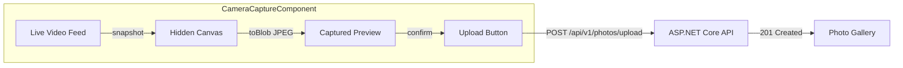
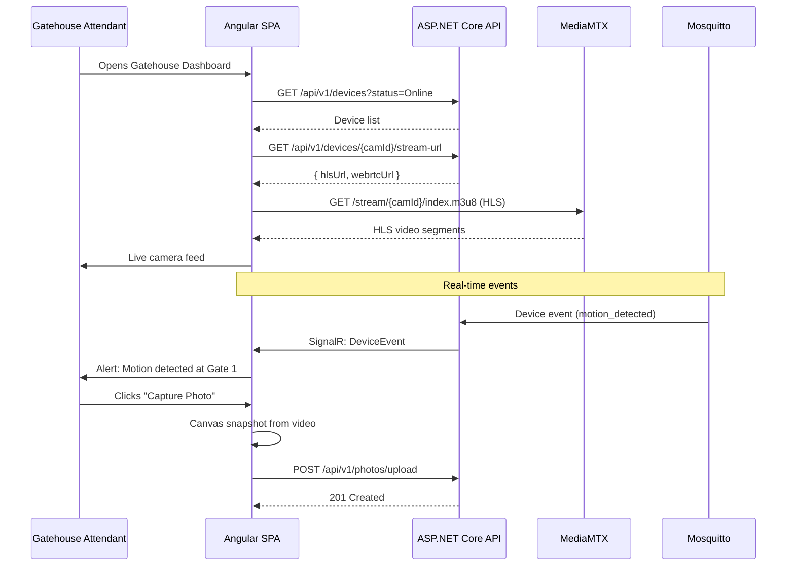

# Frontend Design — Photo Capture & Hardware Integration

> This document contains the Angular SPA design sections to be merged into `design.md`. It covers photo capture/display, hardware dashboard, and real-time event components.

## Frontend Architecture

### Module Structure

Two new lazy-loaded Angular feature modules are added to the existing SPA:

```
src/Web/ControlEasyReborn.Web/src/app/
├── photos/
│   ├── photos.module.ts                    # Lazy-loaded at /photos
│   ├── components/
│   │   ├── photo-upload/
│   │   │   ├── photo-upload.component.ts
│   │   │   ├── photo-upload.component.html
│   │   │   └── photo-upload.component.scss
│   │   ├── photo-gallery/
│   │   │   ├── photo-gallery.component.ts
│   │   │   ├── photo-gallery.component.html
│   │   │   └── photo-gallery.component.scss
│   │   ├── photo-viewer/
│   │   │   ├── photo-viewer.component.ts
│   │   │   ├── photo-viewer.component.html
│   │   │   └── photo-viewer.component.scss
│   │   ├── photo-delete-dialog/
│   │   │   └── photo-delete-dialog.component.ts
│   │   ├── camera-capture/
│   │   │   ├── camera-capture.component.ts
│   │   │   ├── camera-capture.component.html
│   │   │   └── camera-capture.component.scss
│   │   └── profile-photo/
│   │       ├── profile-photo.component.ts
│   │       └── profile-photo.component.html
│   ├── services/
│   │   └── photo.service.ts
│   ├── guards/
│   │   └── photo-permission.guard.ts
│   └── models/
│       └── photo.models.ts                 # Auto-generated by ng-openapi-gen
│
├── hardware-integration/
│   ├── hardware-integration.module.ts      # Lazy-loaded at /devices
│   ├── components/
│   │   ├── device-list/
│   │   │   ├── device-list.component.ts
│   │   │   ├── device-list.component.html
│   │   │   └── device-list.component.scss
│   │   ├── device-detail/
│   │   │   ├── device-detail.component.ts
│   │   │   ├── device-detail.component.html
│   │   │   └── device-detail.component.scss
│   │   ├── device-health-indicator/
│   │   │   ├── device-health-indicator.component.ts
│   │   │   └── device-health-indicator.component.html
│   │   ├── device-event-feed/
│   │   │   ├── device-event-feed.component.ts
│   │   │   ├── device-event-feed.component.html
│   │   │   └── device-event-feed.component.scss
│   │   ├── camera-stream-viewer/
│   │   │   ├── camera-stream-viewer.component.ts
│   │   │   ├── camera-stream-viewer.component.html
│   │   │   └── camera-stream-viewer.component.scss
│   │   ├── biometric-enrollment-dialog/
│   │   │   └── biometric-enrollment-dialog.component.ts
│   │   └── gatehouse-dashboard/
│   │       ├── gatehouse-dashboard.component.ts
│   │       ├── gatehouse-dashboard.component.html
│   │       └── gatehouse-dashboard.component.scss
│   ├── services/
│   │   ├── device.service.ts
│   │   ├── device-event-hub.service.ts      # SignalR
│   │   └── stream-url.service.ts
│   ├── guards/
│   │   └── device-permission.guard.ts
│   └── models/
│       └── device.models.ts                 # Auto-generated by ng-openapi-gen
```

### Routing

```typescript
// In app.routes.ts (lazy-loaded)
{
  path: 'photos',
  loadChildren: () => import('./photos/photos.module').then(m => m.PhotosModule),
  canActivate: [AuthGuard, PhotoPermissionGuard]
},
{
  path: 'devices',
  loadChildren: () => import('./hardware-integration/hardware-integration.module')
    .then(m => m.HardwareIntegrationModule),
  canActivate: [AuthGuard, DevicePermissionGuard]
}
```

Photos module routes:
```typescript
// photos.module.ts
{ path: '', component: PhotoGalleryComponent },
{ path: 'upload', component: PhotoUploadComponent },
{ path: ':id', component: PhotoViewerComponent }
```

Hardware Integration module routes:
```typescript
// hardware-integration.module.ts
{ path: '', component: DeviceListComponent },
{ path: ':id', component: DeviceDetailComponent },
{ path: ':id/events', component: DeviceEventFeedComponent },
{ path: 'dashboard', component: GatehouseDashboardComponent }
```

### Photo Capture & Display Components

#### PhotoUploadComponent

- **Purpose:** Upload one or more photos for a given entity (resident, visit, vehicle, service provider).
- **Input:** `entityType: PhotoEntityType`, `entityId: string`, `gatehouseId?: string`, `source?: string`
- **Behavior:**
  - Drag-and-drop zone plus file picker button (accepts `image/jpeg`, `image/png`, `image/webp`).
  - Multi-file upload with individual progress bars (using `HttpClient` with `reportProgress: true`).
  - Preview thumbnails generated client-side via `canvas` before upload.
  - Calls `POST /api/v1/photos/upload` (multipart/form-data) for each file.
  - On success: emits `photoUploaded` event; parent component refreshes gallery.
  - On error: shows `ProblemDetails` error message inline.
- **Responsive:** Full width on mobile, two-column grid on tablet/desktop.

#### CameraCaptureComponent

- **Purpose:** Live webcam capture at the gatehouse for instant photo capture during check-in.
- **Behavior:**
  - Requests camera access via `navigator.mediaDevices.getUserMedia({ video: { facingMode: 'environment' } })`.
  - Displays live video feed in a `<video>` element.
  - "Capture" button triggers `canvas.drawImage(video, ...)` to snapshot the current frame.
  - Converts canvas to `Blob` (JPEG, quality 0.85) and uploads via `PhotoService.upload()`.
  - Shows a "Retake" option before confirming the upload.
  - Falls back to `PhotoUploadComponent` if camera access is denied (tablet without camera, etc.).
- **Gatehouse optimization:** The component is optimized for a 1024x768 tablet in landscape mode. The video feed takes 60% of the screen width; the captured photo preview takes the remaining 40%.



#### PhotoGalleryComponent

- **Purpose:** Display all photos attached to an entity in a responsive grid.
- **Input:** `entityType: PhotoEntityType`, `entityId: string`
- **Behavior:**
  - Calls `PhotoService.listByEntity(entityType, entityId)` on init.
  - Displays thumbnails in a responsive grid (3 columns on desktop, 2 on tablet, 1 on mobile).
  - Each thumbnail is a `small` size (128x128) loaded lazily via `loading="lazy"`.
  - Click on a thumbnail opens `PhotoViewerComponent` in a full-screen dialog.
  - Supports infinite scroll for entities with many photos.
  - Shows "No photos yet" placeholder when empty.

#### PhotoViewerComponent

- **Purpose:** Full-screen photo viewer with zoom, download, and delete actions.
- **Behavior:**
  - Displays the original photo (via presigned URL from MinIO, or `/api/v1/photos/{id}/file` for local storage).
  - Zoom in/out buttons (CSS transform scale).
  - Download button (triggers `window.open(presignedUrl)`).
  - Delete button (opens `PhotoDeleteDialogComponent`).
  - Navigation arrows for gallery browsing.

#### PhotoDeleteDialogComponent

- **Purpose:** Confirmation dialog for photo deletion.
- **Behavior:**
  - Warns: "This photo will be soft-deleted. It will no longer appear in the gallery but can be restored by an administrator."
  - Additional option for LGPD hard-delete (visible only to `TenantAdmin`): "Permanently delete this photo (LGPD/GDPR right to erasure). This action cannot be undone."
  - Calls `DELETE /api/v1/photos/{id}` (soft-delete by default, `?permanent=true` for hard-delete).

#### ProfilePhotoComponent

- **Purpose:** Resident self-upload for their profile photo.
- **Behavior:**
  - Displays current profile photo (or placeholder avatar if none).
  - "Change photo" button opens file picker (single file, `image/jpeg` or `image/png`).
  - Calls `POST /api/v1/residents/{id}/profile-photo`.
  - Replaces the current photo (only one profile photo per resident; uploading a new one soft-deletes the old one).

### Hardware Integration Components

#### DeviceListComponent

- **Purpose:** Table of all devices for the current tenant, with filtering and sorting.
- **Columns:** Vendor, Model, Device Type (icon), Gatehouse, Status (health indicator), Last Heartbeat, Actions (Edit, Delete, View Stream).
- **Filters:** Device type dropdown, Status dropdown, Gatehouse dropdown, Search text.
- **Actions:** "Register Device" button (opens `RegisterDeviceDialogComponent`).

#### DeviceDetailComponent

- **Purpose:** Detailed view of a single device with configuration, health, and event timeline.
- **Sections:**
  - **Overview:** Device info (vendor, model, serial, firmware, IP, MQTT topic prefix).
  - **Health:** `DeviceHealthIndicatorComponent` showing online/offline/degraded status, last heartbeat, uptime percentage.
  - **Configuration:** JSON config editor (for administrators).
  - **Events:** `DeviceEventFeedComponent` showing the last N events.
  - **Camera Stream:** (if `DeviceType === Camera`) `CameraStreamViewerComponent`.

#### DeviceHealthIndicatorComponent

- **Purpose:** Visual health status indicator.
- **Behavior:**
  - Online: green circle with checkmark, "Online" label.
  - Offline: red circle with X, "Offline (last seen X minutes ago)" label.
  - Degraded: yellow circle with warning, "Degraded" label.
  - Maintenance: gray circle, "Maintenance" label.

#### DeviceEventFeedComponent

- **Purpose:** Real-time feed of device events, updated via SignalR.
- **Behavior:**
  - On init, loads last 50 events from `GET /api/v1/devices/{id}/events`.
  - Subscribes to `DeviceEventHubService` for live events (filtered by `deviceId`).
  - Each event shows: timestamp, event type (with icon), payload summary (truncated JSON).
  - Auto-scrolls to latest event unless user has scrolled up.
  - "View Raw JSON" expandable panel for each event.

#### CameraStreamViewerComponent

- **Purpose:** Live camera stream viewer supporting HLS (standard) and WebRTC (low-latency intercom).
- **Behavior:**
  - On init, calls `StreamUrlService.getStreamUrl(deviceId)` to get the stream URL.
  - For HLS streams: uses `<video>` tag with HLS.js library for browsers that don't natively support HLS.
  - For WebRTC streams: uses `RTCPeerConnection` API to connect to MediaMTX WebRTC endpoint.
  - Fullscreen toggle button.
  - Snapshot button (captures current frame to `canvas`, then uploads via `PhotoService`).
  - Error state: "Stream unavailable" with retry button.



#### BiometricEnrollmentDialogComponent

- **Purpose:** Admin-only dialog for enrolling a resident's biometric template on a specific device.
- **Behavior:**
  - Selects a resident (search by name/CPF).
  - Selects a biometric reader device (filtered by `DeviceType = BiometricReader`).
  - Displays LGPD consent text: "Biometric data will be stored encrypted and can be permanently deleted at your request. By proceeding, you confirm the resident has given informed consent."
  - "Enroll" button calls `POST /api/v1/devices/{id}/biometric-templates` with `{ residentId, algorithm }`.
  - Shows enrollment result (success/failure).
  - Only visible to users with `biometrics.enroll` permission.

#### GatehouseDashboardComponent

- **Purpose:** The main dashboard for gatehouse attendants, combining real-time events, camera feeds, and quick actions.
- **Layout (1024x768 tablet):**
  - Left panel (60%): Primary camera feed (`CameraStreamViewerComponent`).
  - Right panel (40%): Real-time event feed (`DeviceEventFeedComponent`).
  - Bottom bar: Quick actions (Register Visit, Capture Photo, Intercom Call).
- **Behavior:**
  - Auto-loads devices assigned to the current gatehouse (from `AttendantProfile.GatehouseId`).
  - Subscribes to SignalR events filtered by gatehouse.
  - Alerts: visual + audio (configurable) for critical events (biometric match/no-match, intercom call).

### Services

#### PhotoService

```typescript
@Injectable({ providedIn: 'root' })
export class PhotoService {
  constructor(private http: HttpClient) {}

  upload(entityType: PhotoEntityType, entityId: string, file: File, options?: {
    gatehouseId?: string; source?: string
  }): Observable<PhotoDto> {
    const formData = new FormData();
    formData.append('file', file);
    formData.append('entityType', String(entityType));
    formData.append('entityId', entityId);
    if (options?.gatehouseId) formData.append('gatehouseId', options.gatehouseId);
    if (options?.source) formData.append('source', options.source);
    return this.http.post<PhotoDto>('/api/v1/photos/upload', formData);
  }

  getById(id: string): Observable<PhotoDetailDto> {
    return this.http.get<PhotoDetailDto>(`/api/v1/photos/${id}`);
  }

  getThumbnail(id: string, size: 'small' | 'medium' | 'large'): Observable<Blob> {
    return this.http.get(`/api/v1/photos/${id}/thumbnails/${size}`, { responseType: 'blob' });
  }

  delete(id: string, permanent = false): Observable<void> {
    const params = permanent ? { permanent: 'true' } : {};
    return this.http.delete<void>(`/api/v1/photos/${id}`, { params });
  }

  listByEntity(entityType: PhotoEntityType, entityId: string, skip = 0, take = 20):
    Observable<IReadOnlyList<PhotoDto>> {
    return this.http.get<IReadOnlyList<PhotoDto>>(`/api/v1/${entityTypePath(entityType)}/${entityId}/photos`, {
      params: { skip: String(skip), take: String(take) }
    });
  }

  uploadProfilePhoto(residentId: string, file: File): Observable<PhotoDto> {
    const formData = new FormData();
    formData.append('file', file);
    return this.http.post<PhotoDto>(`/api/v1/residents/${residentId}/profile-photo`, formData);
  }
}
```

#### DeviceService

```typescript
@Injectable({ providedIn: 'root' })
export class DeviceService {
  constructor(private http: HttpClient) {}

  list(filters: { deviceType?: DeviceType; status?: DeviceStatus; gatehouseId?: string } = {},
       skip = 0, take = 20): Observable<IReadOnlyList<DeviceDto>> {
    const params: Record<string, string> = { skip: String(skip), take: String(take) };
    if (filters.deviceType !== undefined) params.deviceType = String(filters.deviceType);
    if (filters.status !== undefined) params.status = String(filters.status);
    if (filters.gatehouseId) params.gatehouseId = filters.gatehouseId;
    return this.http.get<IReadOnlyList<DeviceDto>>('/api/v1/devices', { params });
  }

  getById(id: string): Observable<DeviceDto> {
    return this.http.get<DeviceDto>(`/api/v1/devices/${id}`);
  }

  register(device: RegisterDeviceRequest): Observable<DeviceDto> {
    return this.http.post<DeviceDto>('/api/v1/devices', device);
  }

  update(id: string, device: UpdateDeviceRequest): Observable<DeviceDto> {
    return this.http.put<DeviceDto>(`/api/v1/devices/${id}`, device);
  }

  delete(id: string): Observable<void> {
    return this.http.delete<void>(`/api/v1/devices/${id}`);
  }

  getEvents(id: string, from?: Date, to?: Date, eventType?: string, skip = 0, take = 50):
    Observable<IReadOnlyList<DeviceEventDto>> {
    const params: Record<string, string> = { skip: String(skip), take: String(take) };
    if (from) params.from = from.toISOString();
    if (to) params.to = to.toISOString();
    if (eventType) params.eventType = eventType;
    return this.http.get<IReadOnlyList<DeviceEventDto>>(`/api/v1/devices/${id}/events`, { params });
  }

  getHealth(id: string): Observable<DeviceHealthDto> {
    return this.http.get<DeviceHealthDto>(`/api/v1/devices/${id}/health`);
  }
}
```

#### DeviceEventHubService (SignalR)

```typescript
@Injectable({ providedIn: 'root' })
export class DeviceEventHubService {
  private hubConnection: HubConnection | null = null;
  private events$ = new Subject<DeviceEventDto>();

  constructor(private auth: AuthService) {}

  connect(tenantId: string): void {
    this.hubConnection = new HubConnectionBuilder()
      .withUrl('/hubs/devices', { accessTokenFactory: () => this.auth.getToken() })
      .withAutomaticReconnect([0, 2000, 5000, 10000, 30000])
      .build();

    this.hubConnection.on(`DeviceEvent_${tenantId}`, (event: DeviceEventDto) => {
      this.events$.next(event);
    });

    this.hubConnection.start().catch(err => console.error('SignalR connection error:', err));
  }

  getEvents(): Observable<DeviceEventDto> {
    return this.events$.asObservable();
  }

  disconnect(): void {
    this.hubConnection?.stop();
    this.hubConnection = null;
  }
}
```

#### StreamUrlService

```typescript
@Injectable({ providedIn: 'root' })
export class StreamUrlService {
  constructor(private http: HttpClient) {}

  getStreamUrl(deviceId: string): Observable<StreamUrlDto> {
    return this.http.get<StreamUrlDto>(`/api/v1/devices/${deviceId}/stream-url`);
  }
}

// StreamUrlDto
interface StreamUrlDto {
  hlsUrl: string;      // e.g., "http://mediamtx:8888/stream/{deviceId}/index.m3u8"
  webrtcUrl?: string;  // e.g., "http://mediamtx:8889/stream/{deviceId}/webrtc"
  streamType: 'hls' | 'webrtc';
}
```

### Permission Guards

```typescript
// photo-permission.guard.ts
@Injectable({ providedIn: 'root' })
export class PhotoPermissionGuard implements CanActivate {
  constructor(private auth: AuthService, private router: Router) {}

  canActivate(route: ActivatedRouteSnapshot): boolean {
    const requiredPermission = route.data['photoPermission'] as string;
    if (this.auth.hasPermission(requiredPermission)) return true;
    this.router.navigate(['/forbidden']);
    return false;
  }
}

// device-permission.guard.ts — similar pattern for devices.read, devices.manage, biometrics.*
```

### Visual Design Notes

All components follow the visual design system from `.specs/2 - visual-design-system/`:
- **Color coding:** Device health uses semantic colors (green = Online, red = Offline, yellow = Degraded, gray = Maintenance).
- **Cards:** Photo gallery uses card layout with 16px border radius, subtle shadow, and 8px padding.
- **Tables:** Device list uses the standard data table pattern with sticky header, alternating row colors, and inline action buttons.
- **Dialogs:** Photo delete and biometric enrollment use the standard dialog pattern with backdrop blur.
- **Responsive breakpoints:**
  - Mobile (< 640px): single column, stacked camera + event feed.
  - Tablet (640px-1024px): two-column layout, camera on left, events on right.
  - Desktop (> 1024px): full gatehouse dashboard layout.
- **Accessibility:** All interactive elements have ARIA labels. Photo gallery supports keyboard navigation (arrow keys). Camera stream has a text-only fallback for screen readers.