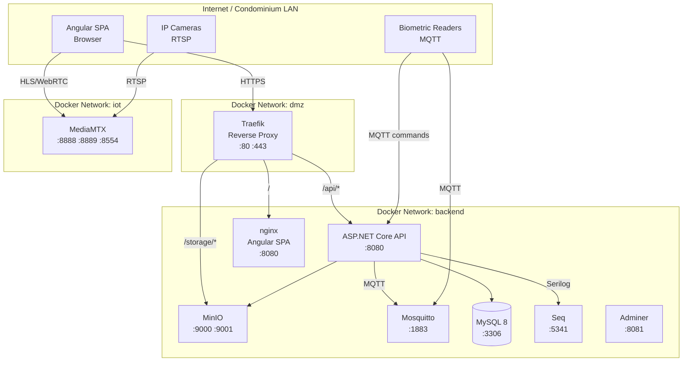
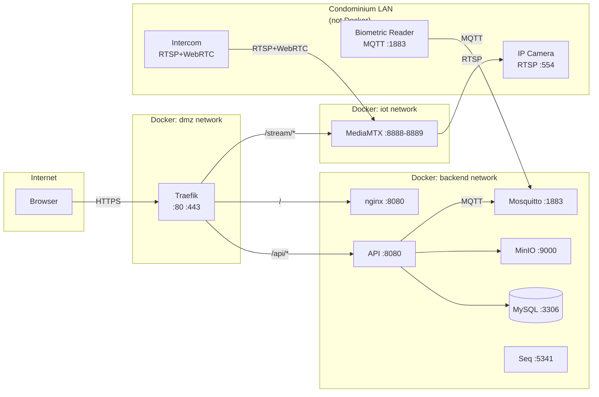

# Infrastructure & Deployment — Photo Capture & Hardware Integration

> This document contains the infrastructure and deployment sections to be merged into `design.md`. It covers Docker Compose production considerations, environment variables, backup, monitoring, security hardening, CI/CD additions, and scaling.

## Docker Compose Production Considerations

### MinIO Configuration

```yaml
# docker/docker-compose.yml — MinIO service
  minio:
    image: minio/minio:latest
    command: server /data --console-address ":9001"
    environment:
      MINIO_ROOT_USER: ${MINIO_ROOT_USER:-minioadmin}
      MINIO_ROOT_PASSWORD: ${MINIO_ROOT_PASSWORD:-minioadmin}
    ports:
      - "9000:9000"   # S3 API
      - "9001:9001"   # Console
    volumes:
      - minio-data:/data
    healthcheck:
      test: ["CMD", "mc", "ready", "local"]
      interval: 5s
      retries: 10
    labels:
      - "traefik.http.routers.minio.rule=Host(`localhost`) && PathPrefix(`/storage`)"
      - "traefik.http.routers.minio.tls=true"
    networks:
      - backend
      - storage
```

**Bucket creation on first boot:** An init container (`minio-init`) runs before the API starts, creates the `controleasy-photos` bucket if it does not exist, and sets a lifecycle policy that transitions objects to a lower-cost storage tier after 90 days (production only):

```yaml
# docker/docker-compose.yml — MinIO init
  minio-init:
    image: minio/mc:latest
    depends_on:
      minio:
        condition: service_healthy
    entrypoint: >
      /bin/sh -c "
      mc alias set myminio http://minio:9000 ${MINIO_ROOT_USER:-minioadmin} ${MINIO_ROOT_PASSWORD:-minioadmin} &&
      mc mb --ignore-existing myminio/controleasy-photos &&
      mc anonymous set none myminio/controleasy-photos
      "
    networks:
      - storage
```

**Volume sizing estimates:**

| Scenario | Residents | Photos per resident | Avg photo size | Thumbnails (3x) | Total (1 year) |
|---|---|---|---|---|---|
| Small condominium | 200 | 3 | 2 MB | 6 MB | 1.8 GB |
| Medium condominium | 500 | 5 | 2 MB | 6 MB | 6 GB |
| Large condominium | 2000 | 5 | 2 MB | 6 MB | 24 GB |
| Enterprise (10 tenants) | 20000 | 5 | 2 MB | 6 MB | 240 GB |

**Recommendation:** Start with a 50 GB volume for small/medium deployments. Configure MinIO erasure coding (4 drives minimum) for production. For enterprise, use MinIO in distributed mode with S3 backend tiering.

### Mosquitto Configuration

```yaml
# docker/docker-compose.yml — Mosquitto service
  mosquitto:
    image: eclipse-mosquitto:2
    ports:
      - "1883:1883"
    volumes:
      - ./mosquitto/mosquitto.conf:/mosquitto/config/mosquitto.conf:ro
      - ./mosquitto/passwd:/mosquitto/passwd:ro
      - mosquitto-data:/mosquitto/data
    healthcheck:
      test: ["CMD", "mosquitto_pub", "-h", "localhost", "-t", "health", "-m", "ok", "-u", "${MQTT_USERNAME}", "-P", "${MQTT_PASSWORD}"]
      interval: 10s
      retries: 5
    networks:
      - backend
      - iot
```

**Mosquitto config (`docker/mosquitto/mosquitto.conf`):**

```conf
# docker/mosquitto/mosquitto.conf
listener 1883
allow_anonymous false
password_file /mosquitto/passwd
persistence true
persistence_location /mosquitto/data
autosave_interval 1800
max_keepalive 60

# TLS for production (uncomment and mount certs)
# listener 8883
# cafile /mosquitto/certs/ca.crt
# certfile /mosquitto/certs/server.crt
# keyfile /mosquitto/certs/server.key
# require_certificate false
```

**ACL per tenant topic:**

```
# docker/mosquitto/acl
user controleasy-api
topic readwrite controleasy/+/devices/+/events/#
topic readwrite controleasy/+/devices/+/commands/#
topic readwrite controleasy/+/devices/+/heartbeat
topic readwrite controleasy/+/devices/+/status

user device-*
topic write controleasy/+/devices/+/events/#
topic write controleasy/+/devices/+/heartbeat
topic read controleasy/+/devices/+/commands/#
```

**Password file generation (dev):**

```bash
# docker/mosquitto/generate-passwd.sh
mosquitto_passwd -c -b passwd controleasy-api ${MQTT_PASSWORD}
mosquitto_passwd -b passwd device-gate-1 ${DEVICE_PASSWORD}
```

### MediaMTX Configuration

```yaml
# docker/docker-compose.yml — MediaMTX service
  mediamtx:
    image: bluenviron/mediamtx:latest
    ports:
      - "8554:8554"   # RTSP
      - "8888:8888"   # HLS
      - "8889:8889"   # WebRTC
    environment:
      MTX_PROTOCOLS: "hls,webrtc"
      MTX_LOGLEVEL: info
    volumes:
      - ./mediamtx/mediamtx.yml:/mediamtx/mediamtx.yml:ro
    networks:
      - backend
      - iot        # connects to cameras on the IoT network
```

**MediaMTX config (`docker/mediamtx/mediamtx.yml`):**

```yaml
# docker/mediamtx/mediamtx.yml
protocols:
  hls: true
  webrtc: true

hlsAddress: :8888
webrtcAddress: :8889
rtspAddress: :8554

# Camera paths are configured dynamically via API
# Example: POST /v2/config/paths/add/{deviceId}
# with source: rtsp://camera-ip:554/stream

paths:
  # Default path for API-configured streams
  "~^stream_(.+)$":
    source: publisher
    sourceOnDemand: true

api: true
apiAddress: :9997
```

### Network Topology



**Network isolation:**
- `dmz` network: Only Traefik. Routes traffic to `backend` and `iot`.
- `backend` network: API, Web, MinIO, Mosquitto, MySQL, Seq, Adminer. No direct internet access.
- `iot` network: MediaMTX and Mosquitto. Cameras and readers connect here. The `backend` network bridges to `iot` via the API's MQTT client and MediaMTX's RTSP source configuration.
- Cameras are on the condominium's physical LAN, not on the Docker network. They are accessed via their RTSP URLs, which are stored in `Devices.ConfigJson` and configured in MediaMTX via its API.

## Environment Variables & Secrets

### New Environment Variables

| Variable | Description | Default (dev) | Required |
|---|---|---|---|
| `Storage__Provider` | Photo storage backend (`Local` or `Minio`) | `Local` | Yes |
| `Storage__LocalFileStorage__BasePath` | Local filesystem path for photos | `./data/photos` | If `Storage:Provider=Local` |
| `Storage__Minio__Endpoint` | MinIO endpoint | `minio:9000` | If `Storage:Provider=Minio` |
| `Storage__Minio__AccessKey` | MinIO access key | `${MINIO_ROOT_USER}` | If `Storage:Provider=Minio` |
| `Storage__Minio__SecretKey` | MinIO secret key | `${MINIO_ROOT_PASSWORD}` | If `Storage:Provider=Minio` |
| `Storage__Minio__BucketName` | MinIO bucket name | `controleasy-photos` | If `Storage:Provider=Minio` |
| `Storage__Minio__UseSsl` | Use TLS for MinIO | `false` (dev), `true` (prod) | If `Storage:Provider=Minio` |
| `Mqtt__BrokerHost` | MQTT broker hostname | `mosquitto` | Yes |
| `Mqtt__BrokerPort` | MQTT broker port | `1883` | Yes |
| `Mqtt__Username` | MQTT API username | `${MQTT_USERNAME}` | Yes |
| `Mqtt__Password` | MQTT API password | `${MQTT_PASSWORD}` | Yes |
| `Mqtt__ClientIdPrefix` | MQTT client ID prefix | `controleasy-api-` | Yes |
| `Biometric__MasterKeyBase64` | AES-256-GCM master key (Base64) | — | Yes |
| `DeviceHealth__HeartbeatTimeoutSeconds` | Seconds before device is Offline | `60` | No |
| `DeviceHealth__DegradedThresholdSeconds` | Seconds before device is Degraded | `180` | No |
| `DeviceHealth__CheckIntervalSeconds` | Health check interval | `30` | No |
| `MediaMtx__HlsBaseUrl` | MediaMTX HLS base URL | `http://mediamtx:8888` | Yes |
| `MediaMtx__WebrtcBaseUrl` | MediaMTX WebRTC base URL | `http://mediamtx:8889` | Yes |
| `MINIO_ROOT_USER` | MinIO root user | `minioadmin` | Yes |
| `MINIO_ROOT_PASSWORD` | MinIO root password | — | Yes |
| `MQTT_USERNAME` | Mosquitto API username | `controleasy-api` | Yes |
| `MQTT_PASSWORD` | Mosquitto API password | — | Yes |

### Secrets Management

**Development:** All secrets are in `docker/.env` (gitignored). The `.env.example` file lists all required variables with placeholder values.

**Production:** Secrets are injected via Docker secrets or a vault:

```yaml
# docker-compose.prod.yml
services:
  api:
    secrets:
      - biometric_master_key
      - minio_root_password
      - mqtt_password
      - jwt_signing_key
      - mysql_password
    environment:
      Biometric__MasterKeyBase64: /run/secrets/biometric_master_key
      Storage__Minio__SecretKey: /run/secrets/minio_root_password
      Mqtt__Password: /run/secrets/mqtt_password
      Jwt__SigningKey: /run/secrets/jwt_signing_key
      Db__Password: /run/secrets/mysql_password

secrets:
  biometric_master_key:
    external: true
  minio_root_password:
    external: true
  mqtt_password:
    external: true
  jwt_signing_key:
    external: true
  mysql_password:
    external: true
```

### Biometric Key Rotation Procedure

1. Generate a new AES-256-GCM key: `openssl rand -base64 32`.
2. Update `Biometric__MasterKeyBase64` in the vault/Docker secret.
3. Deploy a new API version that reads both old and new keys (dual-key window).
4. Run the `BiometricKeyRotationService` background service, which:
   - Reads all `BiometricTemplates` with `EncryptionVersion = 'v1'`.
   - Decrypts with the old key, re-encrypts with the new key.
   - Updates `EncryptionVersion = 'v2'` and `TemplateEncrypted` atomically.
5. Once all templates are on `v2`, remove the old key from the vault.
6. Total downtime: zero. The rotation service processes templates in batches of 100.

## Backup & Recovery

### MinIO Bucket Backup

- **Versioning:** Enable MinIO bucket versioning (`mc version enable myminio/controleasy-photos`). Each photo write creates a new version; deletes create a delete marker. Versions are retained for 30 days, then pruned by lifecycle policy.
- **Lifecycle:** Objects older than 90 days transition to a lower-cost tier (if using S3 backend) or are replicated to a cold storage bucket.
- **Backup to S3:** For production, configure MinIO site replication (`mc admin bucket replicate`) to an off-site S3-compatible bucket (e.g., AWS S3, Wasabi).

```bash
# Enable versioning and lifecycle
mc version enable myminio/controleasy-photos
mc ilm rule add myminio/controleasy-photos --transition-days 90 --transition-tier "COLD"
mc ilm rule add myminio/controleasy-photos --noncurrent-version-expiration-days 30
```

- **Recovery:** If MinIO data is lost, restore from the S3 replica. If a single photo is accidentally deleted, use MinIO versioning to restore the previous version via `mc undo`.

### MySQL Backup Additions

The nightly per-tenant `mysqldump` (from `.specs/1 - modernization-roadmap/design.md`) is extended to include the new tables:

```bash
# The existing tenant backup script now includes:
mysqldump --where="tenant_id='<guid>'" controleasydb Photos Thumbnails Devices DeviceEvents BiometricTemplates >> tenants/<slug>/<date>.sql
```

### Mosquitto Persistent Sessions

Mosquitto data (persistent sessions, retained messages) is stored in the `mosquitto-data` Docker volume. This volume is included in the nightly backup script:

```bash
# Backup Mosquitto data
docker cp controleasy-mosquitto-1:/mosquitto/data /backup/mosquitto-data/
```

### Recovery Procedures

| Scenario | Recovery |
|---|---|
| MinIO single-node failure | Restart container; data is on the persistent volume. |
| MinIO data corruption | Restore from S3 replica using `mc mirror`. |
| MySQL data loss | Restore from nightly `mysqldump` per tenant. |
| Mosquitto failure | Restart container; MQTT clients (hardware devices) reconnect automatically with clean session. |
| MediaMTX failure | Restart container; camera streams reconnect automatically. No persistent data in MediaMTX. |
| Biometric key compromise | Rotate key using the procedure above. All templates are re-encrypted. |

## Monitoring & Alerting

### MinIO Health Checks & Storage Alerts

- MinIO exposes `/minio/health/live` and `/minio/health/ready` endpoints.
- Traefik health check: `curl -f http://minio:9000/minio/health/live`.
- Storage alert: configure MinIO notification target (`mc admin config set myminio notify_webhook`) to POST to the API when storage usage exceeds 80%.
- Seq log sink: MinIO access logs are forwarded to Seq via the API's Serilog enrichment.

### Mosquitto Connection Metrics

- Mosquitto exposes `$SYS/broker/clients/connected`, `$SYS/broker/messages/received`, `$SYS/broker/messages/sent` topics.
- The API subscribes to these system topics and logs connection counts to Seq every 60 seconds.
- Alert: if `clients/connected` drops below the expected number of devices, log a warning.

### Device Health Monitoring Dashboard

The `DeviceHealthMonitorService` (background service) checks device heartbeats every 30 seconds. Devices that miss their heartbeat window (default 60 seconds) are transitioned to `Offline`. Devices with intermittent heartbeats (missed 2 out of 3) are transitioned to `Degraded`.

- **Dashboard:** Angular `GatehouseDashboardComponent` shows device health status in real-time via SignalR.
- **Alert thresholds:** Configurable in `appsettings.json` (`DeviceHealth:HeartbeatTimeoutSeconds`, `DeviceHealth:DegradedThresholdSeconds`).
- **Email/notification alerts:** Future spec (out of scope for v1).

### Photo Upload Pipeline Monitoring

- Upload failures are logged to Seq with structured properties: `PhotoId`, `EntityType`, `EntityId`, `StorageProvider`, `ErrorMessage`.
- Thumbnail generation failures are logged similarly.
- `GET /health` endpoint includes MinIO connectivity check (if `Storage:Provider=Minio`) and Mosquitto connectivity check.

## Security Hardening

### MinIO

- **TLS:** Production MinIO must use TLS. Configure `MINIO_CERT_FILE` and `MINIO_KEY_FILE` environment variables pointing to Traefik-generated Let's Encrypt certs.
- **Bucket policies:** The `controleasy-photos` bucket policy denies anonymous access. Only the `controleasy-api` service account has read/write access. Presigned URLs are the only mechanism for the Angular SPA to access photos directly.
- **IAM per tenant:** Future consideration — per-tenant MinIO access keys. In v1, all tenants share one bucket with `tenant_id` prefix paths and presigned URL expiry (15 minutes).

### Mosquitto

- **TLS:** Production Mosquitto must use TLS. Mount certs via Docker volume.
- **Authentication:** Username/password file (`mosquitto/passwd`). In v1, one API user and one device user per gatehouse. In production, consider certificate-based authentication for devices.
- **ACL:** Per-tenant topic prefix `controleasy/{tenant_id}/devices/...`. Devices can only publish to their own topic. The API can read/write all topics.
- **Network:** Mosquitto is on the `iot` and `backend` networks. It is NOT exposed to the internet. Only the API and hardware devices (on the condominium LAN) can connect.

### MediaMTX

- **RTSP authentication:** Camera RTSP sources are configured with username/password in `Devices.ConfigJson`. MediaMTX passes these credentials to the camera when connecting.
- **HLS/WebRTC CORS:** MediaMTX is configured with CORS headers allowing only the Angular SPA's origin (`https://localhost` in dev, the production domain in prod).
- **Network:** MediaMTX is on the `iot` network. It connects to cameras on the condominium LAN via RTSP. The Angular SPA accesses HLS/WebRTC through Traefik reverse proxy.

### Biometric Key Storage

- The AES-256-GCM master key is stored as a Docker secret (`biometric_master_key`) or injected from a vault (AWS Secrets Manager, HashiCorp Vault).
- **Never** in `appsettings.json`, `.env`, or any committed file.
- **Never** logged by the application.
- **Rotation:** See "Biometric Key Rotation Procedure" above.

### Network Segmentation



**Key principle:** The condominium LAN (cameras, readers) is on a separate physical network from the internet. Traefik is the only entry point from the internet. MediaMTX connects to cameras via RTSP over the LAN, not over the internet.

## CI/CD Additions

### GitHub Actions Steps

```yaml
# .github/workflows/ci.yml — additions for Photos and HardwareIntegration

jobs:
  build:
    steps:
      # ... existing steps ...

      - name: Test Photos Module
        run: dotnet test src/Modules/Photos/ControlEasyReborn.Modules.Photos.Tests/

      - name: Test HardwareIntegration Module
        run: dotnet test src/Modules/HardwareIntegration/ControlEasyReborn.Modules.HardwareIntegration.Tests/

      - name: Integration Tests (MinIO)
        run: dotnet test tests/ControlEasyReborn.IntegrationTests/ --filter "FullyQualifiedName~Photos"
        env:
          Storage__Provider: Minio
          Storage__Minio__Endpoint: localhost:9000
          MINIO_ROOT_USER: minioadmin
          MINIO_ROOT_PASSWORD: minioadmin

      - name: Integration Tests (Mosquitto)
        run: dotnet test tests/ControlEasyReborn.IntegrationTests/ --filter "FullyQualifiedName~HardwareIntegration"
        env:
          Mqtt__BrokerHost: localhost
          Mqtt__BrokerPort: 1883
          Mqtt__Username: test
          Mqtt__Password: test

  docker:
    steps:
      # ... existing steps ...

      - name: Build API image (includes Photos + HardwareIntegration modules)
        run: docker build -f docker/api.Dockerfile -t controleasy-api:latest .

      - name: Push MinIO init container
        run: docker build -f docker/minio-init.Dockerfile -t controleasy-minio-init:latest .

      - name: Smoke Test (Photos)
        run: |
          curl -k -X POST https://localhost/api/v1/photos/upload \
            -H "Authorization: Bearer $TOKEN" \
            -F "file=@test-photo.jpg" \
            -F "entityType=1" \
            -F "entityId=00000000-0000-0000-0000-000000000001"
```

### Testcontainers Additions

```csharp
// tests/ControlEasyReborn.IntegrationTests/PhotosIntegrationTests.cs
public class PhotosIntegrationTests : IClassFixture<MinioFixture>, IClassFixture<TenantAwareWebApplicationFactory>
{
    // Uses Testcontainers.Minio for real MinIO container
    // Tests: upload, retrieve, thumbnail, delete, cross-tenant access
}

// tests/ControlEasyReborn.IntegrationTests/DeviceIntegrationTests.cs
public class DeviceIntegrationTests : IClassFixture<MosquittoFixture>, IClassFixture<TenantAwareWebApplicationFactory>
{
    // Uses Testcontainers for real MySQL + Mosquitto containers
    // Tests: register device, publish event via MQTT, verify DeviceEvents row
}
```

## Scaling Considerations

| Component | Scaling Strategy |
|---|---|
| **MinIO** | Horizontal scaling with erasure coding (minimum 4 drives). For single-node dev, single-disk mode is sufficient. Production: distributed MinIO with server pool. |
| **Mosquitto** | Development: single node. Production: Mosquitto cluster (bridge mode) or migrate to HiveMQ / EMQX for high availability. The `IDeviceEventPublisher` abstraction means the broker can be swapped without code changes. |
| **MediaMTX** | Deploy one MediaMTX instance per gatehouse (edge computing). Each instance handles cameras local to that gatehouse. The API configures streams per-device via MediaMTX's REST API. |
| **Photo thumbnail generation** | Synchronous in v1 (acceptable for < 100 concurrent uploads). If throughput becomes an issue, introduce a background `IHostedService` with `Channel<ThumbnailJob>` that processes thumbnails asynchronously. |
| **DeviceEvents table** | Partition by month for high-volume deployments: `ALTER TABLE DeviceEvents PARTITION BY RANGE (TO_DAYS(IngestedAtUtc))`. Or, for PostgreSQL future compatibility, use table partitioning by `IngestedAtUtc`. |
| **API instances** | Scale horizontally behind Traefik. MinIO and Mosquitto are stateful; the API is stateless (JWT-based auth, no sticky sessions). SignalR uses Redis backplane for multi-instance message fan-out. |
| **SignalR** | For multi-instance API, add Redis backplane: `builder.Services.AddSignalR().AddStackExchangeRedis(redisConnectionString)`. This ensures device events are broadcast to all connected clients regardless of which API instance they are connected to. |