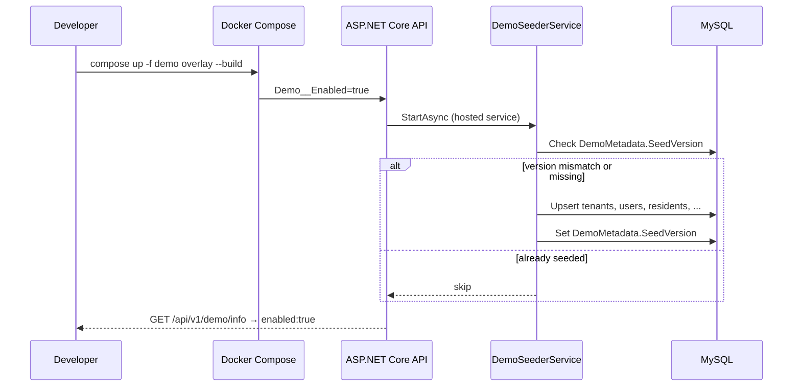

# Design — Demo Mode

## Overview

Demo Mode is a **cross-cutting, opt-in deployment profile** for ControlEasy Reborn. When enabled, the API seeds two condominiums with curated fixtures, suppresses random bootstrap credentials, exposes demo metadata endpoints, and the Angular SPA shows demo-specific UI affordances (banner, login shortcuts, help page).

Demo Mode does **not** introduce a new business module with domain aggregates. It adds:

- Configuration (`DemoOptions`)
- A startup seeder (`DemoSeederService`)
- Two Minimal API endpoints under `/api/v1/demo/`
- A Docker Compose overlay (`docker-compose.demo.yml`)
- Frontend services and components gated on `demo.enabled`

## Glossary

| Term | Meaning |
|---|---|
| **Demo Mode** | Runtime profile activated by `Demo__Enabled=true`. Triggers seeding, UI banner, and guardrails. |
| **Demo persona** | A pre-seeded `User` with a fixed email/password representing a role (PlatformAdmin, TenantAdmin, etc.). |
| **Demo tenant** | A pre-seeded `Tenant` row with **`demo-`** slug prefix and **`[Demo]`** display-name prefix (e.g. `demo-aurora`, `[Demo] Residencial Aurora`). |
| **Demo seed version** | Integer in `DemoMetadata.SeedVersion`; bump to force re-seed on next startup. |
| **Compose overlay** | `docker-compose.demo.yml` merged with base `docker-compose.yml` via `-f` flag. |

## Architecture

### Activation flow



### Configuration

`appsettings.json` (defaults — demo off):

```json
{
  "Demo": {
    "Enabled": false,
    "SeedVersion": 1,
    "DisableOutboundEmail": false
  }
}
```

Environment variables (Docker Compose style):

| Variable | Demo overlay value | Purpose |
|---|---|---|
| `Demo__Enabled` | `true` | Master switch |
| `Demo__SeedVersion` | `1` | Bump to re-seed |
| `Demo__DisableOutboundEmail` | `true` | Block SMTP/notifications |
| `FeatureManagement__Residents__UseWeb` | `true` | Enable all web modules |
| `FeatureManagement__Visits__UseWeb` | `true` | (same pattern for each flag) |
| `Jwt__SigningKey` | documented dev key | Predictable local demo only |

### Backend components

#### `DemoOptions`

```csharp
public sealed class DemoOptions
{
    public const string SectionName = "Demo";
    public bool Enabled { get; init; }
    public int SeedVersion { get; init; } = 1;
    public bool DisableOutboundEmail { get; init; }
}
```

Registered via `services.Configure<DemoOptions>(configuration.GetSection(DemoOptions.SectionName))`.

#### `PlatformAdminBootstrapService` suppression

When `DemoOptions.Enabled == true`, do **not** register `PlatformAdminBootstrapService`. The demo seeder creates `platform@controleasy.app` instead.

#### `DemoSeederService : IHostedService`

Location: `src/BuildingBlocks/ControlEasyReborn.Infrastructure/Demo/DemoSeederService.cs`

Responsibilities:

1. Exit immediately if `DemoOptions.Enabled` is false.
2. Read `DemoMetadata` (single-row table) for `SeedVersion`.
3. If `SeedVersion >= DemoOptions.SeedVersion`, log and return.
4. Within a transaction (via `IAsyncSqlClient`):
   - Upsert two tenants (fixed GUIDs — see table below).
   - Upsert five users with BCrypt password hash for `demo123`.
   - Upsert `AttendantProfile`, `Shift`, `Gatehouse` rows for `demo-aurora`.
   - Insert **61 residents** (`demo-aurora`) and 6 residents (`demo-parque-verde`) from curated fixture `DemoFixtures.Residents` (Chaves / GTA / God of War **Greek era + Atreus** roster). Multiple resident rows may reference the same `ApartmentId` per cohabitation rules.
   - Insert sample visits, vehicles, service providers (minimum viable rows per module schema).
   - Rewrite `lastVisitAt` / activity timestamps relative to `DateTime.UtcNow`.
   - Upsert `DemoMetadata` with current `SeedVersion`.
5. Log structured info: `"Demo seed complete. Version={SeedVersion}. Tenants=demo-aurora,demo-parque-verde"`.

**Naming convention:** Every demo condominium tenant must use:
- **Slug:** `demo-{name}` (kebab-case, max 32 chars per schema).
- **DisplayName:** `[Demo] {name}` (human-readable condominium name after the prefix).

**Fixed tenant GUIDs** (stable across re-seeds):

| Tenant | Id | Slug | DisplayName |
|---|---|---|---|
| Platform (system) | `00000000-0000-0000-0000-000000000001` | `platform` | Platform |
| Demo — Aurora | `00000000-0000-0000-0000-000000000010` | `demo-aurora` | `[Demo] Residencial Aurora` |
| Demo — Parque Verde | `00000000-0000-0000-0000-000000000020` | `demo-parque-verde` | `[Demo] Condomínio Parque Verde` |

#### `DemoFixtures`

Static C# class with the canonical **thematic resident roster** below. Each row includes `Name`, `Franchise`, `Block`, `Apartment`, `Status` (maps to `Active` + audit flags in the domain), fake CPF, and optional phone/email. Blocks are franchise-themed:

| Block | Franchise | Theme label (gatehouse UI) |
|---|---|---|
| **A** | Chaves (*Chavo del Ocho*) | Vila das Flores |
| **B** | GTA | Los Santos |
| **C** | God of War (*Greek era* — GoW I–III) | Olympus |
| **D** | Crossover / premium units | Pantheon Suite |

Keeps SQL init script small; dynamic visit timestamps handled in C#.

**Cohabitation rules (canonical for seeding):**

- **Chaves:** Characters who share a home in *Chaves* / *El Chavo del Ocho* must share the same `Apartment` value in `DemoFixtures`. Implementers map each distinct apartment to an `Apartment` entity; multiple resident rows reference the same `ApartmentId`.
  - **Barril** — Chaves (barrel in the courtyard; solo).
  - **8** — Dona Florinda, Quico, Prof. Girafales (Florinda’s apartment; Girafales is always there).
  - **14** — Seu Madruga, Chilindrina, Chiquinha (Madruga household).
  - **1** — Sr. Barriga (landlord; solo).
  - **18** — Maruxa, Serafim (elderly couple).
  - **7** — Jaça, Pingüinos (neighbourhood kids’ hangout).
  - All other Chaves characters listed below have their **own** apartment number.
- **God of War (Greek era + Atreus):** Same rule — shared mythic household = same apartment.
  - **Sparta-1** — Kratos, **Atreus**, Deimos, Callisto (Spartan family home; **Atreus** is the explicit exception to the Norse-era ban).
  - **Underworld-1** — Hades, Persephone.
  - **Olympus-3** — Ares, Aphrodite (Olympian wing).
  - Other Greek figures keep solo apartments unless noted in the roster.

##### Demo resident roster — `[Demo] Residencial Aurora` (61 rows, tenant `demo-aurora`)

**Distribution:** 20 Chaves + 20 GTA + 21 God of War (Greek era + Atreus) = **61 residents**.

| # | Name | Franchise | Block | Apt | Status |
|---|---|---|---|---|---|
| 1 | Chaves | Chaves | A | Barril | active |
| 2 | Dona Florinda | Chaves | A | 8 | active |
| 3 | Quico | Chaves | A | 8 | active |
| 4 | Prof. Girafales | Chaves | A | 8 | active |
| 5 | Seu Madruga | Chaves | A | 14 | overdue |
| 6 | Chilindrina | Chaves | A | 14 | active |
| 7 | Chiquinha | Chaves | A | 14 | active |
| 8 | Sr. Barriga | Chaves | A | 1 | pending |
| 9 | Popis | Chaves | A | 11 | active |
| 10 | Paty | Chaves | A | 10 | inactive |
| 11 | Godinez | Chaves | A | 12 | pending |
| 12 | Jaça | Chaves | A | 7 | active |
| 13 | Pingüinos | Chaves | A | 7 | active |
| 14 | Jaiminho | Chaves | A | Correios | active |
| 15 | Dona Neves | Chaves | A | 15 | pending |
| 16 | Gloria | Chaves | A | 16 | active |
| 17 | Botija | Chaves | A | 17 | inactive |
| 18 | Maruxa | Chaves | A | 18 | active |
| 19 | Serafim | Chaves | A | 18 | overdue |
| 20 | Pelón | Chaves | A | 13 | active |
| 21 | Michael De Santa | GTA | B | 101 | active |
| 22 | Franklin Clinton | GTA | B | 102 | active |
| 23 | Trevor Philips | GTA | B | 103 | overdue |
| 24 | CJ | GTA | B | 201 | active |
| 25 | Tommy Vercetti | GTA | B | 202 | active |
| 26 | Niko Bellic | GTA | B | 203 | pending |
| 27 | Lamar Davis | GTA | B | 301 | active |
| 28 | Lester Crest | GTA | B | 302 | inactive |
| 29 | Roman Bellic | GTA | B | 303 | active |
| 30 | Sweet Johnson | GTA | B | 401 | active |
| 31 | Amanda De Santa | GTA | B | 104 | active |
| 32 | Lucia De Santa | GTA | B | 105 | active |
| 33 | Wade | GTA | B | 204 | active |
| 34 | Stretch | GTA | B | 205 | overdue |
| 35 | Big Smoke | GTA | B | 304 | active |
| 36 | Ryder | GTA | B | 305 | pending |
| 37 | Tenpenny | GTA | B | 402 | inactive |
| 38 | Woozie | GTA | B | 403 | active |
| 39 | Lance Vance | GTA | B | 404 | active |
| 40 | Ken Rosenberg | GTA | B | 405 | pending |
| 41 | Kratos | God of War (Greek) | C | Sparta-1 | active |
| 42 | Atreus | God of War (Greek) | C | Sparta-1 | active |
| 43 | Deimos | God of War (Greek) | C | Sparta-1 | active |
| 44 | Callisto | God of War (Greek) | C | Sparta-1 | inactive |
| 45 | Athena | God of War (Greek) | C | Olympus-2 | active |
| 46 | Ares | God of War (Greek) | C | Olympus-3 | inactive |
| 47 | Aphrodite | God of War (Greek) | C | Olympus-3 | pending |
| 48 | Hephaestus | God of War (Greek) | C | Forge-1 | active |
| 49 | Hermes | God of War (Greek) | C | Olympus-4 | overdue |
| 50 | Hades | God of War (Greek) | C | Underworld-1 | active |
| 51 | Persephone | God of War (Greek) | C | Underworld-1 | active |
| 52 | Poseidon | God of War (Greek) | C | Sea-1 | active |
| 53 | Helios | God of War (Greek) | C | Sun-1 | active |
| 54 | Perseus | God of War (Greek) | C | Hero-1 | inactive |
| 55 | Theseus | God of War (Greek) | C | Hero-2 | active |
| 56 | Hercules | God of War (Greek) | C | Hero-3 | active |
| 57 | Orpheus | God of War (Greek) | C | Hero-4 | active |
| 58 | Pandora | God of War (Greek) | C | Hero-5 | pending |
| 59 | Gaia | God of War (Greek) | C | Titan-1 | overdue |
| 60 | Cronos | God of War (Greek) | C | Titan-2 | pending |
| 61 | Zeus | God of War (Greek) | D | Pantheon-601 | inactive |

**Status → domain mapping:** `active` → `Active=true`; `inactive` → `Active=false`; `pending` / `overdue` → `Active=true` with a `ResidentStatus` tag or visit flag used by the UI badge (same four tones as the design-system mockup).

##### Demo resident roster — `[Demo] Condomínio Parque Verde` (6 rows, tenant `demo-parque-verde`)

Smaller secondary set (characters **not** duplicated in the Aurora 60) so the multi-tenant picker still shows themed data:

| # | Name | Franchise | Block | Apt | Status |
|---|---|---|---|---|---|
| 1 | Rogelio | Chaves | A | 110 | active |
| 2 | Úrsulo | Chaves | A | 111 | active |
| 3 | Denise | GTA | B | 210 | active |
| 4 | Mallorie | GTA | B | 211 | pending |
| 5 | Eurydice | God of War (Greek) | C | 310 | active |
| 6 | Charon | God of War (Greek) | C | 311 | inactive |

##### Recent activity (thematic, timestamps relative to `UtcNow`)

| Actor | Action summary | Badge |
|---|---|---|
| Chaves | pre-registered a visit for **Seu Madruga** on Sunday at 14:00 | Pre-register |
| Franklin Clinton | delivered a package to **Michael De Santa** at Block B, apt 101 | Check-out |
| Deimos | was added as a new resident of **Apartment Sparta-1** | New |

**God of War roster rule:** Block C/D characters must come from the **Greek era** (*God of War*, *God of War II*, *God of War III*, and related titles). **Atreus** is explicitly included and co-dwells with Kratos at **Sparta-1**. Other Norse-era characters (Freya, Baldur, Mimir, Brok, Sindri, Thor, Odin, etc.) remain **excluded**.

**Seeder verification (cohabitation):** Integration tests must assert that Dona Florinda, Quico, and Prof. Girafales share one `ApartmentId`; Seu Madruga, Chilindrina, and Chiquinha share another; Kratos and Atreus share **Sparta-1**.

Implementers must not substitute generic Brazilian names, split canonical Chaves households across apartments, or swap in Norse-era God of War characters (except **Atreus**); the roster above is the contract.

#### Database: `DemoMetadata` table

Add to `docker/mysql/init/10-demo-metadata.sql`:

```sql
CREATE TABLE IF NOT EXISTS DemoMetadata (
    Id           INT          NOT NULL PRIMARY KEY DEFAULT 1,
    SeedVersion  INT          NOT NULL DEFAULT 0,
    SeededAtUtc  DATETIME(6)  NOT NULL,
    CHECK (Id = 1)
) ENGINE=InnoDB;
```

`DemoMetadata` is a **platform table** (no `tenant_id`). Listed in backfill exemption list in architecture tests.

Optional static seed in `docker/mysql/init/11-demo-seed.sql` for CI/Testcontainers that boot without running the hosted seeder — kept minimal (tenants + users only); full fixture via `DemoSeederService`.

### API endpoints

| Method | Route | Auth | Behaviour |
|---|---|---|---|
| `GET` | `/api/v1/demo/info` | Anonymous | Returns `{ "enabled": bool, "seedVersion": int, "tenants": [{ "slug", "displayName" }] }`. When disabled: `{ "enabled": false }`. |
| `POST` | `/api/v1/demo/reset` | PlatformAdmin | Demo mode only. Truncates demo tenant business data, re-runs seeder, returns 204. 404 when demo disabled. |

Both return `ProblemDetails` on error.

### Docker Compose overlay

`docker/docker-compose.demo.yml`:

```yaml
services:
  api:
    environment:
      Demo__Enabled: "true"
      Demo__SeedVersion: "1"
      Demo__DisableOutboundEmail: "true"
      FeatureManagement__Residents__UseWeb: "true"
      FeatureManagement__Visits__UseWeb: "true"
      FeatureManagement__Vehicles__UseWeb: "true"
      FeatureManagement__ServiceProviders__UseWeb: "true"
      FeatureManagement__Administration__UseWeb: "true"
      Jwt__SigningKey: demo-signing-key-not-for-production-use!!
  web:
    environment:
      # Optional: build-time flag for demo login shortcuts (or rely on API /demo/info)
      NGINX_ENVSUBST_OUTPUT_DIR: /etc/nginx
```

Documented command:

```bash
docker compose -f docker/docker-compose.yml -f docker/docker-compose.demo.yml up -d --build
```

Full reset:

```bash
docker compose -f docker/docker-compose.yml -f docker/docker-compose.demo.yml down -v
docker compose -f docker/docker-compose.yml -f docker/docker-compose.demo.yml up -d --build
```

### Frontend components

#### `DemoInfoService`

- `src/Web/ControlEasyReborn.Web/src/app/core/services/demo-info.service.ts`
- Fetches `GET /api/v1/demo/info` once at app init.
- Exposes `enabled = signal(false)`, `tenants = signal([])`, `seedVersion = signal(0)`.

#### App shell demo banner

- Component: `DemoBannerComponent` (`ce-demo-banner`)
- Rendered in `AppShellComponent` template when `demoInfo.enabled()`.
- Copy (pt-BR default): *"Modo demonstração — dados de exemplo; alterações podem ser restauradas."*
- Dismissible per session (`sessionStorage['ce.demoBanner.dismissed']`).
- Uses `ce-badge tone-warning` styling.

#### Login demo shortcuts

- Collapsible panel below the login form when `demoInfo.enabled()`.
- Buttons: "Platform Admin", "Administrador", "Porteiro", "Morador", "Multi-condomínio".
- Click fills email (+ password `demo123` in a `readonly` hint); does **not** auto-submit.

#### `/help/demo` route

- Lazy-loaded `DemoHelpPageComponent`.
- Guard: redirect to `/` when demo disabled.
- Content: credential table, 5-step walkthrough, reset instructions, link to `docs/demo-mode.md`.

### Documentation deliverable

`docs/demo-mode.md` (created in task 8.10):

- Quick start (compose command)
- Credential table
- Suggested walkthrough script
- Reset procedures
- Security warning (never use demo JWT key in production)

## Demo personas & credentials

| Email | Password | Role | Tenant(s) |
|---|---|---|---|
| `platform@controleasy.app` | `demo123` | PlatformAdmin | platform |
| `admin@controleasy.app` | `demo123` | TenantAdmin | `[Demo] Residencial Aurora` |
| `porteiro@controleasy.app` | `demo123` | AttendantProfile | `[Demo] Residencial Aurora` |
| `morador@controleasy.app` | `demo123` | Morador | `[Demo] Residencial Aurora` |
| `multi@controleasy.app` | `demo123` | TenantAdmin + Attendant | `[Demo] Residencial Aurora` + `[Demo] Condomínio Parque Verde` → tenant picker |

## Security guardrails

1. Demo endpoints return `404` when `Demo__Enabled=false` (reset) or minimal payload (info).
2. Demo seed runs only when enabled; no demo users exist in non-demo deployments.
3. `Demo__DisableOutboundEmail` prevents accidental mail in demo environments.
4. Documented JWT key is **development/demo only** — production compose must never use the overlay file.
5. `POST /api/v1/demo/reset` is audit-logged when Administration audit module is available.

## Success criteria

1. `docker compose … demo overlay up --build` → all services healthy within 2 minutes.
2. `GET /api/v1/demo/info` → `{ "enabled": true, "seedVersion": 1 }`.
3. Login as `porteiro@controleasy.app` / `demo123` → JWT issued, residents list shows ≥ 61 rows; Florinda/Quico/Girafales share apt **8**; Kratos/Atreus share **Sparta-1**.
4. Login as `multi@controleasy.app` → tenant picker shows `[Demo] Residencial Aurora` and `[Demo] Condomínio Parque Verde`.
5. App shell shows demo banner; `/help/demo` renders credential table.
6. With demo overlay **off**, none of the above demo users exist; random PlatformAdmin bootstrap still works.
7. Cross-tenant test: `demo-aurora` resident invisible to `demo-parque-verde` session (C.6 unchanged).

## Risks

| Risk | Mitigation |
|---|---|
| Seed drift when module schemas change | `Demo__SeedVersion` bump + integration test asserting resident count = 61 for `demo-aurora` and cohabitation groups |
| Demo credentials leaked to production | Overlay file clearly named; CI lint checks `Demo__Enabled` not set in prod workflow |
| Seeder slows startup | Idempotent skip when version matches; seed only on first boot or reset |
