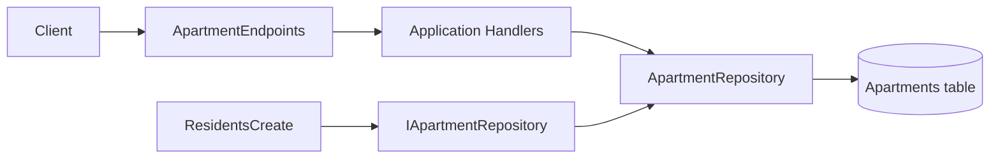
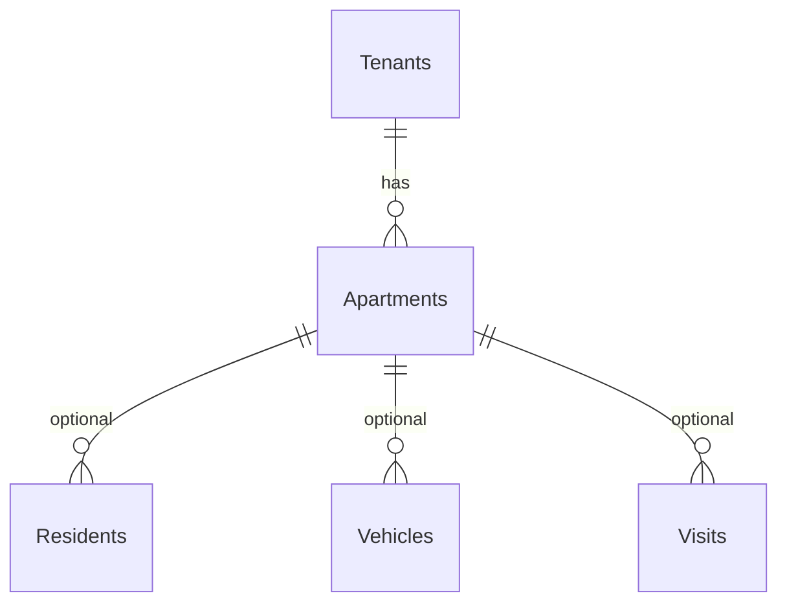

# Design — Apartments module (Phase 1)

## Overview

Residents, vehicles, and visits already store an `ApartmentId` GUID, but no `Apartments` table exists. Demo data derives apartment IDs via `DemoIds.ApartmentId(tenant, block, unit)` without persisted records. Phase 1 introduces a full Apartments vertical slice mirroring the Residents module so the API can manage apartment entities and downstream modules can validate references.

The module follows the existing modular monolith layout: Domain entity, Application handlers/validators, Infrastructure repository via DBTools_SQL, and minimal API endpoints. Tenant isolation uses the shared `ITenantAwareLinqFactory` pattern. Soft deactivation sets `Active = false` on update rather than hard deletes.

Demo seeding inserts distinct block/unit pairs from resident fixtures (and implicit visit/vehicle references) before residents, visits, and vehicles. `Demo__SeedVersion` bumps to `2` so existing demo volumes re-seed.

## Glossary

| Term | Meaning |
|------|---------|
| **Block** | Building tower or section label (e.g. `A`, `B`) |
| **Unit** | Apartment number/name within a block (e.g. `101`, `Sparta-1`) |
| **Soft deactivate** | `Active = false`; row retained for FK-style references |
| **Tenant scope** | Rows filtered by `tenant_id` / `TenantId` via middleware |

## Architecture

Apartments is a self-contained slice under `src/Modules/Apartments/` with four projects (Domain, Application, Infrastructure, Api). The Host registers `AddApartmentsModule()` and maps `/api/v1/apartments` endpoints. `GlobalExceptionHandler` maps Apartments application exceptions to RFC 7807 responses.

Cross-entity validation: `IApartmentRepository.ExistsAsync` is consumed by Residents, Vehicles, and Visits create handlers via an Application-layer project reference (no Infrastructure coupling).



## API Contract Specification

| Method | Path | Auth | Permission (seed) | Success | Errors |
|--------|------|------|-------------------|---------|--------|
| GET | `/api/v1/apartments` | Bearer JWT | `Apartments.Read` | 200 list | 401 |
| GET | `/api/v1/apartments/{id}` | Bearer JWT | `Apartments.Read` | 200 item | 401, 404 |
| POST | `/api/v1/apartments` | Bearer JWT | `Apartments.Write` | 201 created | 400, 401, 409 |
| PUT | `/api/v1/apartments/{id}` | Bearer JWT | `Apartments.Write` | 200 updated | 400, 401, 404, 409 |

**CreateApartmentRequest:** `{ "block": "A", "unit": "14" }`

**UpdateApartmentRequest:** `{ "block": "A", "unit": "14", "active": true }`

**ApartmentResponse:** `{ "id", "tenantId", "block", "unit", "active", "createdAtUtc", "updatedAtUtc" }`

List supports optional `search`, `skip` (default 0), `take` (default 50). Search matches block or unit (LIKE).

Duplicate `(TenantId, Block, Unit)` returns **409 Conflict**.

## Data Model Specification



**Table `Apartments`:**

| Column | Type | Notes |
|--------|------|-------|
| Id | CHAR(36) PK | GUID |
| TenantId | CHAR(36) | Owner tenant |
| Block | VARCHAR(50) | Not null |
| Unit | VARCHAR(50) | Not null |
| Active | TINYINT(1) | Default 1 |
| CreatedAtUtc | DATETIME | |
| UpdatedAtUtc | DATETIME | Nullable |
| tenant_id | CHAR(36) | Tenant filter column |

**Indexes:** `UNIQUE (TenantId, Block, Unit)`, `IX_Apartments_tenant_id`

**Migration:** `docker/mysql/init/02b-apartments-schema.sql` (ordered after residents schema). Backfill marker added to `03-tenant-backfill.sql`.

## Testing strategy

- Integration: CRUD happy path, tenant isolation, duplicate conflict, demo stable IDs
- Regression: existing `VisitEndpointTests` unchanged
- Architecture: `SchemaBackfillSyncTests` passes with Apartments marker

## Verification approach

```bash
dotnet build src/ControlEasyReborn.sln
dotnet test tests/ControlEasyReborn.IntegrationTests
docker compose -f docker/docker-compose.yml -f docker/docker-compose.demo.yml build api web
docker compose -f docker/docker-compose.yml -f docker/docker-compose.demo.yml up -d --force-recreate api web
```

## Phase 2 — Frontend wiring

### UI components

| Component | Path | Role |
|-----------|------|------|
| `ApartmentsApiService` | `features/apartments/apartments-api.service.ts` | CRUD client for `/api/v1/apartments` |
| `ApartmentPickerComponent` | `shared/apartment-picker/` | Reusable `ControlValueAccessor` select; label `{block}-{unit}` |
| `ApartmentsPage` | `features/apartments/apartments.page.ts` | List/create/edit/deactivate at `/apartments` |
| Residents/Vehicles/Visits pages | existing feature folders | Apartment picker, labels, error banners, visits portaria actions |

### Visits portaria flow

- `VisitsApiService.checkIn(id)` → `POST /api/v1/visits/{id}/checkin`
- `VisitsApiService.checkOut(id)` → `POST /api/v1/visits/{id}/checkout`
- Status filter: All (no param), Pending (`?status=Pending`), On-site (`?status=CheckedIn`)
- Row actions: Pending → Check in; CheckedIn → Check out; CheckedOut/Cancelled → read-only

### Shared utilities

- `core/utils/cpf.util.ts` — CPF check-digit validation (mirrors backend `Cpf.IsValid`)
- `core/utils/api-error.util.ts` — extracts ProblemDetails messages for UI banners
- `core/validators/cpf.validator.ts` — Angular form validator
