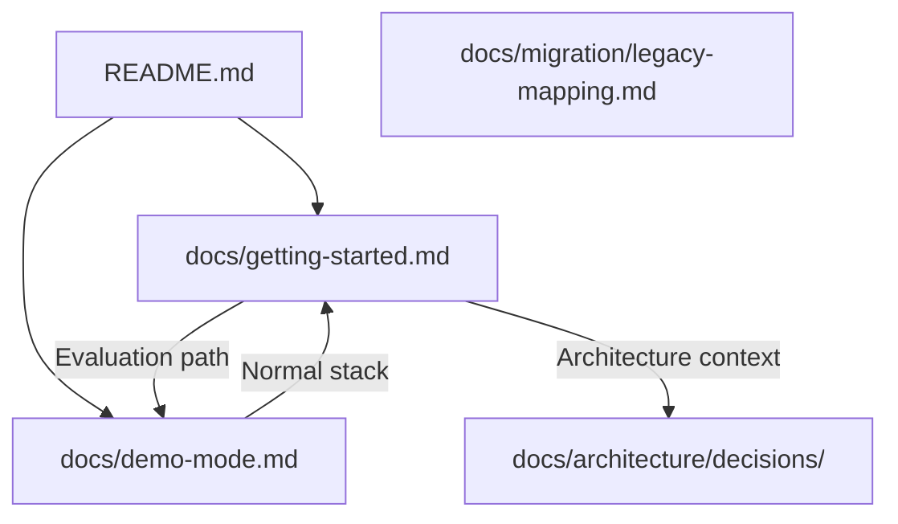
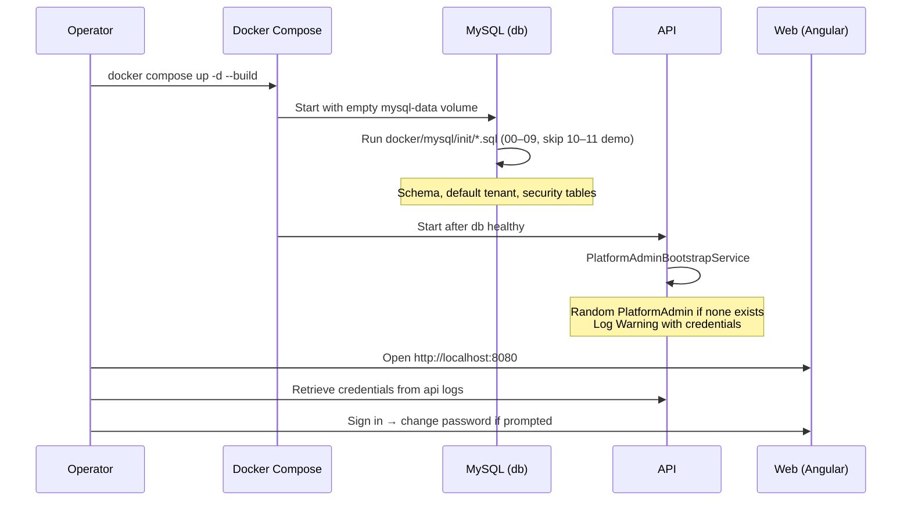

# Getting Started (First Boot) — Documentation Plan

## Overview

ControlEasy Reborn ships as a Docker Compose stack (Traefik reverse proxy, ASP.NET Core API, Angular SPA, MySQL 8, Adminer, Seq). Operators currently scatter setup knowledge across the root `README.md`, `docs/demo-mode.md`, `Makefile`, and inline comments in `docker-compose.yml`. There is no single manual that walks through a **first boot** — the sequence from `docker compose up` through schema initialization, bootstrap services, credential retrieval, and first sign-in.

This plan adds `docs/getting-started.md` as the canonical first-boot manual for the **normal (non-demo) stack**. Demo mode remains documented in `docs/demo-mode.md`; the new guide will cross-link rather than duplicate demo personas, walkthroughs, and reset procedures. The manual must reflect **current code behavior** (verified against `docker/docker-compose.yml`, `docker/mysql/init/`, `PlatformAdminBootstrapService`, and `DemoHostingExtensions`).

The guide targets operators and developers who need a working local or staging deployment on day one. It is not a full operations runbook (multi-arch deployment, production hardening, backup/restore) — those remain future docs under `docs/operations/` when implemented.

## Glossary

| Term | Meaning |
|---|---|
| **First boot** | First startup against an empty MySQL volume; `docker/mysql/init/*.sql` scripts run once via MySQL's `docker-entrypoint-initdb.d` mechanism. |
| **Normal stack** | `docker compose -f docker/docker-compose.yml up` — demo mode disabled; `PlatformAdminBootstrapService` seeds a random PlatformAdmin. |
| **Demo stack** | Base compose plus `docker/docker-compose.demo.yml` overlay — fixed credentials and sample data; PlatformAdmin bootstrap is skipped. |
| **Default tenant** | Row `00000000-0000-0000-0000-000000000001` (`slug = default`) inserted by `02-tenants-seed.sql`. |
| **PlatformAdmin bootstrap** | `PlatformAdminBootstrapService` (`IHostedService`) creates one PlatformAdmin user if none exists; logs email and password at `Warning` level with `// CHANGE IMMEDIATELY`. |
| **AttendantProfile** | Per-tenant assignment required by the login handler; JWT issuance binds `tenant_id`, `profile_id`, and permissions. |
| **Volume reset** | `docker compose down -v` destroys `mysql-data`; next `up` re-runs init scripts (full re-seed). |

## Audience

| Reader | Goal |
|---|---|
| Developer (local) | Start the stack, find bootstrap credentials, sign in, run smoke checks. |
| Operator (staging) | Configure secrets via `.env`, deploy compose, verify health, rotate bootstrap password. |
| Evaluator | Decide between normal stack vs demo mode; reach a signed-in UI quickly. |

## Architecture

### Documentation structure and navigation

```text
README.md                          # Short pointer → docs/getting-started.md
docs/
├── getting-started.md             # NEW — first boot manual (this task)
├── demo-mode.md                   # Unchanged content; add "See also" link back
├── migration/
│   └── legacy-mapping.md
└── architecture/
    └── decisions/
        └── *.md
```

No doc-site tooling (Docusaurus, MkDocs) exists today. Docs are plain Markdown reachable from the root README within two clicks.

### Mermaid — doc cross-references



### Mermaid — first boot sequence (normal stack)



### Files to create or update

| File | Action |
|---|---|
| `docs/getting-started.md` | **Create** — full first-boot manual |
| `README.md` | **Update** — replace terse "Local development (target)" block with link to getting-started; keep demo subsection |
| `docs/demo-mode.md` | **Update** — add "See also" link to getting-started under "Normal development stack" |

### Templates and formatting standards

Follow existing doc conventions observed in `docs/demo-mode.md` and ADRs:

- Title: `# Getting Started — ControlEasy Reborn`
- H2 sections for major steps; H3 for sub-steps
- Runnable bash blocks from repository root
- Tables for URLs, environment variables, and role summary
- No emojis
- English prose, imperative steps ("Copy", "Run", "Open")
- Code truth: document only verified endpoints and ports from `docker/docker-compose.yml`

### Code snippets and examples to include

1. **Prerequisites** — Docker Engine + Compose v2; ports `8080`, `8443`, `8082` (Traefik dashboard).
2. **Optional `.env`** — copy from `docker/.env.example`; `MYSQL_*` and `JWT_SIGNING_KEY`.
3. **Start command** — `docker compose -f docker/docker-compose.yml up -d --build` (and `make up` equivalent).
4. **Verify services** — `docker compose ps`, curl health/API smoke (`GET /api/v1/demo/info` returns `enabled: false`).
5. **Retrieve PlatformAdmin credentials** — `docker compose logs api | grep "CHANGE IMMEDIATELY"` (or follow logs).
6. **Access URLs** — web `http://localhost:8080`, API `http://localhost:8080/api`, Adminer `http://localhost:8080/db`, Traefik dashboard `http://localhost:8082`.
7. **First sign-in** — use logged credentials; note `MustChangePassword` redirect to `/change-password` when implemented.
8. **Production secrets** — change `JWT_SIGNING_KEY`; never use demo overlay in production.
9. **Full reset** — `docker compose down -v` then `up` again.
10. **Demo alternative** — link to `docs/demo-mode.md` for one-command evaluation.

### Known code-truth notes to document honestly

- **PlatformAdmin bootstrap** creates both a `Users` row and an `AttendantProfiles` row (`platform:*` permissions) so first-boot login succeeds (fixed in `.specs/platform-admin-first-boot/`).
- **Seq** is not port-mapped in compose today; do not document `http://localhost:5341` as externally reachable (root README currently lists it — getting-started will not repeat that inaccuracy).
- **MySQL init scripts 10–11** run only in demo overlay context for seed data; normal first boot applies scripts through `09-administration-schema.sql`.
- **TenantAdmin creation** via API may still omit `AttendantProfile` — out of scope for this guide; link to Security module docs when available.

### Verification approach

| Gate | Method |
|---|---|
| Link integrity | Relative links from `README.md` and `docs/demo-mode.md` resolve |
| Code snippets | Run compose commands against current `docker/docker-compose.yml` |
| Navigation | `README → getting-started` in one click; `getting-started → demo-mode` in one click |
| Build | N/A (no doc site); Markdown renders correctly in GitHub |
| Content currency | Cross-check ports, env vars, bootstrap log message, and init script list against source |

No browser preview required — plain Markdown in-repo (per skill: browser verification applies when docs render in a browser site; this project has none).
