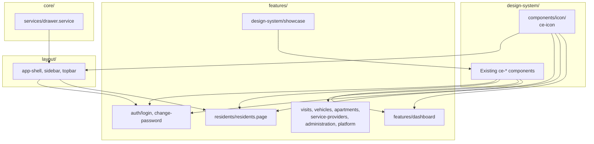
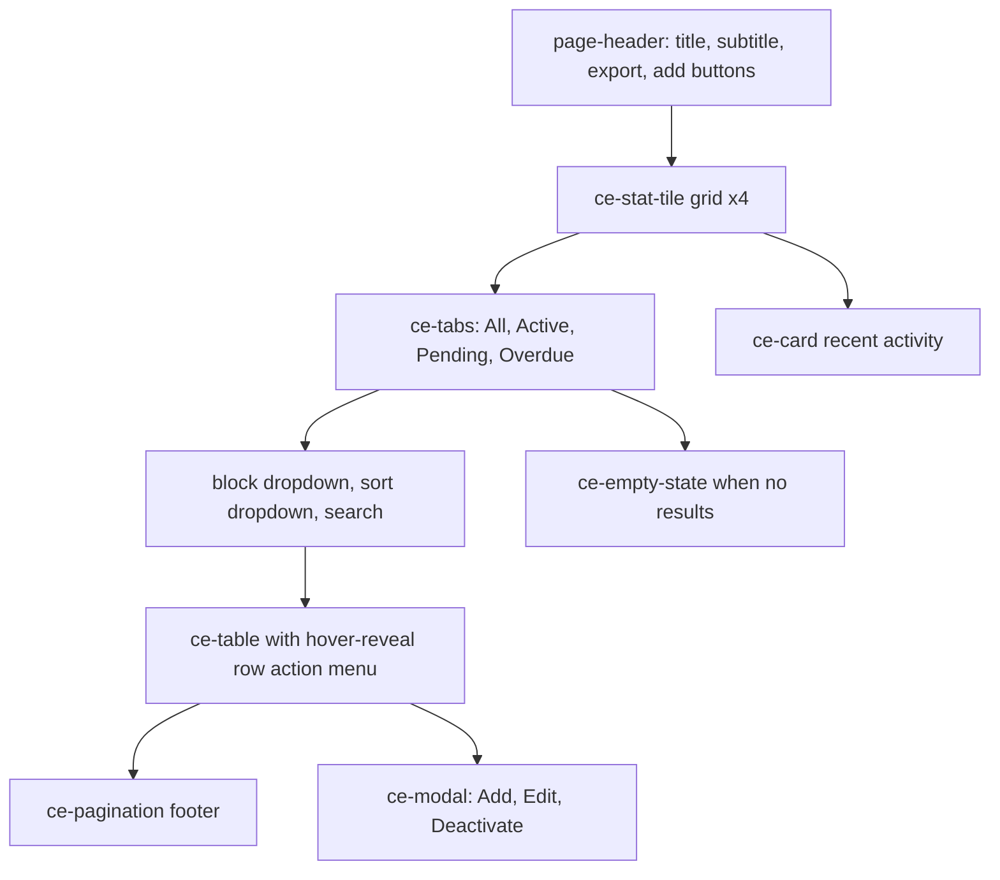
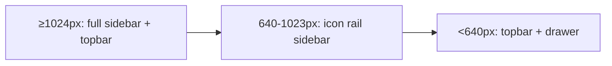

# Design: Mockup Visual Parity

## Overview

The Angular SPA has a strong foundation — `ce-*` components, design tokens, theme service, and a Tailwind v4 `@theme` bridge — but its **feature pages and shell bypass the design system** and its **icons use Unicode glyphs** where the mockup uses Lucide. This spec introduces a shared `ce-icon` component, completes the app shell (mobile drawer, breadcrumbs fed by route data, search and bell buttons, Lucide-driven profile menu), and refactors the login, residents, dashboard, and showcase pages to consume `ce-*` components instead of duplicating their styles. The work is staged in dependency waves: foundation → shell → pages → regression gate.

The end state is a side-by-side Chrome comparison between `mockup/*.html` and the Angular routes (login, residents, dashboard, showcase) at 375px, 768px, and 1440px in both themes, with English copy preserved and Playwright snapshots guarding the contract.

## Glossary

See `requirements.md` for the shared glossary. Additional terms:

- **`LucideAngularModule`** — The Angular module from `lucide-angular` that exposes one component per icon. Each icon is `<lucide-icon [name]="...strokeWidth" [size]="..." />`. The module is deprecated; `@lucide/angular` is the new home (either works).
- **CDK Overlay** — Angular CDK's portal-based overlay system used in `ce-modal`, `ce-dropdown`, and tooltip for portal-rendered floating UI with proper focus management.
- **`DrawerService`** — New lightweight signal-based service in `core/services/drawer.service.ts` that exposes `isOpen` and `toggle()` so the topbar and shell can share drawer state.
- **Route data `breadcrumb`** — Optional `data: { breadcrumb: string }` on each route that `ce-breadcrumbs` reads via `ActivatedRoute` snapshot to render crumbs.
- **Demo mode** — Special tenant mode where data is seeded and an "Open new visit" CTA appears. The recent-activity card and stat tiles are the primary consumers.

## Architecture

### Component / file layout (additions)



### File creation / modification

| Path | Action |
|------|--------|
| `src/app/design-system/components/icon/icon.component.ts` | Create — Lucide-backed `ce-icon` |
| `src/app/design-system/components/icon/icon.spec.ts` | Create — Unit tests for `ce-icon` |
| `src/app/design-system/components/icon/icon.stories.ts` | Create — Showcase story |
| `src/app/design-system/index.ts` | Update — Export `CeIconComponent` |
| `src/app/core/services/drawer.service.ts` | Create — Shared drawer state |
| `src/app/layout/shell/app-shell.component.ts` | Update — Render drawer + backdrop, react to `DrawerService` |
| `src/app/layout/sidebar/sidebar.component.ts` | Update — Use `ce-icon`; expose `id="primary-sidebar"` for drawer targeting |
| `src/app/layout/topbar/topbar.component.ts` | Update — `ce-icon`, search/bell, breadcrumbs via `ce-breadcrumbs` from route |
| `src/app/app.routes.ts` | Update — Add `data.breadcrumb` to each route |
| `src/app/design-system/components/breadcrumbs/breadcrumbs.component.ts` | Verify routerLink wiring (already fixed by fix-design-system task 11) |
| `src/app/features/auth/login.page.ts` | Refactor — Use `ce-input`, `ce-checkbox`, `ce-button`, `ce-spinner`, `ce-icon`; remove duplicated CSS |
| `src/app/features/auth/change-password.page.ts` | Refactor — Same treatment |
| `src/app/features/residents/residents.page.ts` | Refactor — Stat tiles, tabs, dropdowns, table, pagination, modal, empty state, recent activity |
| `src/app/features/dashboard/dashboard.page.ts` | Refactor — Use `ce-card` and `ce-button`; remove duplicated CSS |
| `src/app/design-system/showcase/showcase.page.ts` | Audit — Fix any variant/size drift; replace inline modal demo with `CeModalComponent` |
| `src/app/features/visits/visits.page.ts` | Cleanup — Remove duplicated `ce-*` CSS, import components |
| `src/app/features/vehicles/vehicles.page.ts` | Cleanup — Same |
| `src/app/features/apartments/apartments.page.ts` | Cleanup — Same |
| `src/app/features/service-providers/service-providers.page.ts` | Cleanup — Same |
| `src/app/features/administration/administration.page.ts` | Cleanup — Same |
| `src/app/features/platform/condominiums.page.ts` | Cleanup — Same |
| `tests/visual/login.spec.ts` | Create — Playwright snapshots |
| `tests/visual/residents.spec.ts` | Create — Playwright snapshots |
| `tests/visual/dashboard.spec.ts` | Create — Playwright snapshots |
| `tests/visual/showcase.spec.ts` | Update — Add dark variants if missing |
| `agents/agents/FrontendAgent/AGENTS.md` | Update — Remove stale "greenfield" line; document `ce-icon` and parity workflow |
| `.specs/fix-design-system/tasks.md` | Update — Tick tasks 12.5–12.8 once verification passes |

### Icon component design

```typescript
@Component({
  selector: 'ce-icon',
  standalone: true,
  imports: [LucideAngularModule],
  template: `<lucide-icon [name]="name" [size]="size()" [strokeWidth]="strokeWidth()" />`,
  styles: [` :host { display: inline-flex; line-height: 0; } `],
  changeDetection: ChangeDetectionStrategy.OnPush,
})
export class CeIconComponent {
  name = input.required<LucideIconName>();
  size = input<number>(20);
  strokeWidth = input<number>(2);
}
```

`LucideIconName` is a string-literal union of the icons used in the app (mapped from `mockup/assets/icons.js`): `dashboard, users, building, calendar, car, briefcase, settings, search, bell, sun, moon, menu, eye, eye-off, x, plus, refresh, more-horizontal, edit, trash-2, log-out, chevron-down, chevron-right, check, info, alert-triangle, alert-circle, home, layout-grid`.

The component is added to the design system barrel export so any feature page can use it.

### Drawer service design

```typescript
@Injectable({ providedIn: 'root' })
export class DrawerService {
  private readonly _open = signal(false);
  readonly isOpen = this._open.asReadonly();
  readonly open = () => this._open.set(true);
  readonly close = () => this._open.set(false);
  readonly toggle = () => this._open.update((o) => !o);
}
```

`AppShellComponent` adds the `is-drawer` class and a `body.drawer-open` toggling effect when the service is open, mirroring `mockup/app.html` lines 21–39. Backdrop click and `Escape` close the drawer.

### Login refactor pattern

Replace the duplicated `.ce-input-*` and `.ce-checkbox-*` rules with `ce-input` and `ce-checkbox` components. Use `ce-input`'s `[input-prefix]` and `[input-suffix]` content slots to host the user icon and the password show/hide button. The floating theme toggle uses `ce-icon` with `name="sun"` or `name="moon"`.

### Residents page sections



- **Stat tiles** use the same values as `dashboard.recentVisits`-style metrics from `DashboardApiService` (Total residents, Active, Visits today, Pre-registered visits).
- **Tabs** drive a `selectedTab` signal. Pending/Overdue counts render as `0` until demo mode exposes status tags (per `.specs/4 - demo-mode/design.md`).
- **Block dropdown** derives options from `ApartmentsApiService` (`apartments` list, unique `block` values).
- **Sort dropdown** mirrors `mockup/assets/app.js` options: Name (A→Z), Last visit (newest).
- **Row action menu** is a `ce-dropdown` triggered by a `more-horizontal` `ce-icon` button that appears on row hover.
- **Add/Edit modal** uses `CeModalComponent`; fields are `ce-input` components. Submit calls the residents API.

### Cross-page component adoption

For each of `visits`, `vehicles`, `apartments`, `service-providers`, `administration`, and `condominiums`:
1. Replace every `<button class="ce-button ...">` with `<ce-button variant="..." size="...">`.
2. Replace inline table markup with `<ce-table>` and `<span class="ce-badge tone-...">` with `<ce-badge tone="..." size="sm">`.
3. Replace hand-written modal markup with `<ce-modal>`.
4. Delete the duplicated CSS from each page's `styles: []` block.
5. No visual layout change required for these pages — only the markup cleanup.

### Visual regression tests

Extend `tests/visual/` with three new specs:
- **`login.spec.ts`** — `/login` at 375×800 and 1440×900 in light and dark. Compare against `mockup/login.html`.
- **`residents.spec.ts`** — `/residents` at the same viewports, authenticated via existing fixture. Compare against `mockup/app.html`.
- **`dashboard.spec.ts`** — `/` (dashboard) at 1440×900 in light and dark, screenshot the stat grid and recent activity card. Compare against `mockup/index.html` preview.

All snapshots go into `tests/visual/__snapshots__/`; Playwright's `toHaveScreenshot` will fail the build on drift.

## UI/UX Specification

### Component hierarchy

- **ce-icon** — Single Lucide wrapper, used in sidebar nav, topbar buttons, login input prefixes, residents row actions, modals.
- **AppShell** — Receives `DrawerService`; renders sidebar with `is-drawer` class when open; renders a fixed-position backdrop when open.
- **Topbar** — Receives router events; renders breadcrumbs from `data.breadcrumb`; renders `ce-icon` for menu, sun/moon, bell; renders search input (debounced 250ms); renders profile menu as `ce-dropdown` containing avatar, name, role, tenant switcher (when applicable), Design System link, Sign out.
- **Login** — Floating top-right theme button; central card with `ce-input` (email with user prefix, password with eye toggle suffix), `ce-checkbox` (Remember), `ce-button` (primary submit with `ce-spinner` while pending).
- **Residents** — Page header with primary/secondary `ce-button`; stat tile row; status tabs; filter toolbar; sortable table; pagination; recent activity card; three modals.

### Layout and responsive behavior



- **Desktop (≥1024px):** Sidebar visible (full text), topbar with all controls.
- **Tablet (640–1023px):** Sidebar collapses to icon rail (text hidden per existing media query at 1023px). Topbar unchanged.
- **Mobile (<640px):** Sidebar hidden; hamburger in topbar opens drawer; backdrop click and Escape close it.

### Interaction patterns

- **Drawer:** Open = `DrawerService.open()` + `body.classList.add('drawer-open')`. Close = reverse. Backdrop click and Escape close.
- **Profile menu:** `ce-dropdown`; click outside closes; Escape closes; Tab cycles inside; Enter activates the focused item.
- **Search input:** Debounced 250ms; on `/residents` the input filters the local table; on other routes it is a no-op stub matching the mockup visual.
- **Theme toggle:** Cycles `light` → `dark` → `system` → `light`; icon swaps between `sun` and `moon` based on `resolvedTheme`.
- **Row action menu:** Appears on row hover (`opacity: 0 → 1` transition). Click opens `ce-dropdown` with Edit and Deactivate items.
- **Modals:** `ce-modal` already supports Escape and backdrop close (per fix-design-system task 7). Add / Edit / Deactivate modals all use the same component with different titles and field sets.

### Accessibility

- All `ce-icon` instances have an `aria-label` provided by the parent (decorative-only icons get `aria-hidden="true"` via the host).
- Drawer has `role="dialog"`, `aria-modal="true"`, and `aria-label="Main navigation"`. When open, focus moves to the first nav link; Escape returns focus to the topbar hamburger.
- Topbar search input is `<label>`-paired (`aria-label="Global search"`) and `role="search"`.
- Profile menu (now a `ce-dropdown`) has `aria-haspopup="menu"`, `aria-expanded`, and item roles.
- Residents row action button has `aria-label="Actions for <resident name>"`.

### Animation and transition

- Drawer slide: `transform: translateX(-100% → 0)` over `var(--duration-base) var(--ease-out)`.
- Backdrop fade: `opacity 0 → 1` over the same duration.
- Row action menu: existing `opacity 0 → 1` on row hover, no extra animation.
- All transitions honor `prefers-reduced-motion: reduce` (global rule already in `styles.css`).

## Testing Strategy

1. **Unit tests** — `ce-icon.spec.ts` asserts name and size passthrough, host class on default slot, and `aria-hidden` for decorative usage.
2. **Showcase** — Verify all new components render in `/design-system/showcase` after the refactor (extends existing tests).
3. **Manual smoke** — Re-run `mockup/SMOKE.md` against the Angular routes; document pass/fail in `tasks.md`.
4. **Visual regression** — Playwright snapshots for login, residents, dashboard at 375/1440 × light/dark. Run on every PR that touches a layout, component, or page.
5. **Build** — `ng build` and `dotnet test` (no backend changes expected; integration suite should still pass).

## Verification Approach

1. `grep -rn '&#\d\+;' src/Web/ControlEasyReborn.Web/src/app/` returns zero matches in sidebar, topbar, login, residents, dashboard (icons now use `ce-icon`).
2. `grep -rn '\.ce-button\|\.ce-input\|\.ce-table\|\.ce-card\|\.ce-badge\|\.ce-modal' src/Web/ControlEasyReborn.Web/src/app/features/` returns zero in feature pages (only the design system components own those rules).
3. `ng build` succeeds with no errors.
4. Playwright visual snapshots pass.
5. Mobile drawer opens and closes via hamburger, backdrop, and Escape.
6. Dark theme toggles correctly across shell, login, residents, dashboard.
7. `mockup/SMOKE.md` checklist items are green for login, residents, and showcase.

## Out of Scope

- Adding new icons to Lucide.
- Translating copy to pt-BR.
- Backend changes — any data the UI needs (block field, status tags, recent activity) is already exposed or will be exposed in demo mode per `.specs/4 - demo-mode/design.md`.
- Migrating modal, dropdown, or tooltip to CDK Overlay — the in-template `@if` approach is acceptable for v1 per `.specs/fix-design-system/design.md` "Out of Scope".
- A full responsive redesign beyond the documented breakpoints.
