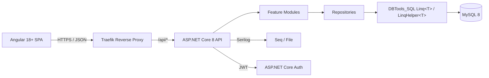
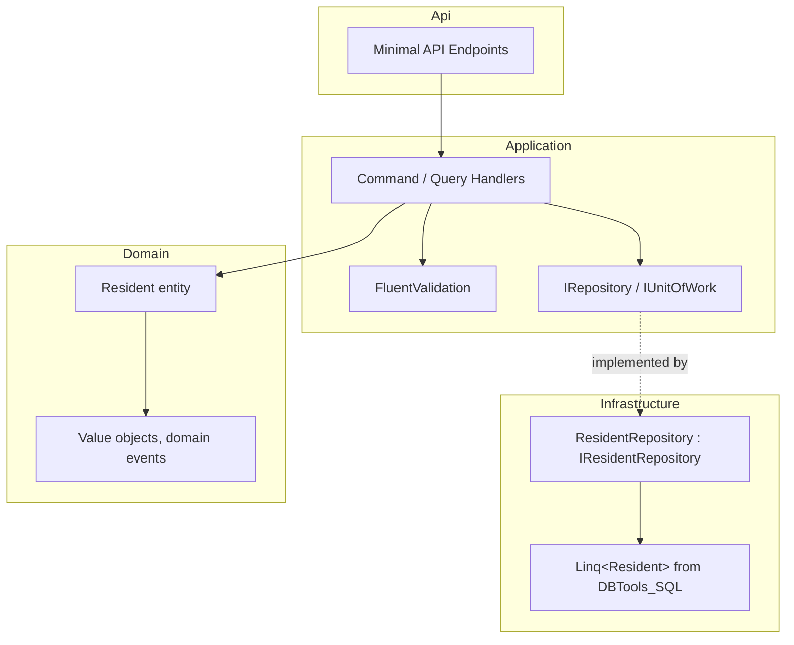
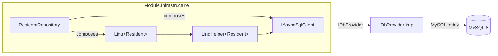
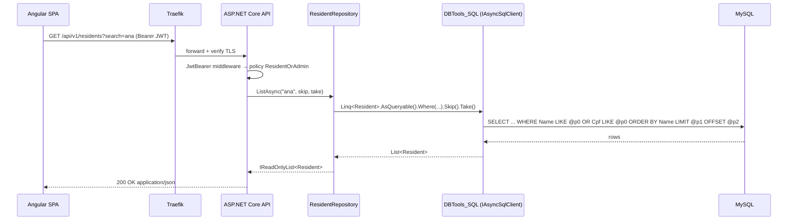
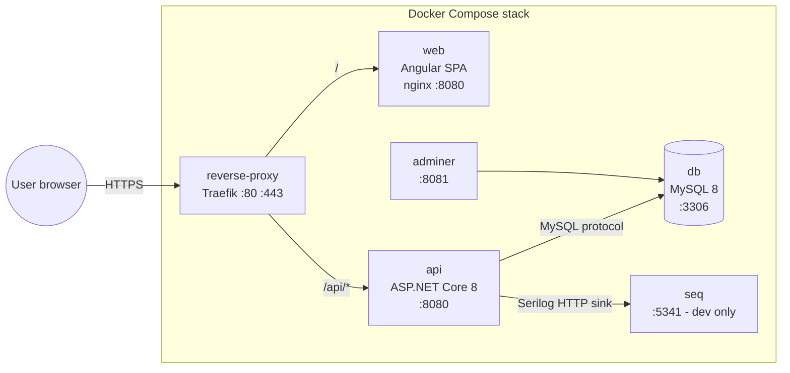

# Design — Modernization Roadmap

## Overview

**ControlEasy Reborn** is a greenfield rewrite of the legacy `ControlEasy 5` WPF desktop system that runs on `.NET Framework 4.8` and talks directly to MySQL through `EntityFramework 6.4.4` and `MySql.Data`. The legacy app has a hand-rolled MVC layout under `ControlEasy5/Controller/`, `ControlEasy5/Model/`, and `ControlEasy5/View/`, and ships with a half-started Blazor Server prototype on the now-EOL `.NET 5` (to be deleted in Phase 0). The goal of this roadmap is to retire the WPF UI, replace it with a modular web application whose frontend is an **Angular 18+ SPA**, and rebuild the data-access layer on top of [`DBTools_SQL`](https://github.com/gednt/DBTools_SQL) — a multi-provider library that **prioritizes LINQ** (lambda predicates via `LinqHelper<TModel>`, property selectors + JOINs via `Linq<TModel>`, and a SQL-translated deferred `IQueryable` via `DbQuery<T>`).

The target system is a **modular monolith** on **ASP.NET Core 8 (LTS)** with an **Angular 18+ SPA** (standalone components + signals) on the front end, packaged in **Docker** containers orchestrated by **Docker Compose** (api, web, db, reverse-proxy, adminer, redis). We adopt the **Strangler Fig** pattern: the legacy WPF app continues to run against the same MySQL while new web modules replace it screen by screen, and we flip a feature flag per module when each is ready. All data access is expressed as LINQ against `IAsyncSqlClient` / `Linq<TModel>` so that queries are type-safe, parameterized, and portable across MySQL/PostgreSQL/SQL Server/SQLite without code changes.

This document is the single source of truth for **how** we build it. It defines the solution layout, the per-module Clean Architecture template, the DBTools_SQL integration pattern, the API surface, the dependency management strategy (Central Package Management), the Docker / Compose topology, and the four-phase migration plan. The companion `tasks.md` turns this into an executable checklist with verification gates.

## Glossary

| Term | Meaning |
|---|---|
| **Modular Monolith** | A single deployable composed of independent feature modules; can be split into microservices later. |
| **Strangler Fig** | Migration pattern where the new system gradually replaces the legacy one route/screen by route. |
| **Clean Architecture** | Layered design (Domain → Application → Infrastructure → Api) with dependencies pointing inward. |
| **Vertical Slice** | A feature cut end-to-end through all layers, instead of horizontal layers. |
| **CQRS-lite** | Separate read and write models for hot paths (e.g., reports), without a full event-sourcing stack. |
| **DBTools_SQL** | Third-party .NET library (gednt/DBTools_SQL) providing multi-provider SQL access with LINQ support. |
| **LinqHelper\<T\>** | DBTools_SQL class for lambda-predicate queries (`Where(u => u.Age > 18)`). |
| **Linq\<T\>** | DBTools_SQL class for property-selector queries (`WhereEquals(u => u.Email, "x")`) + JOINs. |
| **DbQuery\<T\>** | DBTools_SQL `IQueryable<T>` that translates LINQ to SQL with deferred execution. |
| **IAsyncSqlClient** | DBTools_SQL async interface; preferred over the sync `SqlClient`. |
| **IDbProvider** | DBTools_SQL provider abstraction (`SqlServerProvider`, `MySqlProvider`, `PostgresProvider`, `SqliteProvider`). |
| **Reverse Proxy** | Traefik or Nginx in front of `web` and `api` to centralize TLS and routing. |
| **CPM** | Central Package Management — `Directory.Packages.props` with pinned versions shared across modules. |
| **Testcontainers** | xUnit fixture that spins up real containers (MySQL) for integration tests. |

## Architecture

### Solution Layout

```
ControlEasyReborn/
├── src/
│   ├── ControlEasyReborn.sln
│   ├── Directory.Packages.props           # Central Package Management (UC-17)
│   ├── Directory.Build.props              # Shared MSBuild props (LangVersion, Nullable)
│   │
│   ├── Host/
│   │   └── ControlEasyReborn.Api/         # ASP.NET Core 8 Web API (composition root)
│   │
│   ├── Web/
│   │   └── ControlEasyReborn.Web/         # Angular 18+ SPA (ng build → nginx)
│   │
│   ├── BuildingBlocks/
│   │   ├── ControlEasyReborn.SharedKernel/   # Common abstractions, Result, Guard
│   │   ├── ControlEasyReborn.Infrastructure/ # Cross-cutting: DBTools_SQL wiring, JWT, Serilog
│   │   └── ControlEasyReborn.Contracts/      # Cross-module DTOs / events
│   │
│   └── Modules/
│       ├── Residents/         # Moradores + Apartamentos
│       ├── Visits/            # Visitantes + Fluxo de portaria
│       ├── Vehicles/          # Veículos
│       ├── ServiceProviders/  # Prestadores de serviço
│       ├── Security/          # Auth, Users, Roles, Privilégios
│       └── Administration/    # Logs, Auditoria, Configurações
│
├── tests/
│   ├── ControlEasyReborn.UnitTests/
│ ├── ControlEasyReborn.IntegrationTests/   # Testcontainers + MySQL
│   └── ControlEasyReborn.ArchitectureTests/ # NetArchTest rules
│
├── docker/
│   ├── docker-compose.yml
│   ├── docker-compose.override.yml         # dev: bind mounts, Seq, hot-reload
│   ├── .env.example
│   ├── api.Dockerfile
│   ├── web.Dockerfile
│   ├── reverse-proxy/
│   │   ├── traefik.yml
│   │   └── dynamic.yml
│   └── mysql/
│       └── init/                           # 00-schema.sql, 01-seed.sql
│
├── docs/
│   ├── architecture/decisions/             # ADRs (0001-modular-monolith.md, ...)
│   └── migration/legacy-mapping.md         # WPF screen → web module
│
├── .specs/                                 # this spec lives here
└── AGENTS.md
```

### Module Template (per feature, e.g., `Residents`)

```
Modules/Residents/
├── ControlEasyReborn.Modules.Residents.Domain/
│   ├── Entities/Resident.cs                # POCO, no ORM attributes (provider-agnostic)
│   ├── ValueObjects/                       # Cpf, Phone, Email
│   └── Events/ResidentCreated.cs
│
├── ControlEasyReborn.Modules.Residents.Application/
│   ├── Abstractions/IResidentRepository.cs # exposes LINQ-friendly methods
│   ├── Residents/Commands/CreateResident.cs
│   ├── Residents/Queries/ListResidents.cs
│   └── Validators/CreateResidentValidator.cs   # FluentValidation
│
├── ControlEasyReborn.Modules.Residents.Infrastructure/
│   ├── Persistence/ResidentRepository.cs   # implements IResidentRepository
│   └── DI/ResidentsModuleServiceCollectionExtensions.cs
│
└── ControlEasyReborn.Modules.Residents.Api/
    ├── Endpoints/CreateResidentEndpoint.cs # Minimal API
    └── Endpoints/ListResidentsEndpoint.cs
```



### Backend Layering (per module)



**Dependency rule:** `Domain` depends on nothing. `Application` depends on `Domain` and `Abstractions`. `Infrastructure` depends on `Application` and `DBTools_SQL`. `Api` depends on `Application` and registers `Infrastructure` via DI.

### DBTools_SQL Integration (the data-access pattern)

The **only** component that talks to the database is the `Infrastructure` layer, and the **only** API it uses is DBTools_SQL — never raw ADO.NET and never EF.



#### DI registration (one place, in `Host/Program.cs`)

```csharp
// Host/ControlEasyReborn.Api/Program.cs
builder.Services.AddDbTools(options =>
{
    options.Provider   = DatabaseProvider.MySQL;
    options.Host       = builder.Configuration["Db:Host"]!;
    options.Port       = builder.Configuration["Db:Port"]!;
    options.Database   = builder.Configuration["Db:Database"]!;
    options.Username   = builder.Configuration["Db:Username"]!;
    options.Password   = builder.Configuration["Db:Password"]!; // from env / Docker secret
});
// IAsyncSqlClient is now injectable everywhere.
```

#### Repository pattern over DBTools_SQL

```csharp
// Modules/Residents/Infrastructure/Persistence/ResidentRepository.cs
using DBTools.Controllers;
using DBTools.Linq;

internal sealed class ResidentRepository(Linq<Resident> residents, IAsyncSqlClient db)
    : IResidentRepository
{
    public Task<Resident?> FindAsync(Guid id, CancellationToken ct) =>
        residents.FirstOrDefaultAsync(r => r.Id == id, ct);

    public async Task<IReadOnlyList<Resident>> ListAsync(
        string? search, int skip, int take, CancellationToken ct)
    {
        // LINQ first, deferred IQueryable translated to SQL by DBTools_SQL
        IQueryable<Resident> q = residents.AsQueryable();
        if (!string.IsNullOrWhiteSpace(search))
            q = q.Where(r => r.Name.Contains(search) || r.Cpf.Value.Contains(search));
        return await q.OrderBy(r => r.Name).Skip(skip).Take(take).ToListAsync(ct);
    }

    public Task<bool> AddAsync(Resident r, CancellationToken ct) =>
        residents.InsertAsync(r, ct);   // auto-increment/PK handled by Linq<T>

    public Task<bool> UpdateAsync(Resident r, CancellationToken ct) =>
        residents.UpdateAsync(r, ct);
}
```

**Why this shape:**
- **LINQ-first** (UC-10): every read/write is a lambda — no string SQL, no `DataView`.
- **Provider-agnostic** (UC-11): `Linq<Resident>` is constructed against `IAsyncSqlClient`, which is bound to `IDbProvider` (MySQL today). Swapping to PostgreSQL = change one config value.
- **Parameterized by construction** (UC-12): DBTools_SQL's `SqlValidator` rejects dangerous identifiers and all values go through `DbParameter`.
- **Deferred IQueryable for paged lists** (UC-13): `AsQueryable()` returns `DbQuery<T>` — `Skip`/`Take`/`OrderBy` are translated to SQL, not run in memory.
- **Joins** (e.g., Resident + Apartment) use `Linq<T>.InnerJoin<U>()` / `LeftJoin<U>()` returning `JoinResult<TLeft, TRight>`.

#### When to fall back to raw `SqlClient`

Only when a query needs a DB-specific feature not covered by the LINQ provider (e.g., MySQL window functions or a stored procedure). In that case, go through `IAsyncSqlClient.ExecuteAsync(sql, params)`, never raw `MySqlConnection`. This is documented as an ADR.

### API Design

- **Style:** REST + JSON, versioned: `/api/v1/residents`, `/api/v1/visits`, ...
- **Endpoints:** ASP.NET Core **Minimal APIs** grouped per module, mapped via `MapGroup("/api/v1/{module}")`.
- **Routes:** kebab-case, plural nouns (`/api/v1/service-providers`, not `/api/v1/PrestadorServico`).
- **Errors:** `ProblemDetails` (RFC 7807) returned by a global exception filter that maps `NotFoundException` → 404, `ValidationException` → 400, `ConflictException` → 409.
- **Auth:** JWT bearer (`Microsoft.AspNetCore.Authentication.JwtBearer`) with claims `role`, `condominium_id`. Authorization policies: `AdminOnly`, `PorteiroOnly`, `ResidentSelfOrAdmin`.
- **Docs:** `Swashbuckle.AspNetCore` exposing OpenAPI at `/swagger`.
- **Versioning:** `Microsoft.AspNetCore.Mvc.Versioning` for the URL segment; old versions kept alive during the Strangler phase.



### Frontend Design

- **Angular 18+ SPA** (standalone components, signals, TypeScript strict mode) calling the REST API.
- **Build:** Angular CLI (`ng build`) → static bundle served by `nginx` inside the `web` container.
- **State / data:** feature-scoped services wrapping `HttpClient`. Tokens stored in memory; refresh on `401`. `HttpInterceptor` adds the bearer header and the `BaseUrl` (pointing to the reverse proxy).
- **UI kit:** **Angular Material** (or PrimeNG) for tables, forms, dialogs.
- **Type-safety:** TypeScript DTOs/interfaces generated from the API's OpenAPI schema at build time via `ng-openapi-gen` (or `nswag`). C# domain models are **not** shared with the frontend.
- **Auth:** a `LoginComponent` posts to `/api/v1/auth/login`; the JWT is kept in an `AuthService` (signal-based) and attached by an HTTP interceptor.
- **Routing:** lazy-loaded feature routes (`/residents`, `/visits`, `/vehicles`, ...).

### Containerization



#### `docker-compose.yml` (sketch)

```yaml
services:
  reverse-proxy:
    image: traefik:v3.1
    command: --providers.file.directory=/etc/traefik/dynamic
    ports: ["80:80", "443:443"]
    volumes:
      - ./reverse-proxy/traefik.yml:/etc/traefik/static.yml:ro
      - ./reverse-proxy/dynamic.yml:/etc/traefik/dynamic/dynamic.yml:ro
      - traefik-data:/letsencrypt

  api:
    build: { context: ../src/Host/ControlEasyReborn.Api, dockerfile: ../../../docker/api.Dockerfile }
    environment:
      Db__Provider: MySQL
      Db__Host: db
      Db__Port: "3306"
      Db__Database: controleasydb
      Db__Username: ${MYSQL_USER}
      Db__Password: ${MYSQL_PASSWORD}      # from .env / Docker secret, NOT App.config
      Jwt__SigningKey: ${JWT_SIGNING_KEY}
      Serilog__WriteTo__1__Args__serverUrl: http://seq:5341
    depends_on: { db: { condition: service_healthy } }
    labels:
      - "traefik.http.routers.api.rule=Host(`localhost`) && PathPrefix(`/api`)"
      - "traefik.http.routers.api.tls=true"

  web:
    build: { context: ../src/Web/ControlEasyReborn.Web, dockerfile: ../../../docker/web.Dockerfile }
    labels:
      - "traefik.http.routers.web.rule=Host(`localhost`)"
      - "traefik.http.routers.web.tls=true"

  db:
    image: mysql:8.0
    environment:
      MYSQL_ROOT_PASSWORD: ${MYSQL_ROOT_PASSWORD}
      MYSQL_DATABASE: controleasydb
      MYSQL_USER: ${MYSQL_USER}
      MYSQL_PASSWORD: ${MYSQL_PASSWORD}
    volumes:
      - mysql-data:/var/lib/mysql
      - ./mysql/init:/docker-entrypoint-initdb.d:ro
    healthcheck:
      test: ["CMD", "mysqladmin", "ping", "-h", "localhost", "-uroot", "-p${MYSQL_ROOT_PASSWORD}"]
      interval: 5s
      retries: 20

  adminer:
    image: adminer:4.8
    labels:
      - "traefik.http.routers.adminer.rule=Host(`localhost`) && PathPrefix(`/db`)"

  seq:                                   # dev only — remove in docker-compose.prod.yml
    image: datalust/seq:latest
    environment: { ACCEPT_EULA: Y }

volumes:
  mysql-data:
  traefik-data:
```

#### Multi-stage Dockerfile (api)

```dockerfile
# docker/api.Dockerfile
FROM mcr.microsoft.com/dotnet/sdk:8.0 AS build
WORKDIR /src
COPY Directory.Packages.props Directory.Build.props ./
COPY src/ ./src/
RUN dotnet restore src/Host/ControlEasyReborn.Api/ControlEasyReborn.Api.csproj
RUN dotnet publish src/Host/ControlEasyReborn.Api/ControlEasyReborn.Api.csproj \
    -c Release -o /app /p:UseAppHost=false

FROM mcr.microsoft.com/dotnet/aspnet:8.0 AS runtime
WORKDIR /app
COPY --from=build /app .
ENV ASPNETCORE_URLS=http://+:8080
EXPOSE 8080
ENTRYPOINT ["dotnet", "ControlEasyReborn.Api.dll"]
```

### Dependency Management

- **Central Package Management (CPM)** in `src/Directory.Packages.props`:

  ```xml
  <Project>
    <PropertyGroup>
      <ManagePackageVersionsCentrally>true</ManagePackageVersionsCentrally>
      <CentralPackageTransitivePinningEnabled>true</CentralPackageTransitivePinningEnabled>
    </PropertyGroup>
    <ItemGroup>
      <PackageVersion Include="DBTools_SQL" Version="1.6.0" />
      <PackageVersion Include="MySqlConnector" Version="2.3.7" />
      <PackageVersion Include="Angular" Version="18.2.0" />
      <PackageVersion Include="ng-openapi-gen" Version="0.51.0" />
      <PackageVersion Include="FluentValidation.AspNetCore" Version="11.3.0" />
      <PackageVersion Include="Mapster" Version="7.4.0" />
      <PackageVersion Include="Serilog.AspNetCore" Version="8.0.3" />
      <PackageVersion Include="xunit" Version="2.9.2" />
      <PackageVersion Include="Testcontainers.MySql" Version="4.0.0" />
    </ItemGroup>
  </Project>
  ```
- Per-module `.csproj` only declares `<PackageReference Include="..." />` (no version).
- Restore happens **inside Docker** (UC-18) so the restore step is cached as a Docker layer.

### Cross-Cutting Concerns

| Concern | Choice | Where it lives |
|---|---|---|
| Logging | Serilog (Console JSON + Seq dev) | `Host/Program.cs` + `appsettings.json` |
| Validation | FluentValidation | Module `Application/Validators` |
| Mapping | Mapster | `BuildingBlocks/Infrastructure/Mapping` |
| Error model | `ProblemDetails` + global filter | `Host/Program.cs` |
| Auth | JWT bearer | `Host/Program.cs` + `Modules/Security` |
| Health checks | `AspNetCore.HealthChecks.MySql` | `Host/Program.cs` → `/health` |
| Feature flags | `Microsoft.FeatureManagement` (Strangler toggle per module) | `Host/Program.cs` |

## Success Criteria

1. `docker compose up -d` brings the whole stack (proxy, web, api, db, adminer, seq) up healthy in under 2 minutes on a clean machine.
2. The `Host` project compiles against `DBTools_SQL` only; **no** `MySql.Data` or `EntityFramework` references in any project (`grep -ri "MySql.Data\|EntityFramework" src/` returns nothing).
3. Every repository method compiles to a parameterized SQL statement (verified by integration tests asserting against a real MySQL container via Testcontainers).
4. The four user-facing modules (Residents, Visits, Vehicles, ServiceProviders) each have at least one **end-to-end** test: HTTP call → API → repository → DBTools_SQL → MySQL → response.
5. Legacy WPF still runs against the same MySQL with no schema change during the Strangler phase (validated by a smoke test that boots the WPF app and the web app in parallel).
6. Swapping the provider to PostgreSQL (changing `Db__Provider=PostgreSQL` + connection string, no code changes) makes all unit + integration tests pass.

## Components & Files (Phase 1 deliverable)

| Path | Purpose |
|---|---|
| `src/Directory.Packages.props` | CPM, pinned versions |
| `src/Directory.Build.props` | LangVersion=latest, Nullable=enable, TreatWarningsAsErrors |
| `src/Host/ControlEasyReborn.Api/Program.cs` | DI, Serilog, JWT, DBTools_SQL, ProblemDetails, Swagger |
| `src/Host/ControlEasyReborn.Api/appsettings.json` | Multi-provider config block |
| `src/BuildingBlocks/Infrastructure/ServiceCollectionExtensions.cs` | `AddControlEasyDbTools(configuration)` |
| `src/Modules/Residents/*` | Reference module template (Phase 1) |
| `src/Web/ControlEasyReborn.Web/Program.cs` | (Not applicable — Angular is built via `ng build` and served by nginx. The frontend project is at `web/ControlEasyReborn.Web/` with `angular.json` + `src/app/`.) |
| `docker/docker-compose.yml` | Full stack |
| `docker/api.Dockerfile`, `docker/web.Dockerfile` | Multi-stage builds |
| `docker/reverse-proxy/traefik.yml` + `dynamic.yml` | Routing + TLS |
| `docker/mysql/init/00-schema.sql` | Minimal `Residents` table for the smoke test |
| `tests/ControlEasyReborn.IntegrationTests/ResidentsEndpointTests.cs` | Testcontainers smoke test |
| `docs/architecture/decisions/0001-modular-monolith.md` | ADR |
| `docs/architecture/decisions/0002-dblools-sql-as-only-data-access.md` | ADR |
| `docs/migration/legacy-mapping.md` | WPF screen → module map |

## Verification Approach

- **Per task:** the implementation ends with a verification command (build, test, curl, or a Playwright browser check for the web UI).
- **Per phase:** a phase gate (a checklist in `tasks.md`) must be fully green before starting the next phase.
- **Continuous:** GitHub Actions runs `dotnet build`, `dotnet test`, and `docker compose up -d` + curl-based smoke test on every PR.
- **Visual:** for any Angular page work, open the page in Chrome via the Playwright browser tool and screenshot for user approval.

## Risks & Mitigations

| Risk | Mitigation |
|---|---|
| DBTools_SQL LINQ translator does not cover a specific query (e.g., MySQL window function). | Documented escape hatch: go through `IAsyncSqlClient.ExecuteAsync` with parameterized SQL, never raw `MySqlConnection`. |
| DBTools_SQL targets .NET 8 — running side-by-side with the WPF app on .NET Framework 4.8 is fine because they are different processes. | Strangler Fig keeps WPF and web app in separate processes, talking to the same MySQL. |
| Hard-coded credentials leak in old config files. | `.gitignore` blocks `appsettings.*.local.json` and `.env`; secrets only via env vars / Docker secrets. |
| Long Strangler phase → dual maintenance. | Each module has an explicit "decommission WPF screen" date; tracked in `docs/migration/legacy-mapping.md`. |
| Performance regression vs. legacy. | Baseline queries (Visits list, search) benchmarked in Testcontainers before any UI cutover. |
