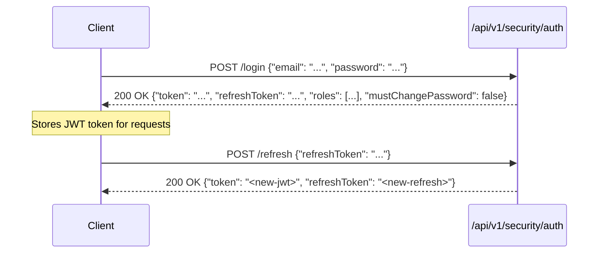

<!-- generated-by: gsd-doc-writer -->
# API Reference — ControlEasy Reborn

ControlEasy Reborn provides a RESTful API built on ASP.NET Core 8 minimal API endpoints. All API routes follow the `/api/v1/` prefix and exchange JSON payloads.

## Authentication & Authorization

All authenticated endpoints require an `Authorization: Bearer <token>` HTTP header containing a valid JSON Web Token (JWT).

### 1. Authentication Flow



### 2. Multi-Tenant Context
The active condominium is resolved either from:
1. The `tenant_id` claim embedded within the JWT token.
2. An optional `X-Tenant-ID: <guid>` request header (used by platform operators switching context).

---

## Endpoint Catalog

### Authentication & Security (`/api/v1/security`)

| Method | Path | Description | Auth Required |
|---|---|---|---|
| `POST` | `/api/v1/security/auth/login` | Sign in with email and password | No |
| `POST` | `/api/v1/security/auth/refresh` | Exchange a refresh token for a new access token | No |
| `POST` | `/api/v1/security/auth/change-password` | Change account password (required on first login) | Yes |
| `GET` | `/api/v1/security/session` | Get current user session, roles, and tenant info | Yes |
| `POST` | `/api/v1/security/tenant-switch` | Switch active tenant context for operator | Yes |
| `GET` | `/api/v1/security/tenants` | List tenants accessible to the current user | Yes |
| `POST` | `/api/v1/security/users` | Register a new platform user | Yes (`platform:*`) |
| `GET` | `/api/v1/security/attendant-profiles` | List attendant profiles for the active tenant | Yes |
| `GET` | `/api/v1/security/attendant-profiles/me` | Get attendant profile of the logged-in user | Yes |
| `POST` | `/api/v1/security/attendant-profiles` | Create a new attendant profile | Yes (`security:write`) |
| `GET` | `/api/v1/security/attendant-profiles/{id}` | Get attendant profile details | Yes |
| `PUT` | `/api/v1/security/attendant-profiles/{id}` | Update attendant permissions and details | Yes (`security:write`) |
| `POST` | `/api/v1/security/attendant-profiles/{id}/deactivate` | Deactivate an attendant profile | Yes (`security:write`) |
| `GET` | `/api/v1/security/shifts` | List gatehouse work shifts | Yes |
| `POST` | `/api/v1/security/shifts` | Create a gatehouse work shift | Yes (`security:write`) |
| `GET` | `/api/v1/security/gatehouses` | List physical gatehouses ("portarias") | Yes |
| `POST` | `/api/v1/security/gatehouses` | Register a physical gatehouse | Yes (`security:write`) |

### Tenants Management (`/api/v1/tenants`)

| Method | Path | Description | Auth Required |
|---|---|---|---|
| `GET` | `/api/v1/tenants` | List all condominiums/tenants | Yes (`platform:*`) |
| `POST` | `/api/v1/tenants` | Register a new condominium tenant | Yes (`platform:*`) |
| `GET` | `/api/v1/tenants/{id}` | Get details of a specific condominium | Yes |
| `POST` | `/api/v1/tenants/{id}/suspend` | Suspend tenant access | Yes (`platform:*`) |
| `POST` | `/api/v1/tenants/{id}/resume` | Resume suspended tenant | Yes (`platform:*`) |
| `GET` | `/api/v1/tenants/{id}/admins` | List tenant administrators for a condominium | Yes (`tenants:admin`) |
| `POST` | `/api/v1/tenants/{id}/admins` | Create or assign a tenant administrator | Yes (`tenants:admin`) |
| `PUT` | `/api/v1/tenants/{id}/admins/{userId}` | Update tenant administrator details | Yes (`tenants:admin`) |
| `POST` | `/api/v1/tenants/{id}/admins/{userId}/revoke` | Revoke administrator status | Yes (`tenants:admin`) |
| `GET` | `/api/v1/tenants/{id}/porteiros` | List porteiros assigned to a condominium | Yes |
| `POST` | `/api/v1/tenants/{id}/porteiros` | Register a porteiro for a condominium | Yes (`security:write`) |
| `POST` | `/api/v1/admin/backups/{tenantId}` | Trigger tenant-specific database backup | Yes (`platform:*`) |

### Residents (`/api/v1/residents`)

| Method | Path | Description | Auth Required |
|---|---|---|---|
| `GET` | `/api/v1/residents` | List residents (supports pagination and filtering) | Yes (`residents:read`) |
| `POST` | `/api/v1/residents` | Register a new resident profile | Yes (`residents:write`) |
| `GET` | `/api/v1/residents/{id}` | Get resident details by ID | Yes (`residents:read`) |
| `PUT` | `/api/v1/residents/{id}` | Update resident information | Yes (`residents:write`) |
| `DELETE` | `/api/v1/residents/{id}` | Remove resident record | Yes (`residents:write`) |

### Apartments & Units (`/api/v1/apartments`)

| Method | Path | Description | Auth Required |
|---|---|---|---|
| `GET` | `/api/v1/apartments` | List condominium apartments and blocks | Yes (`apartments:read`) |
| `POST` | `/api/v1/apartments` | Register a new apartment unit | Yes (`apartments:write`) |
| `GET` | `/api/v1/apartments/{id}` | Get apartment details and resident occupants | Yes (`apartments:read`) |
| `PUT` | `/api/v1/apartments/{id}` | Update apartment configuration | Yes (`apartments:write`) |
| `DELETE` | `/api/v1/apartments/{id}` | Delete apartment record | Yes (`apartments:write`) |

### Visits & Gatehouse Operations (`/api/v1/visits`)

| Method | Path | Description | Auth Required |
|---|---|---|---|
| `GET` | `/api/v1/visits` | List visitor records (active, scheduled, history) | Yes (`visits:read`) |
| `POST` | `/api/v1/visits` | Create a new visit record | Yes (`visits:write`) |
| `GET` | `/api/v1/visits/{id}` | Get visit details | Yes (`visits:read`) |
| `POST` | `/api/v1/visits/{id}/checkin` | Record visitor gatehouse check-in timestamp | Yes (`visits:write`) |
| `POST` | `/api/v1/visits/{id}/checkout` | Record visitor gatehouse check-out timestamp | Yes (`visits:write`) |

### Vehicles (`/api/v1/vehicles`)

| Method | Path | Description | Auth Required |
|---|---|---|---|
| `GET` | `/api/v1/vehicles` | List vehicles by plate or resident | Yes (`vehicles:read`) |
| `POST` | `/api/v1/vehicles` | Register a vehicle | Yes (`vehicles:write`) |
| `GET` | `/api/v1/vehicles/{id}` | Get vehicle registration details | Yes (`vehicles:read`) |
| `PUT` | `/api/v1/vehicles/{id}` | Update vehicle details | Yes (`vehicles:write`) |

### Service Providers (`/api/v1/service-providers`)

| Method | Path | Description | Auth Required |
|---|---|---|---|
| `GET` | `/api/v1/service-providers` | List authorized service providers and contractors | Yes (`service-providers:read`) |
| `POST` | `/api/v1/service-providers` | Register service provider profile | Yes (`service-providers:write`) |
| `GET` | `/api/v1/service-providers/{id}` | Get service provider details | Yes (`service-providers:read`) |
| `PUT` | `/api/v1/service-providers/{id}` | Update service provider details | Yes (`service-providers:write`) |

### Photos & Consent Policies (`/api/v1/photos`, `/api/v1/consent-policy`, `/api/v1/entry-log`)

| Method | Path | Description | Auth Required |
|---|---|---|---|
| `POST` | `/api/v1/photos` | Upload client-resized identity photo (JPEG) | Yes (`photos:write`) |
| `GET` | `/api/v1/photos/{id}` | Retrieve stored photo binary | Yes (`photos:read`) |
| `GET` | `/api/v1/consent-policy` | Get condominium consent policies | Yes (`consent:read`) |
| `PUT` | `/api/v1/consent-policy` | Update tenant-wide photo consent settings | Yes (`consent:write`) |
| `POST` | `/api/v1/entry-log` | Append entry log with photo and consent audit | Yes (`visits:write`) |

### Reports & Dashboard (`/api/v1/reports`, `/api/v1/dashboard`)

| Method | Path | Description | Auth Required |
|---|---|---|---|
| `GET` | `/api/v1/reports` | Export gatehouse activity and visitor records | Yes (`reports:read`) |
| `GET` | `/api/v1/dashboard/stats` | Real-time statistics (active visitors, residents, shifts) | Yes (`reports:read`) |

### System & Diagnostics

| Method | Path | Description | Auth Required |
|---|---|---|---|
| `GET` | `/health` | Health check probe (database status, memory) | No |
| `GET` | `/api/v1/demo/info` | Status of demo mode and sample seed | No |
| `POST` | `/api/v1/demo/reset` | Trigger demo data re-seed | Yes (`platform:*`) |
| `GET` | `/api/v1/bootstrap/status` | Check PlatformAdmin bootstrap status | No |

---

## Error Handling (RFC 7807)

All non-2xx responses return a standard `ProblemDetails` object:

```json
{
  "type": "https://httpstatuses.io/400",
  "title": "Validation failed",
  "status": 400,
  "detail": "One or more validation errors occurred.",
  "errors": {
    "Email": ["The Email field is required."],
    "DocumentNumber": ["Invalid CPF/CNPJ format."]
  }
}
```

### Standard Status Codes
- `200 OK` / `201 Created` — Successful operation.
- `400 Bad Request` — Validation failure (`ValidationException`).
- `401 Unauthorized` — Missing, expired, or invalid JWT token.
- `403 Forbidden` — Insufficient user permissions or roles.
- `404 Not Found` — Requested entity does not exist on the active tenant (`NotFoundException`).
- `409 Conflict` — State conflict or unique key violation (`ConflictException`).
- `500 Internal Server Error` — Unexpected unhandled exception.
