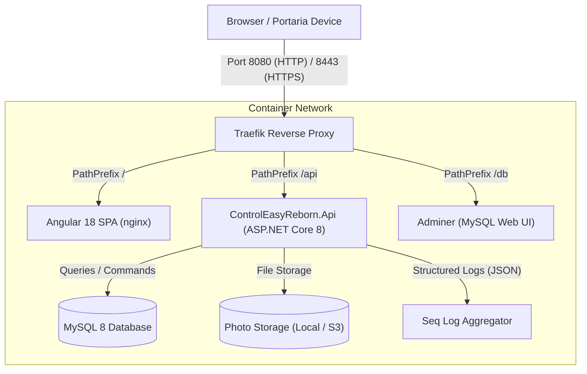
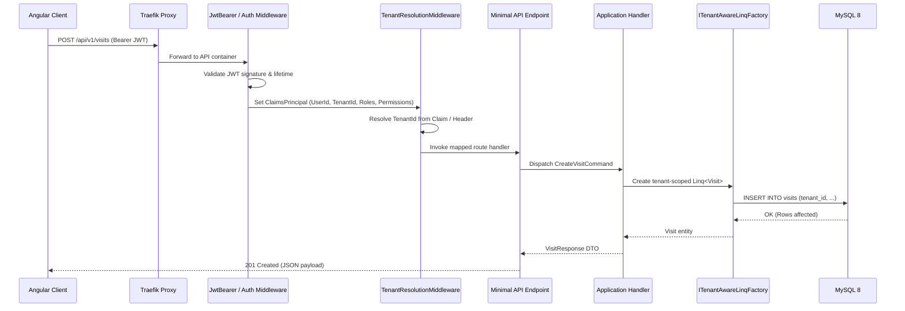

<!-- generated-by: gsd-doc-writer -->
# Architecture Overview — ControlEasy Reborn

This document describes the architectural style, component topology, data flows, and design invariants of ControlEasy Reborn.

## System Overview

ControlEasy Reborn is structured as a **modular monolith** with **Clean Architecture** and **vertical slices** implemented within each feature module. The application is hosted as an ASP.NET Core 8 minimal API service communicating with an Angular 18 Single Page Application (SPA), backed by MySQL 8 and orchestrated via Docker Compose.

### Architectural Invariants

1. **Modular Boundaries:** Each feature module lives under `src/Modules/<Module>/` and is divided into four strict layers:
   - `Domain`: Pure domain entities, value objects, domain exceptions, repository interfaces. Zero external dependencies.
   - `Application`: Use-case handlers, DTOs, FluentValidation validators, business rules.
   - `Infrastructure`: Data persistence with DBTools, external service integrations, module-specific DI registration.
   - `Api`: Minimal API endpoint definitions (`MapGroup`), route registration, authorization policies.
2. **No Cross-Module Domain References:** Modules never reference another module's internal domain or persistence implementation directly. Communication occurs through shared contracts, application abstractions, or API endpoints.
3. **No Entity Framework Core (ADR 0002):** Persistence is implemented using [DBTools](https://www.nuget.org/packages/DBTools) 1.4.3 (`Linq<TModel>` and `IAsyncSqlClient`). LINQ is used for queries and commands; raw SQL is reserved strictly for complex multi-table queries or stored procedures.
4. **Tenant Isolation:** Multi-tenancy is enforced at runtime. All tenant-scoped operations must use `ITenantAwareLinqFactory` to ensure no cross-tenant data leaks.
5. **No MediatR:** Handlers and services are registered as scoped services directly in DI and invoked without reflection-based mediator layers.
6. **Consistent Error Handling:** All errors return standard RFC 7807 `ProblemDetails` via a centralized ASP.NET Core `IExceptionHandler` (`GlobalExceptionHandler`).

## Component Diagram



## Module Structure

The application is decomposed into ten feature modules and a shared kernel:

| Module | Purpose | Key Responsibilities |
|---|---|---|
| `Tenants` | Tenant Isolation | Condominium registration, tenant lifecycle, tenant administrator credentials, backup triggers |
| `Security` | Identity & Access | Users, BCrypt hashing, JWT issuance & refresh tokens, attendant profiles, shifts, gatehouse assignment |
| `Apartments` | Unit Management | Blocks, units, resident occupancy associations |
| `Residents` | Resident Registry | Resident contact details, emergency contacts, authorized unit members |
| `Vehicles` | Vehicle Registry | Vehicle registration, plate tracking, resident and unit association |
| `Visits` | Gatehouse Operations | Visitor registration, active visits, check-in, check-out timestamps |
| `ServiceProviders` | Contractor Access | Service provider registration, company records, entry passes |
| `Photos` | Identity Capture | Gatehouse webcam/upload capture, client-side resizing, consent policy ledger, audit log |
| `Reports` | Analytics & Auditing | Access logs, attendance reports, dashboard statistics |
| `Administration` | System Operations | Condominium configuration, gatehouse settings, system parameters |
| `BuildingBlocks` | Shared Infrastructure | Multi-tenancy middleware, base exceptions, storage abstractions, database health checks |

## Data Flow

### 1. HTTP Request Lifecycle



### 2. Client-Side API Generation

To eliminate divergence between frontend models and backend DTOs:
1. ASP.NET Core endpoints are registered with Swagger/Swashbuckle.
2. The Angular build pipeline executes `npm run openapi-gen` (`prebuild` hook) to convert the OpenAPI JSON spec into strongly-typed TypeScript API clients under `src/Web/ControlEasyReborn.Web/src/app/api/`.
3. Angular standalone components and signals consume these typed client services directly.

## Key Abstractions

### `ITenantAwareLinqFactory`
- **Location:** `src/BuildingBlocks/ControlEasyReborn.Infrastructure/Data/ITenantAwareLinqFactory.cs`
- **Role:** Produces instances of DBTools `Linq<TModel>` pre-filtered by the active tenant ID extracted from `ITenantContext`. Ensures domain queries never accidentally access records belonging to another condominium.

### `IPhotoStorageService`
- **Location:** `src/BuildingBlocks/ControlEasyReborn.Infrastructure/Storage/IPhotoStorageService.cs`
- **Role:** Pluggable storage provider supporting local filesystem storage (`LocalPhotoStorageService` saving to `/storage/photos`) or S3-compatible object storage (e.g. MinIO/AWS).

### `TenantResolutionMiddleware`
- **Location:** `src/BuildingBlocks/ControlEasyReborn.Infrastructure/MultiTenancy/TenantResolutionMiddleware.cs`
- **Role:** Inspects incoming HTTP requests for `tenant_id` claims in JWT tokens or `X-Tenant-ID` headers, resolves the active tenant, and populates `ITenantContext`.

### Authorization Policies
- **Location:** `src/Host/ControlEasyReborn.Api/Hosting/AuthorizationPolicies.cs`
- **Role:** Implements fine-grained access control:
  - `PlatformAdminRequirement`: Restricts platform-level operations (such as creating new condominiums) to platform operators.
  - `RequirePermissionRequirement`: Enforces individual permission flags (e.g., `residents:read`, `visits:write`, `tenants:admin`).

### `GlobalExceptionHandler`
- **Location:** `src/Host/ControlEasyReborn.Api/Program.cs`
- **Role:** Implements ASP.NET Core's `IExceptionHandler` to intercept domain exceptions (`NotFoundException`, `ValidationException`, `ConflictException`, `UnauthorizedException`) and map them into RFC 7807 `ProblemDetails` responses.

## Directory Structure Rationale

```
src/
├── Host/
│   └── ControlEasyReborn.Api/           # The composition root: wires DI, registers middleware, maps routes
├── Web/
│   └── ControlEasyReborn.Web/           # Angular frontend: standalone components, signals, Tailwind CSS, API clients
├── BuildingBlocks/                      # Cross-cutting concerns shared across multiple modules
│   ├── ControlEasyReborn.Domain/        # Base entity, value object, aggregate root definitions
│   ├── ControlEasyReborn.Application/   # Result patterns, base validation interfaces
│   └── ControlEasyReborn.Infrastructure/# DBTools setup, Multi-tenancy, Storage providers, Exception handling
└── Modules/                             # Bounded contexts with decoupled domain models
    └── <ModuleName>/
        ├── ControlEasyReborn.Modules.<Name>.Domain/
        ├── ControlEasyReborn.Modules.<Name>.Application/
        ├── ControlEasyReborn.Modules.<Name>.Infrastructure/
        └── ControlEasyReborn.Modules.<Name>.Api/
```
