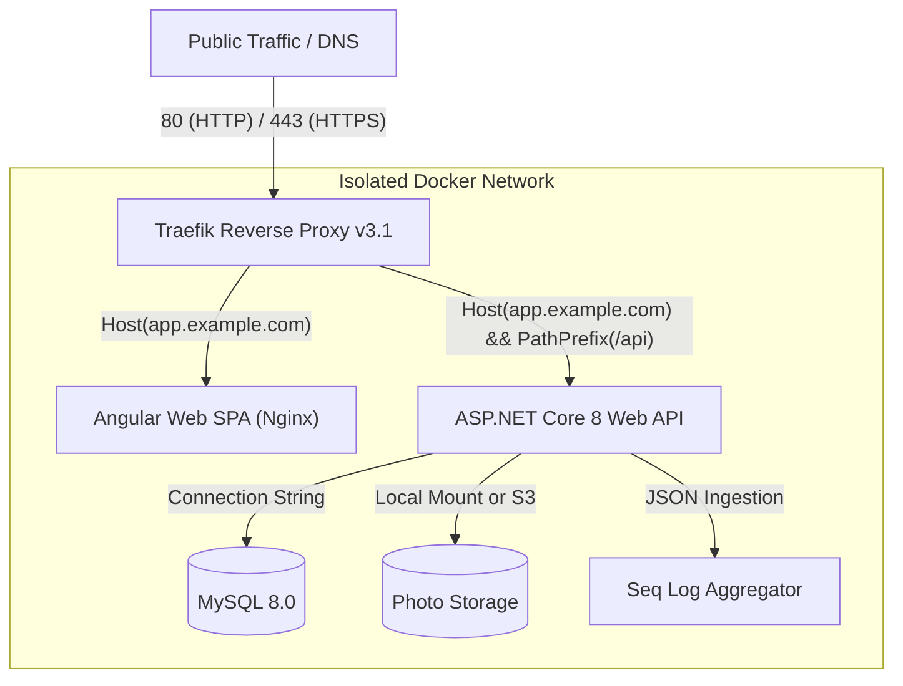

<!-- generated-by: gsd-doc-writer -->
# Deployment Guide — ControlEasy Reborn

This document details the production containerization, CI/CD deployment pipelines, environment configuration, storage persistence, and rollback strategies for ControlEasy Reborn.

## Deployment Topology & Targets

ControlEasy Reborn is deployed as an orchestrated suite of containerized services:



### Core Services

| Service | Image / Build Context | Role | Host Ports |
|---|---|---|---|
| `reverse-proxy` | `traefik:v3.1` | Edge reverse proxy, SSL termination, and routing | `8080:80`, `8443:443`, `8082:8080` |
| `api` | Built via `docker/api.Dockerfile` | ASP.NET Core 8 minimal API runtime | Internal `8080` (or `8081:8080`) |
| `web` | Built via `docker/web.Dockerfile` | Angular 18 static assets served via Nginx | Internal `8080` |
| `db` | `mysql:8.0` | Relational database engine | Internal `3306` |
| `adminer` | `adminer:4` | Web database management tool (optional) | Internal `8080` (`/db`) |
| `seq` | `datalust/seq:latest` | Structured log sink | Internal `5341` |

---

## Build Pipeline & Continuous Integration

The production images are built and validated through GitHub Actions (`.github/workflows/ci.yml`):

1. **Lint & Code Format:**
   - Runs `dotnet format --verify-no-changes`.
   - Runs `npm run lint` and `npm test` with ChromeHeadless.
2. **Build & Contract Verification:**
   - Compiles `.NET` solution in Release mode.
   - Compiles Angular SPA (`ng build --configuration production`).
3. **Automated Test Matrix:**
   - Executes xUnit unit tests and NetArchTest architecture validation.
   - Runs integration tests using real MySQL containers via `Testcontainers.MySql`.
4. **OpenAPI Drift Detection:**
   - Boots the API in a lightweight runner to generate `swagger.json`.
   - Executes `ng-openapi-gen` and confirms zero git diff in generated TypeScript client services.
5. **Container Image Publishing:**
   - On pushes to `main`, builds and pushes versioned images to GitHub Packages (GHCR):
     - `ghcr.io/<org>/controleasy-api:<git-sha>`
     - `ghcr.io/<org>/controleasy-web:<git-sha>`

---

## Production Environment Setup

### 1. Persistent Storage Volumes

The following Docker volumes must be mapped to persistent, backed-up host storage:

- `mysql-data`: Mounts to `/var/lib/mysql`. Holds all transactional tenant and platform data.
- `photos-data`: Mounts to `/storage/photos`. Stores visitor and resident identity capture files (when using `Storage__Provider=Local`).
- `traefik-data`: Mounts to `/letsencrypt`. Stores ACME TLS certificates <!-- VERIFY: Let's Encrypt production certificate resolver configuration -->.
- `seq-data`: Mounts to `/data`. Holds indexed operational logs.

### 2. Environment Variables Checklist

Ensure these variables are injected into the production environment (see [Configuration Reference](CONFIGURATION.md)):

```bash
# Security & Auth
JWT_SIGNING_KEY=very-secure-random-key-at-least-32-chars-long!
ASPNETCORE_ENVIRONMENT=Production

# Database
MYSQL_ROOT_PASSWORD=strong-mysql-root-password
MYSQL_DATABASE=controleasydb
MYSQL_USER=controleasy
MYSQL_PASSWORD=strong-mysql-app-password

# Networking
REVERSE_PROXY_PORT=80
REVERSE_PROXY_HTTPS_PORT=443
```

---

## Health Checks & Monitoring

### Container Health Probes
- **API Health Check:** `GET http://localhost:8080/health`
  - Validates internal service state and executes a `DbToolsHealthCheck` ping against MySQL.
  - Returns HTTP 200 `Healthy` when operational.
- **MySQL Health Check:** Configured via `mysqladmin ping` probe in `docker-compose.yml`.

### Observability
- Centralized structured logs are transmitted asynchronously from the API to Seq over HTTP (`http://seq:5341`).
- Traefik metrics and request logs can be inspected at port `8082` <!-- VERIFY: production Traefik dashboard basic auth credentials -->.

---

## Rollback Procedure

If an unexpected regression or deployment defect occurs:

1. **Roll Back Container Images:**
   Re-deploy the previous known-healthy container image tag:
   ```bash
   docker compose pull api:v1.0.1 web:v1.0.1
   docker compose up -d --force-recreate api web
   ```
2. **Database Rollback:**
   - Database migrations are additive across minor releases.
   - For major disaster recovery, restore the latest verified MySQL backup from `/var/backups` or the tenant backup endpoint (`POST /api/v1/admin/backups/{tenantId}`).
