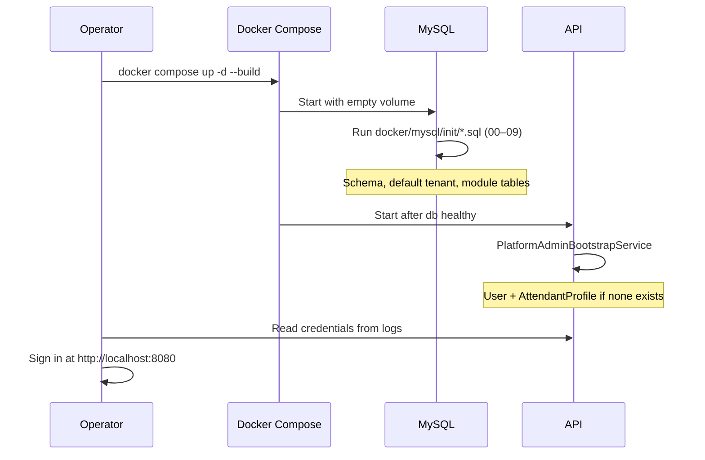

# Getting Started — ControlEasy Reborn

First-boot guide for the **normal (non-demo) Docker Compose stack**: empty database, schema initialization, PlatformAdmin bootstrap, first sign-in, and smoke checks.

For pre-populated sample data and fixed demo credentials, use [Demo Mode](demo-mode.md) instead.

## Prerequisites

| Requirement | Notes |
|---|---|
| Docker Engine 24+ | With Compose v2 (`docker compose`) |
| Git | Clone this repository |
| Free ports | `8080` (HTTP), `8443` (HTTPS), `8082` (Traefik dashboard) |

Optional: copy `docker/.env.example` to `docker/.env` and adjust secrets before first boot (see [Configuration](#configuration)).

## Choose your path

| Goal | Command | Credentials |
|---|---|---|
| **First boot / development** (this guide) | Normal compose | Random PlatformAdmin in API logs |
| **Evaluation / demo / training** | Demo overlay | Fixed `demo123` passwords — see [Demo Mode](demo-mode.md) |

## Configuration

Compose reads environment variables from `docker/.env` (optional). Defaults are suitable for local development only.

Copy the example file from the repository root:

```bash
cp docker/.env.example docker/.env
```

| Variable | Purpose | Default (dev) |
|---|---|---|
| `MYSQL_ROOT_PASSWORD` | MySQL root password | `controleasy_root_dev` |
| `MYSQL_USER` | Application database user | `controleasy` |
| `MYSQL_PASSWORD` | Application database password | `controleasy_dev` |
| `JWT_SIGNING_KEY` | JWT signing secret (min 32 chars) | Placeholder — **change for staging/production** |

**Never** use the demo JWT signing key or `docker-compose.demo.yml` in production. See [Demo Mode — Security warning](demo-mode.md#security-warning).

## Start the stack

From the repository root:

```bash
docker compose -f docker/docker-compose.yml up -d --build
```

Equivalent shortcut:

```bash
make up
```

Compose starts six services:

| Service | Role |
|---|---|
| `reverse-proxy` | Traefik — routes traffic on port 8080 |
| `api` | ASP.NET Core 8 Web API |
| `web` | Angular SPA (nginx) |
| `db` | MySQL 8 |
| `adminer` | Database web UI |
| `seq` | Structured log aggregation (internal to the compose network) |

The API container waits until MySQL reports healthy before starting.

## What happens on first boot

First boot means a **fresh MySQL volume** (`mysql-data` empty). Subsequent restarts reuse existing data; init scripts do not run again.



### Database initialization

MySQL runs scripts from `docker/mysql/init/` in lexical order. On a normal stack (demo overlay **off**), scripts **00** through **09** apply:

| Script | Purpose |
|---|---|
| `00-schema.sql` | Core `Users` table |
| `02-tenants-seed.sql` | `Tenants` table + default tenant |
| `02a-residents-schema.sql` | Residents module schema |
| `03-tenant-backfill.sql` | `tenant_id` backfill |
| `04-tenant-views.sql` | Tenant-scoped views |
| `05-security-schema.sql` | AttendantProfiles, Shifts, Gatehouses, RefreshTokens |
| `06-visits-schema.sql` | Visits module |
| `07-vehicles-schema.sql` | Vehicles module |
| `08-service-providers-schema.sql` | Service providers module |
| `09-administration-schema.sql` | Administration module |

Scripts `10-demo-metadata.sql` and `11-demo-seed.sql` are used when demo mode is enabled (see [Demo Mode](demo-mode.md)).

The default tenant is created automatically:

| Field | Value |
|---|---|
| Id | `00000000-0000-0000-0000-000000000001` |
| Slug | `default` |
| DisplayName | `Condominio Padrao` |

### PlatformAdmin bootstrap

When demo mode is **disabled**, `PlatformAdminBootstrapService` runs once at API startup:

1. If a user with role `PlatformAdmin` already exists, bootstrap is skipped.
2. Otherwise it creates:
   - A `Users` row (random email, random password, `MustChangePassword = true`)
   - An `AttendantProfiles` row on the default tenant (`Permissions = platform:*`)
3. It logs credentials at **Warning** level:

```text
// CHANGE IMMEDIATELY — PlatformAdmin seeded. Email: ..., Password: ...
```

Retrieve them from the API container logs:

```bash
docker compose -f docker/docker-compose.yml logs api | grep "CHANGE IMMEDIATELY"
```

Save the email and password immediately. They are not shown again.

## Verify the stack

### Service status

```bash
docker compose -f docker/docker-compose.yml ps
```

All services should be `running`. The `db` service should be `healthy`.

### Demo mode off

```bash
curl -s http://localhost:8080/api/v1/demo/info
```

Expected:

```json
{"enabled":false,"seedVersion":null,"tenants":null}
```

### Login (API smoke test)

Replace the email and password with the values from your bootstrap log:

```bash
curl -s -X POST http://localhost:8080/api/v1/security/auth/login \
  -H "Content-Type: application/json" \
  -d '{"email":"<bootstrap-email>","password":"<bootstrap-password>"}'
```

A successful response includes `token`, `refreshToken`, `roles` (`PlatformAdmin`), `permissions` (`platform:*`), and `mustChangePassword: true`.

## Access URLs

All HTTP services are reached through Traefik on port **8080**:

| URL | Service |
|---|---|
| [http://localhost:8080](http://localhost:8080) | Web application (Angular SPA) |
| [http://localhost:8080/api](http://localhost:8080/api) | REST API (Swagger in Development) |
| [http://localhost:8080/db](http://localhost:8080/db) | Adminer (MySQL UI) |
| [http://localhost:8082](http://localhost:8082) | Traefik dashboard |

**Adminer login** (when prompted):

| Field | Value |
|---|---|
| System | MySQL |
| Server | `db` |
| Username | `controleasy` (or your `MYSQL_USER`) |
| Password | `controleasy_dev` (or your `MYSQL_PASSWORD`) |
| Database | `controleasydb` |

Seq receives API structured logs inside the compose network only; it is not exposed on a host port in the default compose file.

## First sign-in (web UI)

1. Open [http://localhost:8080](http://localhost:8080).
2. Enter the bootstrap email and password from the API logs.
3. You should land on **Change your password** (bootstrap accounts require a password update).
4. Enter the bootstrap password as **Current password**, choose a new password (8+ characters), and submit.
5. You reach the dashboard.

The API sets `mustChangePassword: true` on the bootstrap account until you complete this step.

**Rotate the bootstrap password** as soon as possible after first login in any non-local environment.

## Post-bootstrap checklist

After first sign-in as PlatformAdmin:

1. **Change secrets** — set a strong `JWT_SIGNING_KEY` in `docker/.env` and recreate the API container.
2. **Change the bootstrap password** — complete the change-password screen on first login.
3. **Register condominiums** — open **Platform → Condominiums** (`/platform/condominiums`) in the web UI, or call `POST /api/v1/tenants` with a PlatformAdmin JWT.
4. **Assign tenant administrators** — during registration, check **Create first tenant administrator**, or use `POST /api/v1/tenants/{id}/admins` later.
5. **Configure gatehouse data** — shifts, gatehouses, and attendant profiles per tenant via the Security module API.

The default tenant starts empty (no residents, visits, or demo users).

### Register a condominium (web UI)

1. Sign in as PlatformAdmin (bootstrap credentials from API logs).
2. Complete the password change step if prompted.
3. In the sidebar, open **Platform → Condominiums**.
4. Click **Register condominium**.
5. Enter a **display name** (e.g. `Residencial Aurora`) and a unique **slug** (lowercase letters, numbers, and dashes).
6. Optionally enable **Create first tenant administrator** and fill email, display name, and a temporary password.
7. Submit — the new condominium appears in the list with status **Active**.

Tenant administrators created this way must change their password on first login (`MustChangePassword = true`).

### Register a condominium (API)

Replace the email and password with your PlatformAdmin credentials:

```bash
TOKEN=$(curl -s -X POST http://localhost:8080/api/v1/security/auth/login \
  -H "Content-Type: application/json" \
  -d '{"email":"<bootstrap-email>","password":"<bootstrap-password>"}' \
  | jq -r '.token')

curl -s -X POST http://localhost:8080/api/v1/tenants \
  -H "Authorization: Bearer $TOKEN" \
  -H "Content-Type: application/json" \
  -d '{"slug":"residencial-aurora","displayName":"Residencial Aurora"}'
```

List all condominiums:

```bash
curl -s http://localhost:8080/api/v1/tenants \
  -H "Authorization: Bearer $TOKEN"
```

## Full reset

To destroy all data and repeat first boot (schema re-init + new bootstrap credentials):

```bash
docker compose -f docker/docker-compose.yml down -v
docker compose -f docker/docker-compose.yml up -d --build
```

Then retrieve the new PlatformAdmin credentials from the API logs.

`make down` runs the same volume-destructive `down -v` against the default compose file.

## Troubleshooting

### Port 8080 already in use

Stop the conflicting process or change the published port in `docker/docker-compose.yml` under `reverse-proxy.ports`.

### `db` service unhealthy

Check MySQL logs:

```bash
docker compose -f docker/docker-compose.yml logs db
```

Common causes: insufficient disk space, port conflict on 3306 if MySQL is also installed on the host, or corrupted volume. Try a full reset (`down -v`) on a development machine.

### No bootstrap credentials in logs

Bootstrap runs only when no `PlatformAdmin` user exists. If the database volume persists from a previous run, bootstrap is skipped:

```text
PlatformAdmin already exists; skipping bootstrap.
```

Either use existing credentials, inspect the `Users` table via Adminer, or run a [full reset](#full-reset).

### Login returns "No active attendant profile found"

This indicates the PlatformAdmin user exists without a matching `AttendantProfiles` row (legacy partial bootstrap). Run a [full reset](#full-reset) on a development machine, or insert a profile manually via Adminer with `Permissions = platform:*` on the default tenant.

Current bootstrap creates both user and profile automatically.

### Login returns "Invalid email or password"

Confirm you copied the exact email and password from the latest `CHANGE IMMEDIATELY` log line. Special characters in the generated password must not be altered.

### Stale containers after code changes

Rebuild and recreate affected services:

```bash
docker compose -f docker/docker-compose.yml build api web
docker compose -f docker/docker-compose.yml up -d --force-recreate api web
```

## Evaluate with demo data

If you need sample residents, visits, and fixed passwords (`demo123`) instead of an empty stack:

```bash
docker compose -f docker/docker-compose.yml -f docker/docker-compose.demo.yml up -d --build
```

See [Demo Mode](demo-mode.md) for personas, walkthrough, and reset procedures.

## See also

- [Demo Mode](demo-mode.md) — pre-populated stack for demos and training
- [Legacy mapping](migration/legacy-mapping.md) — WPF screen to web module status
- [Architecture decisions](architecture/decisions/0001-modular-monolith.md) — modular monolith overview
- [AGENTS.md](../AGENTS.md) — stack, conventions, and verification gates for contributors
